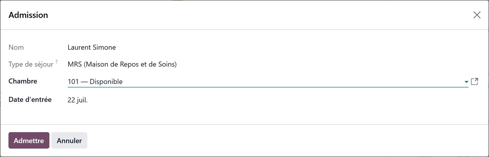

# Admitting a candidate

:::{rh-description}
Admitting a candidate in Resthome: the checks before Admitted, the admission wizard (room and start date), what is created, and the safeguards including the duplicate identification number.
:::

:::{rh-faq}
What does the admission create?
: The contact becomes a resident, their stay opens as **Confirmed** on the chosen room and date, and the resident's record opens.

Is a room required?
: Yes. The wizard only offers rooms that are free, that become free on a known date, or that are on the waiting list.

The identification number already belongs to a resident. What do I do?
: Click **Link to that resident**: the file is repointed at the existing record, and the empty duplicate is archived. This is also the normal path for readmitting a former resident.

What happens if I move an admitted file back to an earlier stage?
: Stays still in draft or confirmed are cancelled automatically. A stay that has already started is left untouched.
:::

When the file is ready, the candidate becomes a resident. Two equivalent
actions open the **Admission** wizard: drag the card into the **Admitted**
column, or mark the file as won from the file itself.

## 1. Pass the checks

Resthome refuses the admission, on every path, as long as:

- the **Desired stay type** is empty — the documents for the health insurer
  cannot be produced without it;
- the **insurability** has not been verified, where the country has an
  electronic check — unless the file waives it.

A third check is about identity: if the national identification number entered
already belongs to a resident, a banner names the existing record. **The admission will be refused**
as long as the file points at a separate one.

:::{admonition} One person, one record
:class: warning

The **Link to that resident** button fixes it in one click: the file is
repointed at the existing record, and the empty duplicate created along the way
is archived. A record already in use is never archived — the two are then merged
by hand.

This is the normal path for **readmitting a former resident**: their history,
assessments and documents come back with them.
:::

:::{admonition} In Belgium
:class: rh-country rh-country-be

The stay type is needed to produce Annexe 7, and the insurability check is the
MDA, waived by unticking **MDA check required**. See [Admitting a resident in
Belgium](../belgique/admission.md).
:::

## 2. Fill in the wizard

- **Stay Type** — carried over from the file, read-only.
- **Room** — required.
- **Stay start date** — today by default.
- **Notes** — copied into the stay's admission reason.

Depending on the modules installed, the wizard also carries the **invoice type**
and the [split billing debtors](../facturation-partagee/index.md).

Click **Admit**.

## 3. Check what was created

Resthome then:

- turns the contact into a **resident**;
- opens the **stay** in the **Confirmed** state, on the chosen room and date;
- opens the **resident's record**, to continue with the dependency assessment
  and the documents.

The stay still has to be **started** (**Start Stay**) once the resident is
actually there. See [Managing a resident](../residents/gerer-un-resident.md).

:::{admonition} Two dates not to confuse
:class: note

- **Stay start date** — when billing for accommodation (the room) begins. This
  is the one in the wizard.
- **Admission Date** — when the care allowance paid by the health insurer
  begins. It is set when the stay is **started**.

They are often identical, but can differ.
:::

:::{admonition} In Belgium
:class: rh-country rh-country-be

Starting the stay prepares the admission agreement (Annexe 7) sent to the
health insurer through eAgreement, and the Katz assessment sets the category
declared for the INAMI allowance. See [Admitting a resident in
Belgium](../belgique/admission.md).
:::

## Safeguards

- **Closing the wizard** creates nothing and brings the card back to its
  previous stage: the file is only won by **Admit**.
- **Moving a file out of Admitted** cancels the stays still in **draft** or
  **confirmed**; a stay already **started** is left untouched.
- **No duplicate stay**: the wizard reuses the file's existing stay, or a stay
  of the resident that belongs to no file — never one belonging to another file.
  The room, the date and the stay type are pre-filled.

## What's next

- [Managing a resident](../residents/gerer-un-resident.md)
- [The move-in procedure](../residents/procedure-emmenagement.md)
- [Billing](../facturation/index.md)
