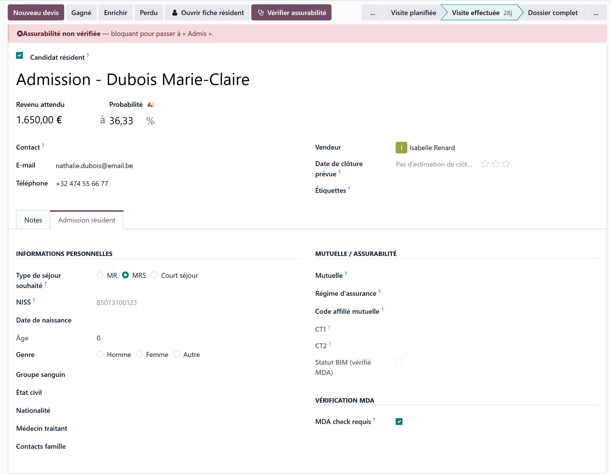

# The candidate's file

:::{rh-description}
The Resident Admission tab of an admission file in Resthome: desired stay type, short stay, identity, health insurer and insurability, key contacts.
:::

:::{rh-faq}
Where do I enter the candidate's identity?
: In the **Resident Admission** tab of the file, which replaces the commercial tabs of a sales pipeline.

Why can't I choose a stay type?
: Because no approval is recorded for the facility yet. A banner says so and offers **Record the approvals**; the stay types on offer come from those approvals.

What are the three key contacts?
: The **emergency contact**, the **legal representative** and the **trusted person**. Each has a box to tick when there is none, so an empty field is never mistaken for an oversight.
:::

The **Resident Admission** tab is where the candidate's file is built, without
leaving the enquiry.

## Personal information

- **Desired stay type** — MR, MRS or day care, offered according to the
  facility's approvals. It is not required to fill in the file, but it is
  required to admit: it determines the bed and Annexe 7.
- **Short stay** — derived from the stay type. It then asks for the
  **number of short-stay days used** this calendar year and for **notes**.
- Identity: **NISS**, ID card and expiry, **date of birth**, **age**, **gender**,
  **blood type**, **marital status**, **nationality**, **place of birth**.
- **Resident language** and **spoken languages**, **religion**.
- **Attending physician** and **deputy physician**.
- **Family contacts**, telephone, e-mail.

:::{admonition} No approval on file
:class: warning

If the facility has no approval recorded, no stay type can be offered. The
banner **This establishment has no approval on file yet** appears, with a
**Record the approvals** link — fill them in first.
:::

:::{admonition} Short stay: 90 days a year
:class: info

The law caps short stays at **90 days per calendar year**. Enter the days
already used — ask the family, or confirm with the health insurer — before
accepting the admission.
:::

## Health insurer and insurability

- **Mutuelle**, **insurance regime**, **membership code**, **CT1**, **CT2**,
  **BIM status**.
- **MDA Check**: **MDA check required**, **latest MDA**, **MDA status**,
  **Insured**, **last check**.

The **Check insurability** button sends an [MDA request](../ehealth/mda.md) and
fills in the health insurer, the BIM status and the CT1/CT2 codes on its own. It
needs the **NISS**: without it, Resthome asks for it first.

:::{admonition} The insurability check gates the admission
:class: warning

As long as the check has not succeeded, moving to **Admitted** is refused. For a
case that does not require it — a candidate with no NISS, for example — untick
**MDA check required**.

If the answer comes back **not insured**, the admission is still possible: an
orange banner warns that billing will have to be addressed to the resident, and
the answer is recorded in the file's history.
:::

## Key contacts

Three roles, each with a box to tick when the person does not exist:

- **Emergency contact** — or **No emergency contact**
- **Legal representative** — or **No legal representative**
- **Trusted person** — or **No trusted person**

The box matters: it tells the team that the question was asked, rather than
leaving an empty field that looks like an oversight.

## What's next

- [Admitting a candidate](admettre.md)
- [Insurability (MDA)](../ehealth/mda.md)
