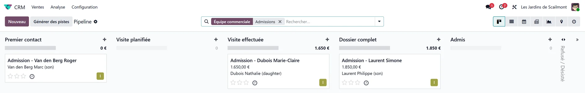

# Admissions

:::{rh-description}
The Resthome Admissions application: a pipeline from the first enquiry to the move-in, the candidate's file, and the admission that creates the resident and their stay.
:::

:::{rh-faq}
Where is the admissions pipeline?
: In the **Admissions** application. Each enquiry is a card that you move from stage to stage on a kanban board.

Who is the candidate, the resident or the relative who calls?
: The candidate is the person to be accommodated. The relative who calls is recorded as a family contact, and the identity (national identification number, date of birth) stays on the candidate.

How do I close an enquiry that does not go ahead?
: Click **Give up** on the file and choose the reason: admitted to another home, withdrew and staying at home, or died before admission.
:::

:::{toctree}
:hidden:

dossier-candidat
admettre
:::

The **Admissions** application follows every enquiry, from a relative's first
phone call to the day the resident moves in. Each enquiry is a **file** that you
move forward on a kanban board; when it is ready, one action turns the candidate
into a **resident**, with their room and their stay.

## The stages

| Stage | Meaning |
| --- | --- |
| **First Contact** | Enquiry received, to be followed up. |
| **Visit Scheduled** | A visit to the facility has been booked. |
| **Visit Completed** | The visit has taken place. |
| **File Complete** | The administrative and medical file is ready. |
| **Admitted** | Triggers the admission — see [Admitting a candidate](admettre.md). |
| **Refused / Withdrawn** | The enquiry does not go ahead (folded column). |

Drag a card from one column to the next, at the actual pace of the case. Visits
can also be scheduled from the file itself, in the shared calendar.

## A file made for a nursing home

Each file carries the **Resident candidate** box, ticked by default. It opens the
[candidate's file](dossier-candidat.md) and hides what belongs to a sales
pipeline and not to an admission: expected revenue, probability, quotations.

:::{admonition} In Belgium
:class: rh-country rh-country-be

The file also carries the NISS, the MR/MRS stay type and the MDA insurability
check, and starting the stay prepares the admission agreement (eAgreement): see
[Admitting a resident in Belgium](../belgique/admission.md).
:::

## Giving up an enquiry

When an enquiry does not go ahead, click **Give up** on the file and choose the
reason:

- **Admitted to another home**
- **Withdrew — staying at home**
- **Died before admission**

The reason stays on the file: it is what lets you read, months later, why the
place was not taken.

## What's next

- [The candidate's file](dossier-candidat.md) — identity, health insurer, key contacts.
- [Admitting a candidate](admettre.md) — the checks, the wizard, the stay.
- [Managing a resident](../residents/gerer-un-resident.md) — once admitted.
