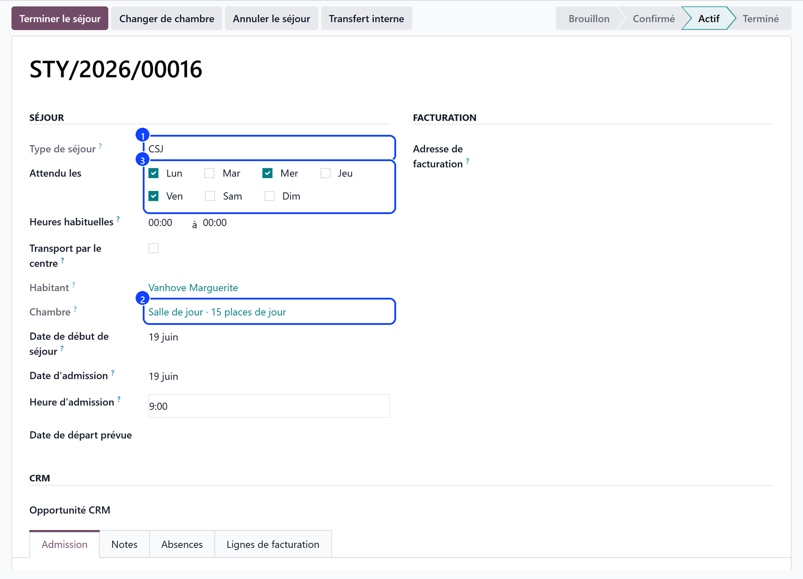
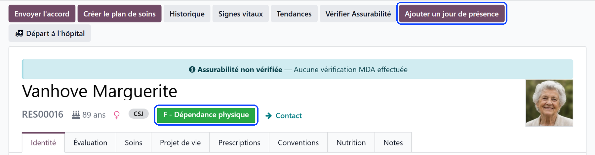

# Admitting a day care user

:::{rh-description}
Admitting a day care user in Resthome: the CSJ stay in a day place, the days expected, the day price, the category and the agreement.
:::

:::{rh-faq}
Which stay type do I choose?
: CSJ. The room picker then offers the day places only.

Do I have to tick the days the user comes?
: Only when a rhythm was agreed with the family. Left empty, the user is expected on every day the centre opens.

How is the day price billed?
: At the price of the day place, on the days attended, one line a month. Nothing is subscribed at admission; while the place is still at 0.00 EUR, a note on the user's file says so.

Which category does the health insurer see?
: The CSJ category read from the Katz evaluation — F, Fd or D. The badge on the user's file shows that letter, not the rest home one.
:::

A day care user is admitted like any resident, with a **CSJ** stay in a **day
place**. What changes is what the stay carries: the days the user comes, and
a day place billed on the days attended instead of every night.

## Open the stay

Admit the user from the [admission pipeline](../../admissions/admettre.md) or from
their file, with **CSJ** as **Stay Type** (1):

- the **Room** picker (2) offers the **day places** only;
- the stay shows no nightly rate, no short-stay option and no invoice type:
  there is no bed, and a day care month is billed after the days happened.

From a day room, **Assign Resident** opens a CSJ stay straight away.

## The days the user is expected

On the stay, **Expected on** (3) holds the days agreed with the family:
**Mon** to **Sun**. They drive everything that plans work for the user — care
tasks, medication, the missed-care count.

- Nothing ticked: the user is expected on **every day the centre opens**.
- A day recorded in the register always counts, even outside the agreed days.
- **Usual hours** says when the user usually arrives and leaves. Left blank,
  the centre's hours apply. They place the care and the medication of the day
  until the register says when the user actually came.

## Transport by the centre

When the centre drives the user between home and the centre, tick
**Transport by the Centre** on the stay:

- under **Driven on**, the days of the transport — none ticked: every day the
  user comes;
- under **Transporter**, who drives them — empty: the centre's own vehicle.

The register then ticks **Transported by the Centre** on those days, and the
transport supplement counts them. A transport priced at 0.00 EUR — included in
the day price, or billed by the transport firm itself — subscribes nobody.

## Start the stay

Click **Start Stay** on the user's first day. Resthome then:

- shows the **Add a day of attendance** button on the user's file;
- checks that the day place has a price: a place at 0.00 EUR bills the user
  no day price, and a note on the file says so.

Nothing is subscribed under the **Conventions** tab: the day price is the
place's, billed on the days attended. See
[Setting up a day care centre](configuration.md).

:::{note}
Starting a stay needs the admission hour: it declares when the INAMI
intervention begins.
:::

## The CSJ category

The same Katz evaluation serves both sectors. For a day care user, Resthome
reads its **CSJ category**:

- **F** — dependent for washing and dressing, and for transfer or toileting;
- **Fd** — disoriented in time and space, and dependent for washing or
  dressing;
- **D** — dementia diagnosed by a specialist, with a written report.

A user in none of the three earns **no** day care forfait. The badge on the
file and the name of the evaluation carry the CSJ letter, and the evaluation's
**Billed Category** is the one sent to the insurer. See
[The Katz assessment](../katz.md).

## The agreement request

A day care admission asks the health insurer for its agreement with a request
of its own, **csj-in**, and its Annexe 14; the end of care is a **csj-out**.
The agreement runs for a year, then asks to be renewed. See
[Agreements (eAgreement)](../ehealth/eagreement.md).

## Moving between the rest home and the day care centre

A resident who leaves a bed for the day care centre — or the other way round —
changes sector: use the **internal transfer**, which closes one stay, opens the
other and produces the annexes the insurer expects. See
[Internal transfer](../ehealth/eagreement-transfert.md).

## What's next

- [Recording attendance](presences.md) — marking present the users who came, one day at a time.
- [Care for a day care user](soins.md) — the care plan and the tasks of the days expected.
