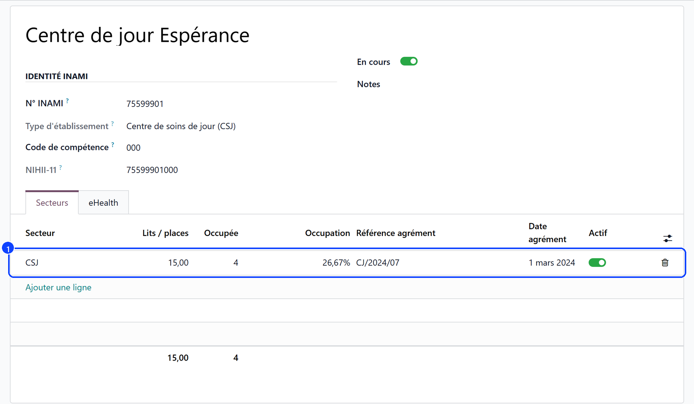
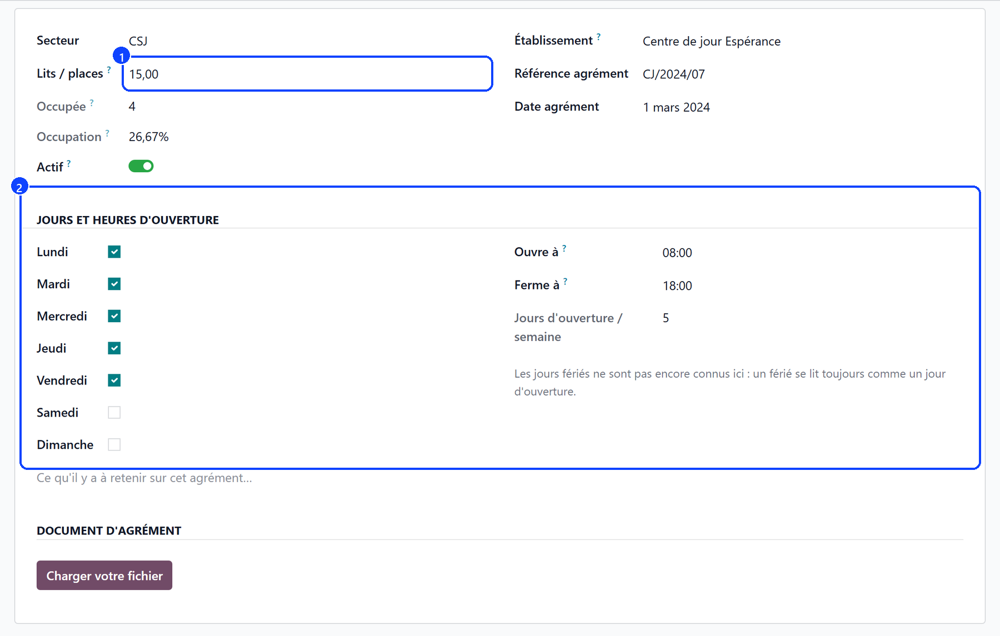
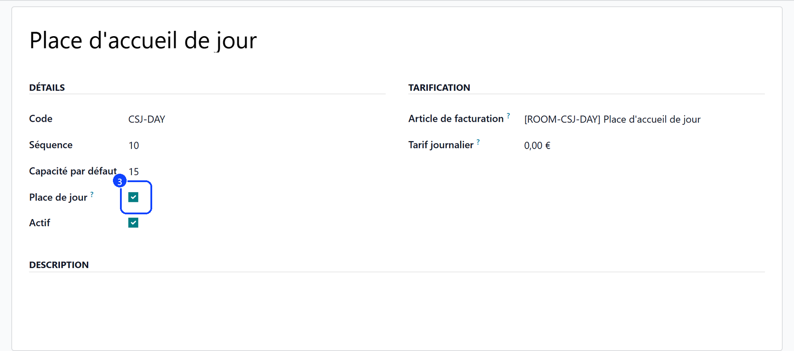
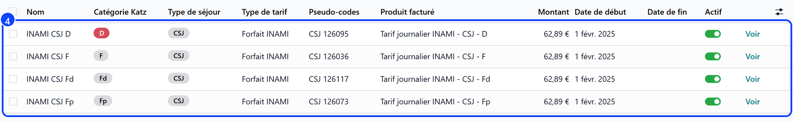
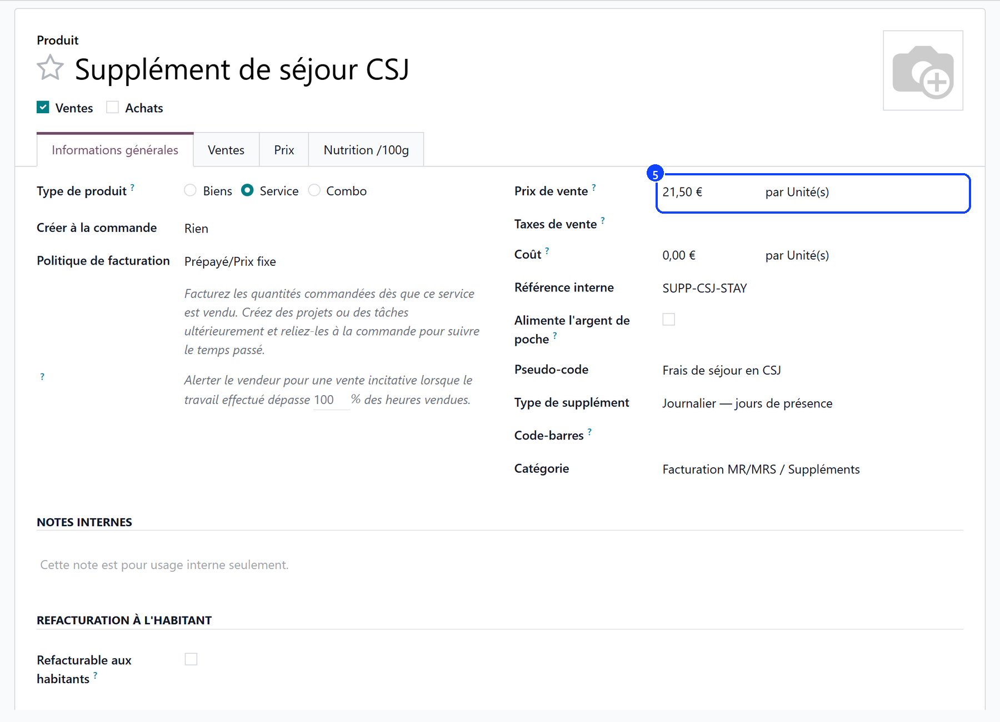

# Setting up a day care centre

:::{rh-description}
Setting up a day care centre (CSJ) in Resthome: the approval and opening hours, day places, CSJ forfait rates and the day price.
:::

:::{rh-faq}
Where do I enter the days the centre opens?
: On the CSJ approval of the establishment: Settings, Approvals, Manage establishments and approvals. Monday to Friday, 8:00 to 18:00, by default.

Why is a bedroom refused to a day care user?
: Because a bedroom is a licensed bed. A day care stay only goes in a day place, and a residential stay never does: tick Day Place on the room type of the day room.

Does the capacity of the day room limit the admissions?
: No. A centre enrols more people than it has places, and they share them day by day. The capacity is the number of places the room offers.

What if the day price is still 0.00 EUR when a user starts?
: Nothing is subscribed, and the user's file says so. Set the price on the product: every user who started in the meantime is subscribed at once, from their admission day.
:::

A day care centre needs five things before its first user: its approval, its
opening days, a day room, the amounts of the CSJ forfait and its own day price.

## 1. Record the CSJ approval

A day care centre has **its own INAMI number** — one starting with 755 to 758,
ending in 000 — and Resthome records it on an **establishment** of its own,
with its eHealth certificate. See
[eHealth and eFact settings](../reglages-ehealth.md).

1. Go to **Settings → Approvals → Manage establishments and approvals** and
   create the establishment of the day care centre: its name and its INAMI
   number. Resthome reads the type from the number.
2. Under its **Sectors** tab, add a line with **CSJ** as sector and the number
   of places it covers under **Beds / places** (1).
3. Open the line: the approval's own form carries the reference, the date and
   the opening days below.

A house that runs a rest home as well keeps its MR and MRS approvals next to
it, on the rest home's own establishment: an admission is only offered the
sectors the house is licensed for.

## 2. Set the opening days and hours

On the CSJ approval, the **Opening days and hours** section (2) says when the
centre opens: the days from **Monday** to **Sunday**, **Opens at** and
**Closes at**. It starts from Monday to Friday, 8:00 to 18:00 — the legal
floor.

- **Open Days / Week** counts the days ticked.
- **Below the Norm** lights up under five days a week, or with a window
  narrower than 8:00–18:00. It is said, never blocked: what the centre opens
  is its own to declare.
- **Occupied** and **Occupancy** count the users enrolled against the places:
  more users than places is normal for a day care centre — they do not all
  come the same day.

These days are read everywhere else: a day recorded in the register on a day
the centre is closed is flagged **Centre closed that day**, and a user with no
agreed days is expected on every day the centre opens.

:::{note}
Public holidays are not known yet: a holiday still reads as an open day.
:::

## 3. Create the day room

A day care user holds a **day place**, never a licensed bed.

1. Under **Configuration → Rooms → Room Types**, create the type of the day
   room and tick **Day Place** (3). Its **Daily Rate** stays at 0.00: a place
   is not rented, the user pays the day price set in step 5.
2. Under **Accommodation → Rooms**, create the room with that type, and the
   number of places as its **capacity**.

From then on:

- a day care stay only goes in a day place, and a residential stay never does;
- every room picker offers day places to a day care stay, and beds to the
  others;
- a day room reads « 15 day places » in the pickers, never « free beds »: the
  places are shared, and a centre enrols more users than it has places.

## 4. Fill in the CSJ rates

The health insurer pays a **daily forfait** per CSJ category. Under
**Billing → Configuration → INAMI Rates**, the grid carries one row per CSJ
category, each with its own **pseudo-code**:

| Category | Pseudo-code |
| --- | --- |
| F | 126036 |
| Fp | 126073 |
| D | 126095 |
| Fd | 126117 |

Enter the amount in force from its start date (4). The amount is the **same
for every category**: the category declares the user's profile to the insurer.
The list opens on the current year: use the **Currently valid** filter to see
the rates in force whatever year they started.

:::{warning}
A rate left at 0.00 EUR bills no forfait. Resthome never sends a claim at zero:
the month's generation says which users were left without one, and why.
:::

## 5. Set the centre's day price

What the user pays is the centre's **day price**: the product **CSJ Stay
Supplement** (SUPP-CSJ-STAY), under **Billing → Configuration → Supplement
Types**. Set its **Sales Price** (5).

- Each user is **subscribed automatically** when their stay starts, from the
  admission day.
- A user who follows the tariff follows its yearly **indexation** too.
- A price agreed with one user goes on their convention, with **Negotiated
  price** ticked: the indexation then leaves it alone. See
  [Supplements](../../facturation/supplements.md).

## What's next

- [Admitting a day care user](admission.md) — the stay, the days expected, the category, the agreement.
- [Recording attendance](presences.md) — the register of the day, and one day at a time.
