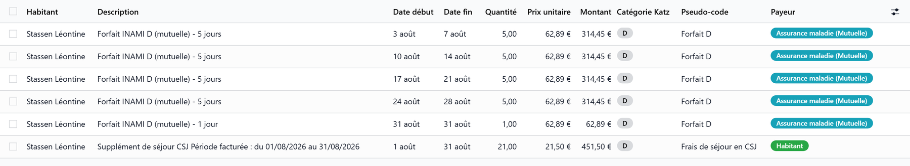

# Billing a day care month

:::{rh-description}
Billing a day care month in Resthome: the CSJ forfait on the days that earn it, the day price on every day recorded, the unticked month.
:::

:::{rh-faq}
Why does a Monday, Wednesday and Friday user have three forfait lines a week?
: Because each forfait line covers exactly the days it bills. A run of consecutive days that earn the forfait makes one line; a day without one ends the run.

Is anything billed at the start of the month?
: No. A day care centre bills the days recorded, after they happened: nothing is billed ahead, and a day nobody came is not billed at all.

A day was recorded after the month was generated. What happens?
: The month is billed again for that user, as when an absence changes: the new day reaches the forfait and the day price.

The month billed nothing for a user. Why?
: Almost always because the register of that month is empty for them. The period says so, with the last day recorded for each user concerned.
:::

A day care month is generated like any other month — see
[Billing a month, step by step](../../facturation/facturer-un-mois.md). What
differs is what it counts: the days of the **attendance register**, not the
calendar.

## What the month bills

- **The forfait**, to the health insurer: one line per run of consecutive days
  that earn it, at the rate of the user's CSJ category. A user who comes on
  Monday, Wednesday and Friday has three runs a week.
- **The day price**, to the user: every day recorded, whether it earns the
  forfait or not.
- **The daily supplements**, on the days recorded — not on the calendar days.

And what it never bills:

- no room: a day place is not rented;
- nothing **ahead**: the days are billed once they happened;
- no absence rebate, and no leave to declare: a day nobody came is simply not
  billed.

A day recorded, corrected or removed after the month was generated bills the
month again for that user, as a change of absence does.

The lines are read on the period, under its **Billing Lines** tab, or on the
stay's tab of the same name. Each forfait line carries the CSJ category, its
pseudo-code and the health insurer as payer; the day price line names the
user.

## The month nobody ticked

When a user's month bills nothing, refreshing the period says why in its
chatter: **nothing recorded in the attendance register** for them, with the
**last day recorded** of each user concerned. A recent date says the register
was not kept up; « never » says the user never came.

Fill in the register — see [Recording attendance](presences.md) — then
**Refresh** the period.

## When the staffing norm reduces the forfait

A staffing norm applied to the billing year reduces every CSJ forfait of that
year, and the period says so when it is generated. Under 75 % of the norm, no
forfait line is produced at all — never a claim at 0.00 EUR — and the period
says **Forfait withdrawn by the sector**. See [The staffing norm](norme-personnel.md).

## Sending to the health insurers

The forfaits go to the health insurers by **eFact**, under the day care
centre's **own INAMI number**, in their own sending. See
[Electronic invoicing (eFact)](../ehealth/efact.md).

## What's next

- [The staffing norm](norme-personnel.md) — the yearly check that can reduce the forfait.
- [Recording attendance](presences.md) — the register every line of the month comes from.
