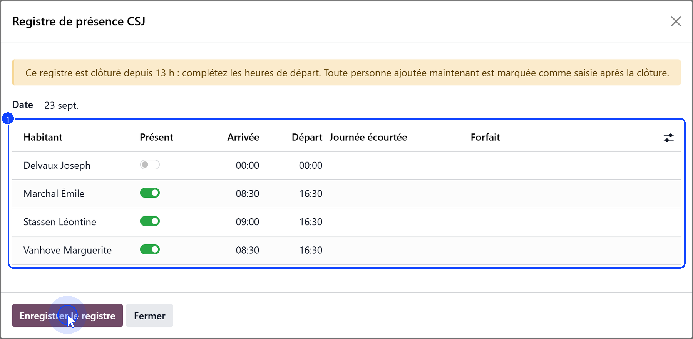
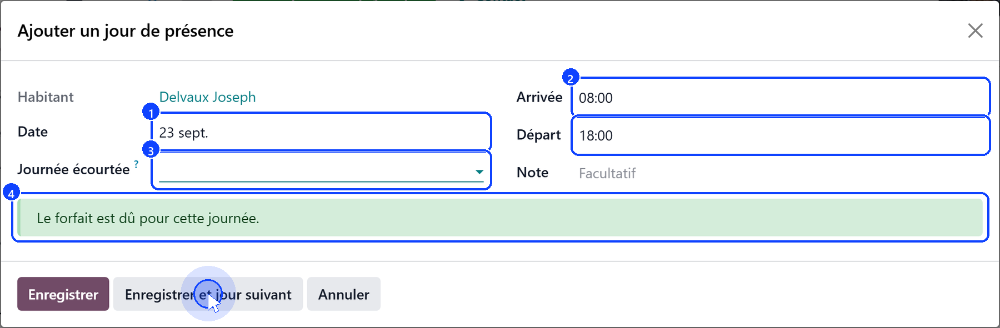
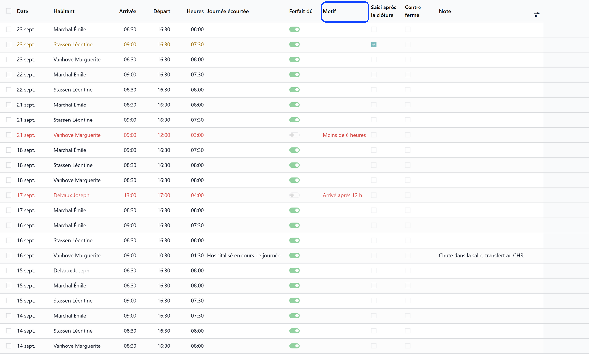

# Recording attendance

:::{rh-description}
Recording attendance in a day care centre (CSJ): the day's register, one day at a time, the days that earn the forfait, the 13:00 closure.
:::

:::{rh-faq}
When does a day earn the forfait?
: When the user stayed at least 6 hours and arrived by 12:00 — or when the day was cut short by a hospitalisation or a death, however short.

A user came for three hours: do I record the day?
: Yes. The day earns no forfait, but it is a day spent at the centre: the day price and the daily supplements are billed.

Can I still record a day after 13:00?
: The departures, yes. From 13:00 the register is closed to arrivals, and a past day can only be amended by a manager; each change is kept in the audit log.

I forgot to mark a user present yesterday. What happens to their care?
: Once the register has closed, a user who was expected and not marked present is considered absent: the care of that day is cancelled, not counted as missed. A manager can still add the day; the billing then follows.
:::

The **attendance register** is what the whole day care centre rests on: it
decides the forfait, the day price and the care. It holds one line per user
and per day, with the arrival and departure hours.

## The day's register

**Accommodation → Day care register** opens the register of one day: every day
care user whose stay runs that day (1). The days already recorded come marked
**Present**, with their hours.

1. Switch on **Present** for the users who came.
2. Enter their arrival and departure hours: without them, the day earns no
   forfait.
3. Click **Save the register**.

Switching **Present** off removes the user's day. From 13:00 the banner says
the register is closed to arrivals: the departures can still be completed, and
a user added now is marked as recorded after the closure.

## One day for one user

On the user's file, **Add a day of attendance** opens a dialog for a single
day — the right tool to catch up a fortnight for one person.

1. Choose the **Date** (1): today by default.
2. Check **Arrival** and **Departure** (2): they start from the centre's
   hours.
3. If a hospitalisation or a death interrupted the day, choose it under
   **Day Cut Short** (3).
4. Read the verdict before saving (4): the forfait is due, or the reason it
   is not.
5. Click **Save**, or **Save and next day** to move on to the following day.

- A day already in the register is loaded, never doubled: saving updates it.
- The next day always starts blank, on the centre's hours.
- A notification confirms each day saved, and says whether the forfait is due.

## A day that earns the forfait

A day earns the forfait when the user:

- stayed at least **6 hours**, and
- arrived by **12:00**;

or when the day was **cut short** by a hospitalisation or a death, however
short. Otherwise the register says why: **Less than 6 hours**, **Arrived after
12:00**, or **Arrival or departure time missing**.

A day that earns no forfait is still recorded: the user came, and the centre
bills them its day price.

## The 13:00 closure

- Before **13:00**, the register of the day is open.
- From **13:00**, it is closed to arrivals; departures can still be entered.
- A **past day** can only be amended by a manager, and every change is kept in
  the audit log.
- A line added after the closure is marked **Recorded after closure**.

Once the register has closed, its silence is an answer: a user who was
expected and not marked present **did not come** that day.

## The history

**Accommodation → Day care attendance** lists the days recorded, with the
filters **Today**, **This month**, **Forfait not due**, **Recorded after
closure** and **Centre closed that day**, grouped by resident or by day.

A day that earns no forfait shows in red, with its reason under **Why Not
Due**; a day recorded after the closure shows in orange. A day recorded on a
weekday the centre does not open is flagged, never refused: it is either a
date typed wrong, or an exceptional opening.

## What's next

- [Billing a day care month](facturation.md) — what the days recorded become on the invoices.
- [Care for a day care user](soins.md) — how the register decides the care of the day.
