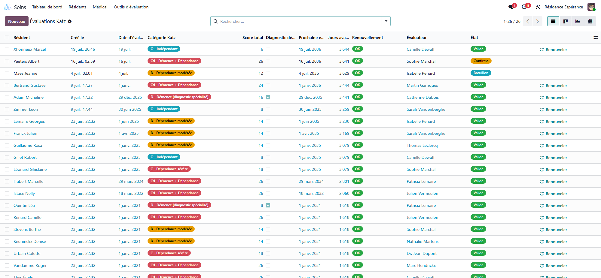
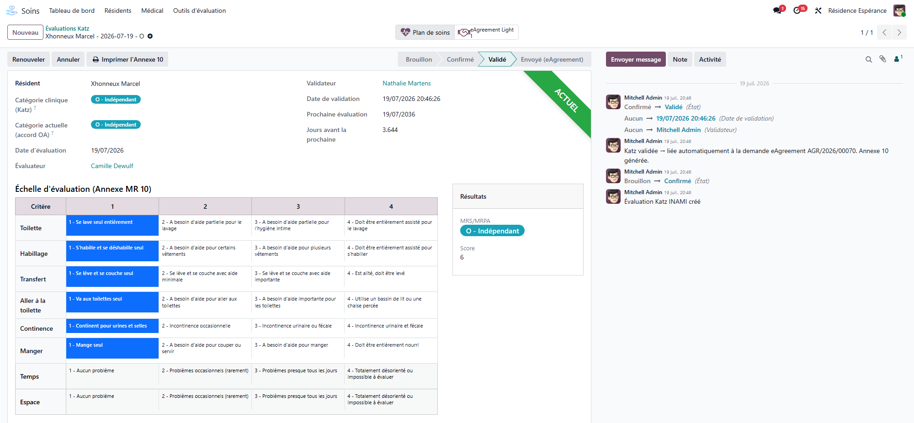
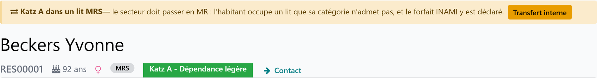
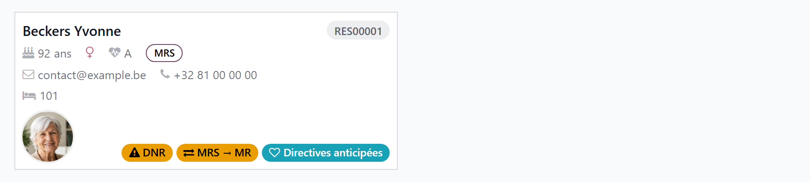
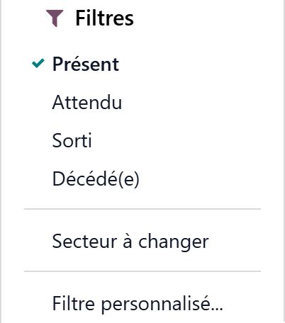

# The Katz Assessment

:::{rh-description}
The Katz scale in the nursing home with Resthome — rate the 6 criteria, determine the category (O, A, B, C, Cd) and the INAMI dependency allowance.
:::

:::{rh-faq}
How do I calculate a resident's Katz category?
: Rate the 6 dependency criteria (washing, dressing, transfers, using the toilet, continence, eating) from 1 to 4; Resthome derives the category (O, A, B, C, Cd), which is declared to the mutuelle for the INAMI allowance.

What does category O mean?
: Category O corresponds to an independent resident. Under the AViQ tariffs, the dependency allowance is the same amount for every category, including O. As long as no Katz assessment is validated, the resident is in category O by default; validate the Katz to declare the correct category to the mutuelle.

How do I handle a worsening of dependency?
: Enter a new Katz assessment with a worsening reason. Resthome prepares Annexe 10 (reason + clinician's signature); the new category is only billed once the mutuelle's agreement is obtained.
:::

The **Katz scale** measures a resident's degree of **dependency**. It is what
determines their care **category** and therefore the **INAMI allowance** reimbursed
by the mutuelle. In Resthome, data entry is guided and the calculation is automatic.

## The 6 criteria

Each criterion is rated from **1** (independent) to **4** (fully dependent):

1. **Washing**
2. **Dressing**
3. **Transfers and mobility**
4. **Using the toilet**
5. **Continence**
6. **Eating**

From these ratings, Resthome calculates the **category** in accordance with the
regulations.

## The categories

| Category | Meaning |
|---|---|
| **O** | Independent |
| **A** | Mild dependency |
| **B** | Moderate dependency |
| **C** | Severe dependency |
| **Cd / Cc** | Severe dependency with disorientation / special cases |

:::{admonition} The allowance is the same for every category
:class: info

Under the **AViQ** tariffs, the amount of the dependency allowance is **identical for
every category**, including **O**. The category does not change the amount:
it serves to declare the correct profile to the mutuelle (see [The INAMI
allowance](forfait-inami.md)).
:::

:::{admonition} Category O by default
:class: note

As long as no **validated** Katz exists, the resident is in category **O** by
default, and a "Katz to do" reminder appears on the dashboard. Validate the
Katz to declare the correct category to the mutuelle.
:::

## Entering an assessment

1. From the resident's record, open **Katz** (button or assessment tools).
2. **New**: rate the 6 criteria.
3. **Confirm** then **Validate** the assessment.

The category and the allowance are updated automatically for billing.

:::{admonition} What Resthome does for you
:class: tip

On validation, Resthome links the assessment to billing (the allowance) and, where
applicable, prepares the care agreement with the mutuelle. You don't have to
re-enter the category anywhere else.
:::

## Renewal of the assessment

A Katz assessment has its own **renewal cycle**: each validated assessment
carries a **next assessment date**, and the list shows a **renewal indicator**
per resident. When the due date approaches or passes, a reminder appears on the
dashboard; the care dashboard counts the Katz assessments to renew and the
missing ones. To renew, enter a new assessment — the history is kept.

## Worsening during the stay

If the resident's condition deteriorates, enter a **new assessment** with a
**worsening reason**. Resthome then prepares the update of the agreement
(**Annexe 10**): the reason you entered is carried over automatically, and the
clinician's **signature** completes the document.

## When the category no longer matches the bed

An **MRS** bed only takes categories **B and above**. A resident assessed at
**O or A** belongs in an **MR** bed. Resthome refuses to **put or keep a stay in
MRS** for a resident assessed at O or A — at admission and at transfer time.
A **room change is not blocked**, though: the resident can still be moved from
one room to another while the banner below stays up.

Nothing stops a resident's condition from improving — and when a new assessment
comes out at A while they occupy an MRS bed, Resthome says so instead of
letting it pass. The banner appears **as soon as you validate** the assessment,
and stays on the resident's record until the sector is changed:

The **Internal transfer** button on the banner opens the transfer wizard with
the destination already set to MR — see
[Room change and transfer](../residents/changement-chambre.md).

The same signal follows the resident everywhere they are listed. On the board,
the card carries an **MRS → MR** badge:

And the residents list has a **Sector to be changed** filter, to see everyone
waiting for a transfer in one go:

:::{admonition} What this changes for billing
:class: warning

Until the transfer is done, the stay is still declared to the mutuelle **in
MRS**, with a category that sector does not accept. The banner is a task, not
an informational note: the sooner the transfer is entered, the shorter the
period to correct.
:::

## Learn more

- [The INAMI allowance (dependency)](forfait-inami.md) — from category to billed amount.
- [Managing a resident](../residents/gerer-un-resident.md)
- [The resident's file in Belgium](dossier-resident.md)
- [Geriatric assessments](../residents/evaluations.md) — the international scales beside Katz.
- [Billing](../facturation/index.md)
- [Agreements (eAgreement)](ehealth/eagreement.md)
