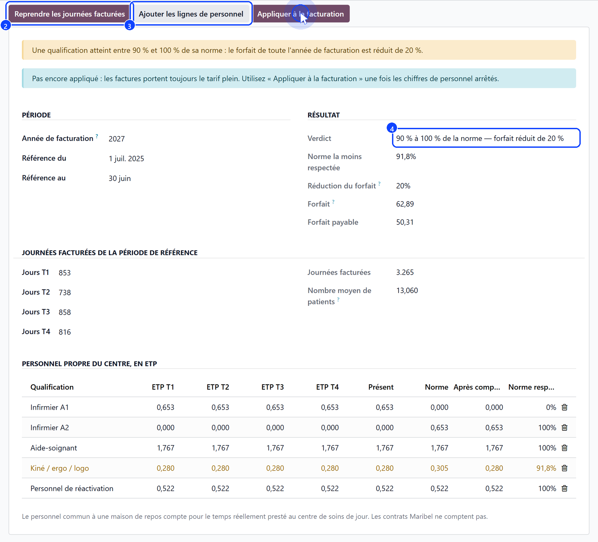

# The staffing norm

:::{rh-description}
The yearly staffing norm check of a day care centre (CSJ): billed days, staff in FTE, compensation, and the effect on the forfait.
:::

:::{rh-faq}
What does the check decide?
: Whether the centre holds the staffing norm its forfait depends on. Below it, the forfait of the whole billing year is reduced by 20 %, by 50 %, or withdrawn.

Which period does it measure?
: The four quarters from 1 July, two years before the billing year, to 30 June of the year before it.

Does computing the check change the invoices?
: No. The verdict reaches the billing only once a manager applies it: the FTE are typed by hand, and a half-filled check must not empty a year of invoices.

Some months of the year are already invoiced. What then?
: Applying the verdict lists them in the check's chatter: an invoice already posted needs a credit note, a month generated but not invoiced takes the new price once it is generated again.
:::

A day care centre is paid its forfait in full only if it employs the
**staffing norm**. Once a year, the check compares the staff actually present
with what the norm asks for the number of users, and gives the verdict for the
**whole billing year**, 1 January to 31 December.

The check is found under **Forfait → Day care staffing norm** — or under
**Billing → Day care staffing norm** when the Forfait application is not
installed. It is reserved to managers.

## 1. Open the check

Create a check for the **Billing Year**. The reference period fills itself:
1 July two years before, to 30 June of the year before — for the 2027 forfait,
1 July 2025 to 30 June 2026.

## 2. Collect the billed days

Click **Collect the billed days** (2): the four quarters, **Q1 Days** to
**Q4 Days**, are filled with the CSJ forfait days claimed from the health
insurers over the reference period — what was claimed, not what was lived.
A centre whose reference period predates Resthome types its four quarters in.

The **Average Users** is the billed days divided by **250** — a day care centre
opens some 250 days a year, not 365.

## 3. Enter the staff

Click **Add the staff rows** (3), then enter, per qualification and per
quarter, the FTE of the centre's own staff:

- **Nurse A1** and **Nurse A2**;
- **Care assistant**;
- **Physio / occupational / speech therapist**;
- **Reactivation staff**.

## 4. Read the verdict

For every 15 users, the norm asks for:

| Qualification | FTE per 15 users |
| --- | --- |
| Nurses (A1 and A2 together) | 0.75 |
| Care assistants | 2.03 |
| Physio, occupational and speech therapists | 0.35 |
| Reactivation staff | 0.60 |

A surplus in one qualification may make up a shortage in another, within
limits:

- an A1 nurse surplus fills a reactivation shortage — up to 20 % of that norm;
- an A2, then an A1 nurse surplus fills a care assistant shortage — without
  limit;
- a reactivation, then a therapist surplus fills a nurse shortage — up to
  20 % of that norm each;
- a therapist shortage is never made up.

The **Lowest Norm Held**, after compensation, decides the **Verdict** (4):

| Lowest norm held | Forfait of the billing year |
| --- | --- |
| 100 % or more | Due in full |
| From 90 % to under 100 % | Reduced by 20 % |
| From 75 % to under 90 % | Reduced by 50 % |
| Under 75 % | No forfait |

**Forfait** shows the daily forfait of the year, **Forfait Payable** what
remains of it after the **Forfait Reduction**. In the staff table, the row
that decides the verdict is highlighted, with the norm it holds.

## 5. Apply the verdict to the billing

Click **Apply to billing** and confirm: every CSJ forfait of the billing year
is then claimed at the reduced amount. Until then, the blue banner says so:
the invoices still carry the full tariff.

- The action is refused while the FTE are empty.
- A year is billed under **one** verdict: a second check cannot be applied to
  the same year.
- The chatter of the check lists the months of the year already generated:
  a posted invoice needs a **credit note**; a month generated but not invoiced
  takes the new price once it is **generated again**.

**Stop applying it** puts the full tariff back, and lists the months generated
under the reduction in the same way.

:::{warning}
Under 75 % of the norm, no forfait is claimed at all: the month produces no
forfait line — never a claim at 0.00 EUR — and the period says **Forfait
withdrawn by the sector**.
:::

## What's next

- [Billing a day care month](facturation.md) — what the verdict changes on the month.
- [Institutional allowance](../forfait/index.md) — the allowance of a rest home, computed from its own staff.
