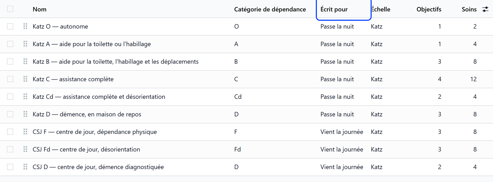
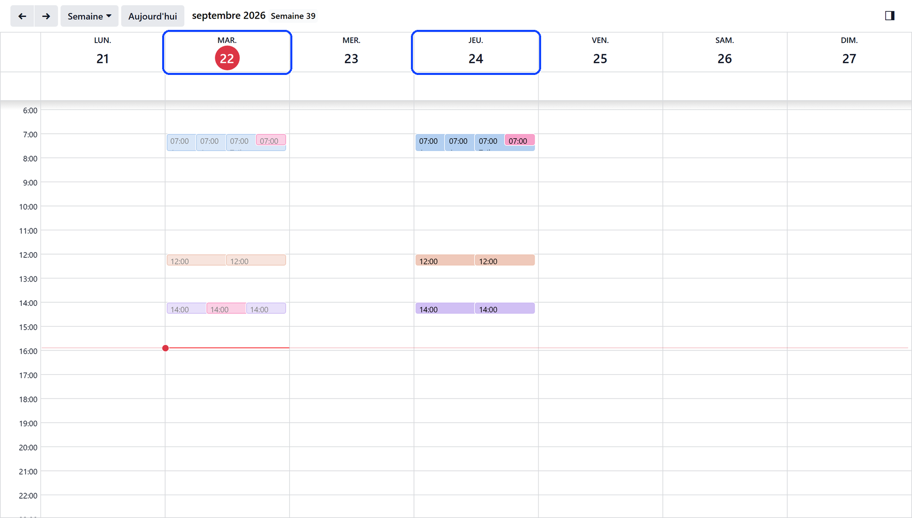

# Care for a day care user

:::{rh-description}
Care for a day care user in Resthome: care plan templates for people who come by day, tasks and medication on the days they come.
:::

:::{rh-faq}
Why does a day care user have no task today?
: Because they are not expected today — it is not one of their days — or because the register closed without them.

Which care plan templates are offered for a day care user?
: Those written for people who come by day, or for any stay, that match their CSJ category. A template written for someone who stays the night — night round included — is never offered.

A care was not given because the user did not come. Is it missed?
: No. Once the register has closed, the care of a user who did not come is cancelled, not counted as missed.

A task was due at 9:00 and the user has not been ticked in yet. Is it missed at 11:00?
: No. Until 13:00 the register may still receive the user: the task stays planned, and the check after the closure decides.
:::

A day care user is cared for like any resident — a care plan, its tasks, the
medication — but only on the days they are at the centre. Everything that
plans work reads the same answer: **is the user expected that day?**

## The care plan

On the file of a user without a plan, **Create the care plan** opens it. From
the plan, **Apply a template** adds the objectives and cares a plan of that
kind usually carries.

A template says who it is **Written for**: **Any stay**, **Stays the night** or
**Comes by day**. A day care user is offered only the templates written for
people who come by day or for any stay, that match their CSJ category —
Resthome ships one for **F**, **Fd** and **D**. See
[Care plans](../soins/plans-de-soins.md).

## Tasks on the days the user comes

Care tasks are planned only on the days the user is **expected**:

- the days ticked under **Expected on**, on the stay;
- with none ticked, every day the centre opens;
- and any day actually recorded in the register, even outside those days.

The medication follows the same days. On the other days, the plan says the
user is away and plans nothing.

## When the user does not come

- **Before 13:00**, the register is open: the care of the day stays planned,
  since the user may still arrive.
- **From 13:00**, a user expected and not ticked in did not come: the care of
  the day is **cancelled**, not counted as missed.
- A **hospitalisation** is recorded as for any resident, and pauses the care
  in the same way.

## On the phone

The care app shows the same tasks: the cares of the day, for the users who are
expected. See [Cares](../soins-mobile/soins.md).

## What's next

- [Recording attendance](presences.md) — the register that decides who is there.
- [Admitting a day care user](admission.md) — the days expected, set on the stay.
