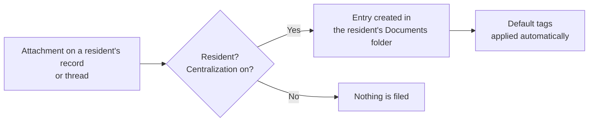

# Automatic centralization of attachments

:::{rh-description}
In a nursing home (MR/MRS), every attachment added to a resident's record or message thread is automatically filed in their Documents folder, with its tags.
:::

:::{rh-faq}
What is automatic centralization of attachments?
: Every file attached to a resident's message thread or record is automatically copied into that resident's personal folder in the Documents app, with the default tags applied. This way you find all their files in one place, with no manual filing.

Which documents are centralized, and which are not?
: Only attachments on resident records are centralized. Files added to an ordinary contact, a vendor or an employee are not: centralization applies only to people marked as residents.

Where exactly do centralized documents end up?
: In the resident's personal folder, under the "Residents" root folder of the Documents app. The "Documents" button on the resident's record opens this folder directly; its counter includes the files in the subfolders.

Are the default tags applied automatically?
: Yes. The tags chosen in "Settings > Documents" (Default tags) are applied automatically to every centralized document, which then makes searching and filtering easier. This field is optional: you can leave it empty.

Can I turn off automatic centralization?
: Yes, by unchecking the "Nursing home" block in "Settings > Documents > File centralization". Documents already filed stay in place; only future attachments are no longer centralized. The setting is enabled by default.

Who can see the centralized documents?
: Access follows that of the resident's folder: only users with rights on the Documents app can access them. Centralized documents have no individual owner; they inherit the folder's rights, which keeps the resident folder consistent.
:::

In a nursing home, a single resident accumulates dozens of files: accommodation
agreement, medical forms, health-insurance statements, GDPR consents… Without filing,
these files end up scattered across message threads. **Automatic centralization**
solves the problem: **every attachment added to a resident's record or message thread
is copied into their personal folder** in the **Documents** app, with the **default
tags** applied.

You have nothing to do: filing is **automatic** and **enabled by default**. The
configuration (activation, root folder, tags) is in **Settings > Documents > File
centralization**, **Nursing home** block.

:::{admonition} Prerequisites
:class: info

This feature relies on the **Documents** application: it is only available if
Documents is installed. The **residents root folder** and each resident's **personal
folder** are created automatically — you have nothing to prepare.
:::

## How it works

As soon as a file is attached to a resident — whether **as an attachment on a message
in the thread** or **directly on their record** — Resthome creates a corresponding
entry in the Documents app, inside that resident's folder.

Three conditions trigger the filing:

- the record is indeed that of a **resident** (a person marked as a resident);
- **centralization** is **enabled** for the facility;
- the **Documents** app is installed.

If any one is missing, the attachment simply stays attached to the message or the
record, with no copy in Documents.

:::{admonition} What is NOT centralized
:class: note

Centralization concerns **residents only**. Attachments added to an **ordinary
contact**, a **vendor** or an **employee** are not copied into the Documents app.
:::

## Where documents end up

Every centralized document is filed in the **resident's personal folder**, itself
placed under the **"Residents"** root folder. On admission (or when the resident record
is activated), this personal folder is created automatically, with three ready-to-use
subfolders:

- **Medical documents**
- **Administrative documents**
- **Billing documents**

The folder is named after the **resident** and renames itself automatically if the name
changes.

<!-- screenshot to add: a resident's personal folder in the Documents app, with its three subfolders -->

:::{admonition} The "Documents" button on the resident's record
:class: tip

On a resident's record, the **Documents** button (counter at the top of the record)
opens their folder in the Documents app **directly**. The counter includes the files
filed in the **subfolders**, not only at the folder root.
:::

## Default tags

To every centralized document, Resthome automatically applies the **default tags**
chosen for the facility (**Settings > Documents > File centralization > Default tags**).
This is what then lets you quickly **filter** and **find** documents in the Documents
app.

Resthome already provides a list of ready-to-use tags tailored to the business:

| Tag | Typical use |
|---|---|
| **Katz** | Dependency assessments |
| **End of stay** | Discharge or death documents |
| **eAgreement** | MR/MRS agreements (care convention) |
| **OA** | Statements and letters from the insurance body |
| **Convention** | Convention |
| **Medical form** | Medical forms and certificates |
| **Billing** | Statements and invoices |
| **CPAS** | CPAS coverage |
| **GDPR** | GDPR consents and documents |

:::{admonition} Start light
:class: tip

The **Default tags** are **optional**. Leave the field **empty** to start, or put a
single generic tag in it: you can always tag each document more precisely afterwards in
the Documents app.
:::

## Who can see the documents

Centralized documents **inherit the rights of the resident's folder**: only users with
access to the **Documents** app can view them. They have no individual owner, which
prevents a file from "belonging" to a single staff member and keeps the whole resident
folder consistent and manageable by the team.

:::{admonition} Segregated by facility
:class: note

In multi-company, **each facility has its own "Residents" root folder** and its own
centralization configuration. A resident's documents therefore stay segregated within
their company.
:::

## Enabling or disabling

Centralization is **enabled by default**. You control it with the **Nursing home** block
in **Settings > Documents > File centralization**:

- **checking** the block **enables** automatic filing;
- **unchecking** the block **stops** centralization of **future** attachments — documents
  already filed **stay in place**, nothing is deleted or moved.

The details of the three settings (activation, **root folder**, **default tags**) are
described on the [Document settings](../configuration/reglages-documents.md) page.

## Key takeaways

- Every attachment added to a resident's **message thread** or **record** is
  **automatically copied** into their Documents folder.
- Filing concerns **residents only** — not contacts, vendors or employees.
- The facility's **default tags** are **applied automatically** to every centralized
  document.
- The resident's **personal folder** (and its subfolders) is created automatically; the
  **Documents** button on the record opens it directly.
- Centralization is **enabled by default** and is disabled by unchecking the **Nursing
  home** block — documents already filed stay in place.
- The setting and root folder are **specific to each facility**.

## Further reading

- [Documents](index.md)
- [Document settings](../configuration/reglages-documents.md)
- [Manage a resident](../residents/gerer-un-resident.md)
