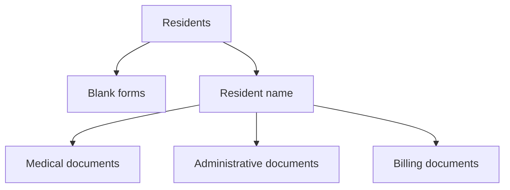

# Resident documents

:::{rh-description}
The automatic document folder for every nursing home (MR/MRS) resident: subfolders, tags, and the Documents button on the record.
:::

:::{rh-faq}
Where is a resident's document folder located?
: In Odoo's Documents app, under the "Residents" folder. The easiest way: open the resident's record and click the "Documents" button — it opens their personal folder directly.

Do I have to create the folder and subfolders myself?
: No. Resthome creates the resident's personal folder and its three subfolders (Medical, Administrative, and Billing documents) automatically, as soon as the resident is created or their resident record is activated.

What does the number shown on the "Documents" button count?
: The number of files stored in the resident's folder, subfolders included. The subfolders themselves are not counted, only the documents they contain.

Can I delete a resident folder by mistake?
: No. Automatically created folders are protected: a standard user can drop documents into them and view them, but cannot delete the folder itself.

What are tags like Katz, eAgreement, or GDPR for?
: They are ready-to-use tags for categorizing documents and finding them by filter in the Documents app. You can also apply some of them automatically through the settings ("Default tags").

Does each facility have its own folders?
: Yes. In multi-company, each facility has its own "Residents" root folder and its own "Blank forms" folder, which keeps documents separated per home.
:::

For **each resident**, Resthome maintains a **document folder** stored in Odoo's
**Documents** app. You have nothing to create or file by hand: the folder, its
subfolders, and the filing are automatic. You access it from the **Documents**
button on the resident's record, or from the **Documents → Residents** app.

:::{admonition} Prerequisite
:class: info

This feature relies on Odoo's **Documents** app: it must be installed. Once
enabled, the resident folders and tags are set up automatically — you have
nothing to prepare.
:::

## One folder per resident, created automatically

As soon as a resident is created (or as soon as their record becomes a resident
record), Resthome creates their **personal folder** under the **"Residents"**
root folder, with **three ready-to-use subfolders**:

| Subfolder | What goes in it |
|---|---|
| **Medical documents** | The resident's assessments, forms, and medical items. |
| **Administrative documents** | Convention, ID documents, agreements, letters. |
| **Billing documents** | Invoices and items related to the resident's billing. |

The folder is named after the **resident's name** and **renames itself
automatically** if the name changes. Folders are **sorted alphabetically**, which
keeps them easy to browse in the Documents app.

:::{admonition} Protected folders
:class: note

Automatically created folders are **protected from deletion**: a standard user
can drop documents into them and view them, but cannot delete the folder itself.
This keeps you from accidentally losing a resident's entire document structure.
:::

<!-- screenshot to add: a resident's folder in the Documents app showing the three subfolders Medical / Administrative / Billing documents -->

## The "Documents" button on the record

On the resident's record, a **"Documents" smart button** shows the **number of
files** stored in their folder. The counter adds up the documents in the folder
**and its subfolders** (the subfolders themselves are not counted). Clicking the
button **opens** the resident's personal folder directly in the Documents app.

:::{admonition} Only for Documents app users
:class: tip

The button only appears for users who have access to the **Documents** app.
Others still see the resident record normally, without the shortcut.
:::

<!-- screenshot to add: resident record with the "Documents" smart button and its counter in the top right -->

## Folders created at the facility level

When the company (the facility) is created, Resthome automatically sets up two
folders at the top of the Documents app:

- **Residents** — the root folder that contains all resident folders.
- **Blank forms** — a subfolder for your **templates** and documents to fill in
  (standard conventions, blank medical forms, etc.).

:::{admonition} Separated by facility
:class: note

In multi-company, **each facility has its own root folder** "Residents" and its
own "Blank forms" folder. Documents therefore stay separated from one home to
another.
:::

## Predefined tags

Resthome provides a list of ready-to-use **tags** for **categorizing** documents
and **finding them by filter** in the Documents app:

| Tag | Typical use |
|---|---|
| **Katz assessment** | Katz dependency assessment grids and reports. |
| **Medical form** | Medical forms and documents. |
| **MR/MRS agreement (eAgreement)** | Health insurer agreements (eAgreement). |
| **OA allocation** | Decisions and allocations from the insurer. |
| **Convention** | The convention signed with the resident. |
| **Billing** | Invoices and billing items. |
| **CPAS** | CPAS coverage documents. |
| **GDPR consent** | Consents and privacy-related documents. |
| **End of stay** | End-of-stay / departure documents. |

:::{admonition} Apply tags automatically
:class: tip

You can have one or more of these tags applied **automatically** to every
centralized document, through the **Default tags** field in the settings.
See [Document settings](../configuration/reglages-documents.md).
:::

## Automatic filing of attachments

Beyond the folders, Resthome can **automatically centralize** attachments dropped
on a resident's record: they land directly in their personal folder, with no
manual filing. This behavior is set in the configuration.

:::{admonition} Learn more
:class: info

The detailed behavior, use cases, and activation are described on the
[Document centralization](centralisation.md) page.
:::

## Key points to remember

- Each resident has an **automatic personal folder** with three subfolders:
  **medical**, **administrative**, **billing**.
- The folder follows the **resident's name** and renames itself; folders are
  **protected from accidental deletion**.
- The record's **"Documents" button** opens the folder and counts the files,
  subfolders included.
- At the facility level, Resthome creates the **"Residents"** and
  **"Blank forms"** folders, **separated per company**.
- Nine predefined **tags** (Katz, eAgreement, GDPR, CPAS…) make filtering easier,
  and can be applied automatically.

## Further reading

- [Document centralization](centralisation.md)
- [Managing a resident](../residents/gerer-un-resident.md)
- [Document settings](../configuration/reglages-documents.md)
- [FAQ](../faq.md) · [Glossary](../glossaire.md)
