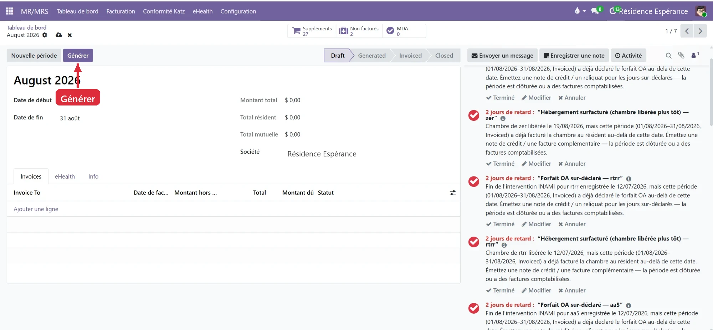
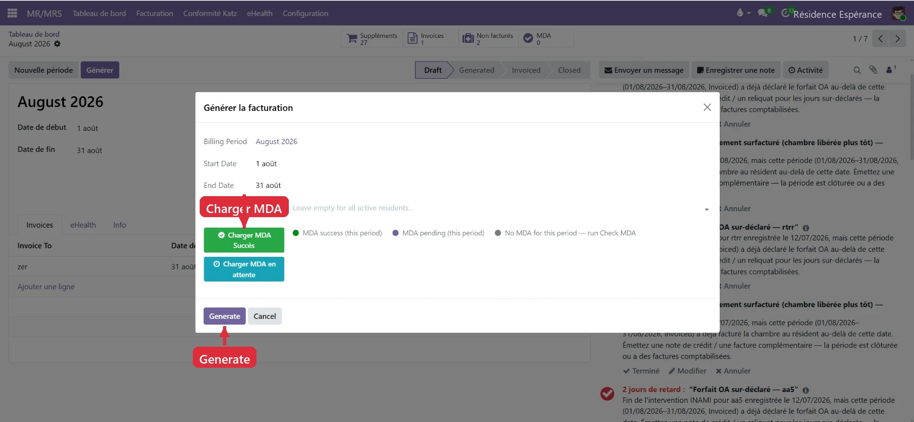
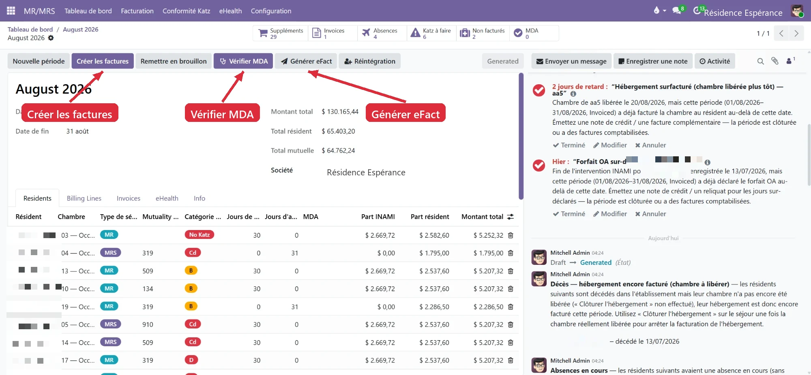

# Electronic invoicing (eFact)

:::{rh-description}
The complete eFact guide for nursing homes (MR/MRS) with Resthome: generate, check, invoice and send the INAMI allowances to the mutualities, step by step.
:::

:::{rh-faq}
I receive an acknowledgement of receipt (931000) after the eFact sending, should I wait?
: Yes. The 931000 only confirms that the insurance organisation received the batch and passed the first check — it is not the final result. There is nothing to resend: wait for the settlement (920900), which states what is accepted and paid. This can take a few days.

What does "deadline exceeded" mean on an eFact period card?
: The sending deadline of this period has passed. Send the batch without delay: beyond it, some insurance organisations may refuse it.

One eFact batch per mutuality or per union?
: One batch per union of mutualities (100 National Alliance, 300 Solidaris, 500 National Union, 600 CAAMI, 900 HR Rail…), not per small individual mutuality. Resthome does the grouping automatically.

How do I correct a rejected eFact batch?
: The rejection code and reason state the cause (insurability, allowance, dates). Fix it and resend; the Resends counter avoids duplicates and the Reintegration button lets you reintegrate lines into a new sending.

What is the difference between the acknowledgement (931000) and the settlement (920900)?
: The 931000 only confirms that the insurance organisation received your batch and passed the first check. The settlement (920900) is the final result: it states the amounts actually accepted and/or rejected. Until the settlement arrives, nothing is final — but there is nothing to resend.

What does a global rejection (920099) on an eFact batch mean?
: The whole batch was refused by the insurance organisation. The rejection code and reason give the cause (insurability, allowance, dates…). Fix it, then resend the batch; the Resends counter keeps track of retransmissions to avoid duplicates.

How do I reintegrate rejected eFact lines into a new sending?
: After fixing the cause of the rejection, use the Reintegration button: it puts the affected lines back into a new sending, without redoing the whole period.

Can I invoice a resident through eFact if their insurability (MDA) is not validated?
: No. Without valid insurability (MDA), the resident cannot be invoiced to the mutuality under third-party payment. Run Check MDA before creating the invoices and correct the resident's mutuality if needed.

Is electronic invoicing (eFact) mandatory?
: Yes. The electronic sending of the INAMI allowances is mandatory: production started in April 2026 and the final deadline to be compliant is 1 October 2026. Resthome respects the sending deadlines per period and warns you when a deadline approaches or is exceeded.

A resident leaves or dies during an already invoiced month, what happens to the eFact?
: Part of the allowance was over-invoiced. Resthome detects it during the self-check and prepares the corresponding credit note (or remainder), on the resident side and, if needed, on the mutuality side through a corrective batch.

Where do I see the status of an eFact sending and its settlement in Resthome?
: On each batch, the status (Draft, sent, acknowledged, accepted, rejected) and the invoiced / accepted / refused amounts are displayed. For an overview of all sendings of a month, open the eFact Cockpit from the period or a dashboard card: it shows at a glance what is transmitted, accepted, rejected or awaiting settlement.
:::

The **eFact** is the **electronic** sending of the **mutuality share** (the
INAMI allowance) to the **insurance organisations** (OA), through the eHealth /
MyCareNet network. Resthome builds the files, transmits them and **follows the
responses** for you — acknowledgements, settlements, acceptances and rejections.

This guide walks you through from start to finish: generate a period, check,
invoice, send the eFact and handle the returns.

:::{admonition} 2026 obligation
:class: info
Electronic invoicing of the allowances is **mandatory**. Production started in
**April 2026**; the final deadline to be compliant is **1 October 2026**.
Resthome respects the sending **deadlines** per period and alerts you when a
deadline approaches or is exceeded.
:::

## The cycle of a period, at a glance

Each billing month is a **period** that goes through four states, in order:

| State | What it means |
|------|---------------------|
| **Draft** | The period is created, nothing is computed yet. |
| **Generated** | Allowances and shares are computed, resident by resident. To be checked. |
| **Invoiced** | The invoices are posted. The eFact can be built and sent. |
| **Closed** | The period is finished and locked. |

The guiding thread: **Generate → check → Create invoices → Generate eFact →
send → follow the responses**.

## 1. The periods dashboard

Open the **MR/MRS → Dashboard** application. Each month is a card summarising
the essentials.

On each card:

- the **status** of the period (Invoiced, Generated…);
- **Invoices** (number of invoices) and **Total**;
- **Resident Part** (the share charged to the resident);
- the **eFact deadline** (e.g. "eFact: 20 Sep");
- shortcuts: **View Invoices**, **eFact** (the batches), **eFact Cockpit**.

:::{admonition} "Deadline exceeded"
:class: warning
If a card shows **eFact: deadline exceeded** in red, the sending deadline of
this period has **passed**. Send without delay — beyond it, some insurance
organisations may refuse the batch.
:::

## 2. Generate the period (Draft → Generated)

Open the month's period. In **Draft** state, one button matters: **Generate**.

A **"Generate billing"** wizard opens.

- **Billing Period / dates**: reminder of the month concerned.
- **Residents**: leave **empty for all active residents** (or target one
  resident for a specific case).
- **Load MDA**: loads the already verified insurability (MDA) — "Success" or
  "pending". The legend shows the MDA state of the period.

Click **Generate**. The period becomes **Generated**: Resthome computed, for
**each resident**, the Katz allowance, the **INAMI share** (mutuality) and the
**resident share**.

In the **Residents** tab, you find line by line:

- the **stay type** (MR / MRS) and the **room**;
- the **Katz category** (B, C, Cd, D…) or **No Katz**;
- the **presence days** and **absence days**;
- the **INAMI share**, the **resident share** and the **total amount**.

The other tabs: **Billing Lines** (the line details), **Invoices**, **eHealth**
(the exchanges) and **Info**.

## 3. Check before invoicing

This is the most important step. At the top of the period, **counters** give
the health state of the month: **Supplements**, **Absences**, **Not invoiced**,
**MDA** and **Katz to do** (missing Katz evaluations to complete).

:::{admonition} Resthome's self-check
:class: tip
After generation, Resthome combs through the period and **flags anomalies** in
the discussion thread (on the right). Each message describes the problem
**and** the action to take. The most frequent cases:

- **Room freed but still invoiced** (over-invoicing) — a resident left their
  room during the month, but the accommodation is still being invoiced. →
  Issue a **credit note** or close the accommodation.
- **Over-declared OA allowance** — the end of INAMI intervention (or a death)
  precedes the end of the period, but the allowance was declared beyond. →
  Issue a **credit note / remainder** for the over-declared days.
- **Death — accommodation still invoiced** — the resident died but the room
  has not yet been freed ("Close the accommodation").
- **Ongoing absences** — unclosed absences influence the allowance.

Handle each point (**Done** button once settled) before invoicing.
:::

**Check MDA** — the **Check MDA** button verifies the **insurability** of your
residents with the mutualities. A resident without valid coverage cannot be
invoiced under third-party payment.

## 4. Create the invoices (Generated → Invoiced)

When the checks are green, click **Create invoices**. Resthome generates and
posts:

- the **resident invoices** (share charged to the resident / the family);
- the **mutuality share**, which will feed the eFact.

The period becomes **Invoiced**. You can still **Reset to draft** as long as
you have not sent the eFact, if a correction is needed.

## 5. Generate the eFact (the batches)

Click **Generate eFact**. Resthome builds the **batches** — one electronic
file per insurance organisation — then shows the **eFact Batches** list.

:::{admonition} One batch per union of mutualities
:class: note
Sendings are grouped **per union** (the big OA families), not per small
individual mutuality: **100** (National Alliance), **300** (Solidaris),
**500** (National Union), **600** (CAAMI), **900** (HR Rail)… Resthome takes
care of the grouping.
:::

Each batch line shows:

- the **OA** and its **code**;
- the batch **reference** (e.g. `EF/2026/…`) and the billing **month**;
- the sending **deadline** and the **MDA** state;
- the batch **status** (Draft, sent, accepted, rejected…);
- the **amounts**: invoiced, accepted, refused;
- in case of refusal, the rejection **code** and **reason**.

## 6. Send and follow the responses

Once the batches are built, **send them**: the transmission goes to the
insurance organisations through the eHealth network.

The response cycle is automatic:

1. **Acknowledgement of receipt (931000)** — the OA confirms having
   **received** the batch and passed the first check. **This is normal: there
   is nothing to resend, wait for the settlement** (a few days).
2. **Notification with warnings (920098)** or **global rejection (920099)** —
   where applicable: either the batch is accepted despite minor errors, or the
   whole batch is refused (to fix and resend).
3. **Settlement (920900)** — the final result: **accepted** and/or
   **rejected** amounts. Resthome **reconciles** the responses and updates
   each batch (rejection code and reason).

:::{admonition} Handling a rejection
:class: warning
If a batch (or part of it) is **rejected**, the rejection **code** and
**reason** tell you why (insurability, allowance, dates…). Fix the cause, then
**resend**. The **Resends** counter keeps track of retransmissions to avoid
duplicates.
:::

The **Reintegration** button lets you, where applicable, reintegrate lines
(for example after correction) into a new sending.

## 7. The eFact Cockpit

From a period or a dashboard card, the **eFact Cockpit** offers a **steering
view**: the state of all batches and sendings at a glance — transmitted,
accepted, rejected, pending. It is the ideal screen to **follow a monthly
campaign** and spot what is blocking.

## 8. Credit notes and regularisations

When a resident **leaves** or **dies** during an already invoiced month, part
of the accommodation or the allowance was **over-invoiced**. Resthome detects
it (see the self-check above) and prepares the corresponding **credit note**
or **remainder**, to refund the undue period — on the resident side **and**,
if needed, on the mutuality side through a corrective batch.

## Prerequisites

:::{admonition} To check before sending
:class: warning
- **Insurability (MDA)** checked for the period.
- Correct **mutuality** on each resident.
- Invoices **posted** (period in *Invoiced* state).
- Active **eHealth certificate**.
:::

## Key points to remember

- The period always follows the order **Draft → Generated → Invoiced → Closed**.
- **Check before invoicing**: handle every self-check message.
- **Check the MDA** — no third-party payment without valid insurability.
- **One eFact batch per union** of mutualities, not per mutuality.
- Respect the sending **deadline** of each period ("deadline exceeded").
- A **rejection** is fixed then **resent** — the Resends counter avoids
  duplicates.
