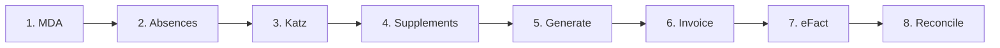

# Month-end checklist

:::{rh-description}
The complete month-end sequence in Resthome, in order: insurability, absences, Katz, supplements, generate, invoice, send eFact, reconcile payments.
:::

:::{rh-faq}
In what order should I close a billing month in Resthome?
: Check insurability (MDA), close the absences, bring the Katz assessments up to date, enter the supplements, generate the period, create the invoices, generate and send the eFact batches, then reconcile the settlements.

Why must the MDA come before generating the period?
: Because the MDA determines the health insurance fund and the insurability of each resident. Generating before it means billing the wrong insurer, and the batch comes back rejected.

What happens if I forget to close an absence?
: The allowance is computed on presence days: an open absence distorts the day count and therefore the insurer's share. The period's Absences counter shows the ones still open.

Can I still correct a month after invoicing?
: Yes, but not silently. Reset the invoice to draft or issue a credit note, then refresh. Resthome never modifies a posted invoice on its own, to prevent double invoicing.

How do I know the month is really finished?
: When every batch has been acknowledged and settled, the Cockpit's stacks are empty and the amounts to reconcile are nil.
:::

This page gathers, **in order**, everything a month-end requires. Each step
links to the page that details it.

The order is not arbitrary: each step **feeds the next**, and skipping one shows
up several steps later as a rejection that is far more costly to fix.

## Overview

## Before generating

### 1. Check insurability (MDA)

Run the **batch MDA** for the month: it confirms who is insured and, above all,
**which insurer actually responds**. A resident who changed fund without telling
you is caught here — not by a rejection three weeks later.

- Every resident must reach the **Success** status.
- Handle the **Not insured** cases: their share goes to the resident, not to the
  insurer.
- Retry the **errors** and the **no-responses**.

→ [Insurability (MDA)](../ehealth/mda.md) · [MDA errors](../ehealth/mda-erreurs.md)

:::{admonition} The single most useful step
:class: tip

Most eFact rejections come from a wrong insurer or a lost insurability. Running
the MDA at the **start** of the month, before anything else, removes that whole
class of problems.
:::

### 2. Close the absences

Every absence in the month must have its **return** filled in — or be knowingly
left open if the resident is still away.

The period's **Absences** counter shows those still open. An open absence
distorts the day count, and therefore the allowance.

→ [Absences and hospitalisations](absences.md)

### 3. Bring the Katz assessments up to date

The Katz category determines the **INAMI flat rate**. A missing or expired
assessment means a resident billed in category **O** — the lowest.

The **Katz to do** counter on the dashboard lists them.

→ [The Katz assessment](../residents/katz.md)

### 4. Enter the supplements

One-off supplements for the month (hairdresser, pedicure, drinks…) must be
entered **before** generating. Recurring supplements carry over on their own.

→ [Supplements](supplements.md) · [The Supplements app](application-supplements.md)

## Generating and invoicing

### 5. Generate the period

Open the month's period and click **Generate**. Resthome computes, for each
resident, the allowance, the accommodation and the supplements.

Read the **self-checks** shown on the right: over-declared allowance, room
freed but still billed, unclosed absence. They are there to be acted on before
invoicing, not after.

→ [Invoice a month](facturer-un-mois.md)

### 6. Create the invoices

Click **Create invoices**. The resident's share becomes an invoice; where a
split is set up, each maintenance debtor receives their portion.

→ [Maintenance debtors](split-billing.md) · [Public welfare centre (CPAS)](cpas.md)

:::{admonition} After this point, corrections have a cost
:class: warning

Once invoices are **posted**, Resthome no longer modifies them automatically. A
correction goes through a **reset to draft** or a **credit note**, then a
refresh. This is a protection against double invoicing, not an obstacle.
:::

## Sending and following up

### 7. Generate and send the eFact batches

Click **Generate eFact**: Resthome builds one batch per insurer. Check them,
then send.

→ [Electronic billing (eFact)](../ehealth/efact.md)

### 8. Follow the responses

Sending is not the end. Each batch goes through an **acknowledgement** then a
**settlement**:

- **rejected lines** — fix the cause and issue a remainder;
- **rejected batch** — a format problem, to escalate;
- **settlement** — check the amount paid against the amount accepted.

The **eFact Cockpit** gathers everything to be done into stacks: to send,
awaiting insurer, to correct, to reconcile, overdue payments.

→ [eFact rejections](../ehealth/efact-rejets.md) · [Settlements and payments](../ehealth/efact-paiements.md)

## Quick checklist

| # | Step | Done when |
|---|---|---|
| 1 | **MDA** | every resident is at Success |
| 2 | **Absences** | no unintended open absence |
| 3 | **Katz** | no "Katz to do" left |
| 4 | **Supplements** | the month's one-off entries are in |
| 5 | **Generate** | the period is Generated, self-checks handled |
| 6 | **Invoice** | the resident invoices are created |
| 7 | **eFact** | the batches are sent |
| 8 | **Follow up** | the Cockpit stacks are empty |

## The deadline not to miss

eFact batches must reach the insurer by the **20th of the following month**.
Working backwards, the MDA and the corrections should be done in the **first
week** — which leaves room to handle a rejection without missing the deadline.

## Further reading

- [Invoice a month](facturer-un-mois.md)
- [The billing journey](../parcours-facturation.md)
- [Electronic billing (eFact)](../ehealth/efact.md)
