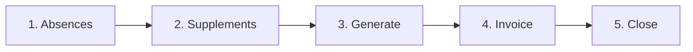

# Month-end checklist

:::{rh-description}
The complete month-end sequence in Resthome, in order: absences, supplements, generate, invoice, close the period.
:::

:::{rh-faq}
In what order should I close a billing month in Resthome?
: Close the absences, enter the supplements, generate the period, create and confirm the invoices, then close the period.

What happens if I forget to close an absence?
: Billing is computed on presence days: an open absence distorts the day count and therefore the amounts. The period's Absences counter shows the absences taken into account.

Can I still correct a month after invoicing?
: Yes, but not silently. Reset the invoice to draft or issue a credit note, then refresh. Resthome never modifies a posted invoice on its own, to prevent double invoicing.

How do I know the month is really finished?
: When no invoice is left in draft and the period is Closed.
:::

This page gathers, **in order**, everything a month-end requires. Each step
links to the page that details it.

The order is not arbitrary: each step **feeds the next**, and skipping one shows
up several steps later as a correction that is far more costly to make.

## Overview

## Before generating

:::{admonition} In Belgium
:class: rh-country rh-country-be

The month starts with a batch **insurability** check (MDA), which confirms who
is insured and which mutuality actually responds; its results are loaded when
the period is generated. See
[Billing a month in Belgium](../belgique/facturation.md).
:::

### 1. Close the absences

Every absence in the month must have its **return** filled in — or be knowingly
left open if the resident is still away.

The period's **Absences** counter shows the absences taken into account. An
open absence distorts the day count, and therefore the amounts billed.

→ [Absences and hospitalisations](absences.md)

### 2. Enter the supplements

One-off supplements for the month (hairdresser, pedicure, drinks…) must be
entered **before** generating. Recurring supplements carry over on their own.

→ [Supplements](supplements.md) · [The Supplements app](application-supplements.md)

:::{admonition} In Belgium
:class: rh-country rh-country-be

The **Katz** assessments must be up to date: a missing or expired one leaves
the resident in category O. The **Katz to do** counter lists them. See
[The Katz assessment](../belgique/katz.md).
:::

## Generating and invoicing

### 3. Generate the period

Open the month's period and click **Generate**. Resthome computes, for each
resident, the accommodation, the supplements and the medication — and the
care allowance, where the country pack bills one — and applies the absences.

Review the **Residents** and **Billing Lines** tabs, and any message Resthome
posts in the period's thread: they are there to be acted on before invoicing,
not after.

→ [Billing a month, step by step](facturer-un-mois.md)

:::{admonition} In Belgium
:class: rh-country rh-country-be

Before creating the invoices, run **Check MDA** on the generated period, then
**Generate eFact**: the batches are built from the period's lines, not from the
invoices. See [Billing a month in Belgium](../belgique/facturation.md).
:::

### 4. Create the invoices

Click **Create Invoices**, check the draft invoices, then confirm them. The
resident's share becomes an invoice; where a split is set up, each maintenance
debtor — a relative, a public welfare body — receives their portion.

→ [Split billing](../facturation-partagee/index.md)

:::{admonition} After this point, corrections have a cost
:class: warning

Once invoices are **posted**, Resthome no longer modifies them automatically. A
correction goes through a **reset to draft** or a **credit note**, then a
refresh. This is a protection against double invoicing, not an obstacle.
:::

## Closing the month

### 5. Close the period

Once no invoice is left in draft, click **Close Period**. If the button does not
show, the message under the header says what is still blocking.

:::{admonition} In Belgium
:class: rh-country rh-country-be

Before the close, the eFact batches built at step 3 — one per union — are sent
by the **20th of the following month**, then followed up — acknowledgements, settlements, rejected lines to correct and
remainders — in the **eFact Cockpit**. See
[Billing a month in Belgium](../belgique/facturation.md).
:::

## Quick checklist

| # | Step | Done when |
|---|---|---|
| 1 | **Absences** | no unintended open absence |
| 2 | **Supplements** | the month's one-off entries are in |
| 3 | **Generate** | the period is Generated, its messages handled |
| 4 | **Invoice** | the resident invoices are created and confirmed |
| 5 | **Close** | the period is Closed |

## Further reading

- [Billing a month, step by step](facturer-un-mois.md)
- [Absences and hospitalisations](absences.md)
- [Billing overview](index.md)
