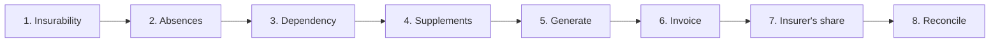

# Month-end checklist

:::{rh-description}
The complete month-end sequence in Resthome, in order: insurability, absences, dependency assessments, supplements, generate, invoice, send the insurer's share, reconcile payments.
:::

:::{rh-faq}
In what order should I close a billing month in Resthome?
: Check insurability, close the absences, bring the dependency assessments up to date, enter the supplements, generate the period, create the invoices, send the insurer's share, then reconcile the settlements.

Why must insurability be checked before generating the period?
: Because it determines the health insurer and the insurability of each resident. Generating before it means billing the wrong insurer, and the submission comes back rejected.

What happens if I forget to close an absence?
: The care allowance is computed on presence days: an open absence distorts the day count and therefore the insurer's share. The period's Absences counter shows the ones still open.

Can I still correct a month after invoicing?
: Yes, but not silently. Reset the invoice to draft or issue a credit note, then refresh. Resthome never modifies a posted invoice on its own, to prevent double invoicing.

How do I know the month is really finished?
: When every submission to the health insurers has been acknowledged and settled, and the amounts to reconcile are nil.
:::

This page gathers, **in order**, everything a month-end requires. Each step
links to the page that details it.

The order is not arbitrary: each step **feeds the next**, and skipping one shows
up several steps later as a rejection that is far more costly to fix.

:::{admonition} In Belgium
:class: rh-country rh-country-be

The checklist runs on the eHealth side: batch MDA, Katz assessments, eFact
batches sent by the 20th of the following month, and the eFact Cockpit. See
[Billing a month in Belgium](../belgique/facturation.md).
:::

## Overview

## Before generating

### 1. Check insurability

Check, for the whole month, who is insured and, above all, **which health
insurer actually responds**. A resident who changed insurer without telling you
is caught here — not by a rejection three weeks later.

- Every resident must be confirmed as insured.
- Handle the residents who are **not insured**: their share goes to the
  resident, not to the insurer.
- Retry the checks that ended in an error or without a response.

:::{admonition} The single most useful step
:class: tip

Most rejections by the health insurers come from a wrong insurer or a lost
insurability. Checking insurability at the **start** of the month, before
anything else, removes that whole class of problems.
:::

### 2. Close the absences

Every absence in the month must have its **return** filled in — or be knowingly
left open if the resident is still away.

The period's **Absences** counter shows those still open. An open absence
distorts the day count, and therefore the care allowance.

→ [Absences and hospitalisations](absences.md)

### 3. Bring the dependency assessments up to date

The dependency category is declared to the health insurer with the care
allowance. A missing or expired assessment leaves the resident in the default
category, and the billing no longer matches the resident's profile.

A counter on the dashboard lists the assessments still to do.

### 4. Enter the supplements

One-off supplements for the month (hairdresser, pedicure, drinks…) must be
entered **before** generating. Recurring supplements carry over on their own.

→ [Supplements](supplements.md) · [The Supplements app](application-supplements.md)

## Generating and invoicing

### 5. Generate the period

Open the month's period and click **Generate**. Resthome computes, for each
resident, the care allowance, the accommodation and the supplements.

Read the **self-checks** shown on the right: over-declared allowance, room
freed but still billed, unclosed absence. They are there to be acted on before
invoicing, not after.

→ [Billing a month, step by step](facturer-un-mois.md)

### 6. Create the invoices

Click **Create invoices**. The resident's share becomes an invoice; where a
split is set up, each maintenance debtor — a relative, a public welfare body —
receives their portion.

→ [Split billing](../facturation-partagee/index.md)

:::{admonition} After this point, corrections have a cost
:class: warning

Once invoices are **posted**, Resthome no longer modifies them automatically. A
correction goes through a **reset to draft** or a **credit note**, then a
refresh. This is a protection against double invoicing, not an obstacle.
:::

## Sending and following up

### 7. Send the insurer's share

Resthome prepares the insurer's share, one submission per health insurer —
through the electronic exchanges with the health insurer, where the country has
them. Check the submissions, then send.

### 8. Follow the responses

Sending is not the end. Each submission goes through an **acknowledgement** then
a **settlement**:

- **rejected lines** — fix the cause and issue a remainder;
- **rejected submission** — a format problem, to escalate;
- **settlement** — check the amount paid against the amount accepted.

## Quick checklist

| # | Step | Done when |
|---|---|---|
| 1 | **Insurability** | every resident is confirmed as insured |
| 2 | **Absences** | no unintended open absence |
| 3 | **Dependency** | no assessment left to do |
| 4 | **Supplements** | the month's one-off entries are in |
| 5 | **Generate** | the period is Generated, self-checks handled |
| 6 | **Invoice** | the resident invoices are created |
| 7 | **Insurer's share** | the submissions are sent |
| 8 | **Follow up** | every submission is settled and reconciled |

## The deadline not to miss

Health insurers usually set a deadline for receiving the month's billing. Working
backwards, the insurability check and the corrections should be done in the
**first week** — which leaves room to handle a rejection without missing the
deadline.

## Further reading

- [Billing a month, step by step](facturer-un-mois.md)
- [Absences and hospitalisations](absences.md)
- [Billing overview](index.md)
