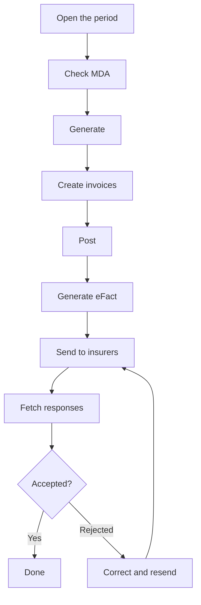

# Billing a month, step by step

:::{rh-description}
Billing a month in a nursing home (MR/MRS) with Resthome, step by step — from the period to the eFact submission of the INAMI packages to the insurer, where to click.
:::

:::{rh-faq}
How do I bill a month in Resthome?
: Open the month's period, generate, review (MDA, Katz, anomalies), create the invoices (resident's share and insurer's share), post them, then generate and send the eFact to the insurers.

In what order should I bill?
: Always: Generate → review → Create invoices → post → Generate eFact → send → track the responses. Check insurability (MDA) before billing.

Can I make corrections after billing?
: As long as the eFact has not been sent, you can set the period back to draft. After sending, correct via a credit note or a corrective batch.
:::

This guide walks you **from start to finish** through a billing month: open the
period, check insurability, generate the invoices, post them, then **send the
insurer's share via eFact** and track the responses. Follow it with Resthome open
alongside: each step tells you **where to click**.

:::{admonition} The idea in two parts
:class: tip

Each month is billed in **two flows**:

- the **resident's share** — accommodation, supplements and supplement agreements,
  care services, medication, adjusted for absences → standard invoices;
- the **insurer's share** (INAMI package) → **eFact** submission to the insurers.

Resthome runs them in parallel on a single **period**.
:::

## Step 1 — Open the month's period

1. Main menu → **MR/MRS** app.
2. **Billing → Billing periods**.
3. Open the month's period, or create it with **New period**.

The period lists the residents concerned and its **status** at the top (Draft →
Generated → Invoiced → Closed).

## Step 2 — Check insurability (MDA)

Before billing the insurer, check that everyone is **in order**:

1. On the period, click **Check MDA** (batch check).
2. Wait for the responses; fix the flagged cases (wrong insurer, loss of
   insurability).

This is the step that avoids rejections later. Details: [Insurability
(MDA)](../ehealth/mda.md).

## Step 3 — Generate the billing lines

1. Click **Generate**.
2. For each resident, Resthome computes: **accommodation**, **package** (on the days
   present), **supplements** and **supplement agreements**, **care services**,
   **medication**, and applies the **absences**.

:::{admonition} Advance billing
:class: note

Accommodation is billed **one month in advance**; the package and supplements for
the month served. See [Overview](index.md).
:::

## Step 4 — Create the invoices (resident's share)

1. Click **Create invoices**.
2. The **draft** invoices for the resident's share are generated.
3. Check them, then **Post** them.

:::{admonition} A posted invoice "freezes" the month
:class: warning

Once **posted**, a resident's invoice is locked for that month (protection). To
correct it: set it back to **draft** or issue a **credit note**, then **Refresh**.
Other residents are not affected.
:::

## Step 5 — Generate the eFact (insurer's share)

Once the invoices are posted:

1. On the period, click **Generate eFact**.
2. Resthome builds the eFact **batches**, **grouped by union** of insurers.

## Step 6 — Send to the insurers

1. Open **eHealth → eFact → Cockpit** (or the batches).
2. Click **Send all** (or send batch by batch).
3. The submissions go out to the insurers via the eHealth network.

## Step 7 — Track the responses

1. Click **Fetch responses** to bring back the acknowledgements and settlements.
2. Each batch moves through **Sent → Acknowledged → Accepted / Rejected**.
3. In case of a **rejection**, fix the cause (insurability, dates, amounts) and
   **resend**.

Details and advanced buttons: [Electronic billing (eFact)](../ehealth/efact.md).

## Process recap

## Going further

- [Insurability (MDA)](../ehealth/mda.md)
- [Electronic billing (eFact)](../ehealth/efact.md)
- [Absences and hospitalisations](absences.md)
- [Agreements (eAgreement)](../ehealth/eagreement.md)
