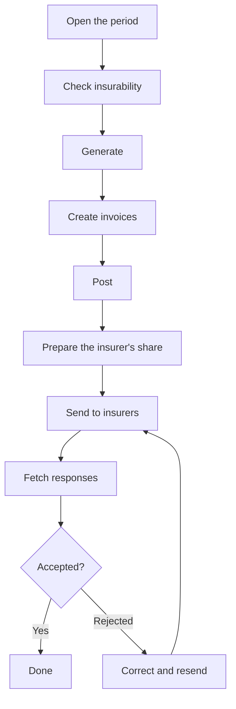

# Billing a month, step by step

:::{rh-description}
Billing a month in a care home with Resthome, step by step: from the period to sending the insurer's share to the health insurers.
:::

:::{rh-faq}
How do I bill a month in Resthome?
: Open the month's period, check insurability, generate, review (insurability, dependency assessments, anomalies), create the invoices, post them, then send the insurer's share to the health insurers and track the responses.

In what order should I bill?
: Always: check insurability → Generate → review → Create invoices → post → send the insurer's share → track the responses.

Can I make corrections after billing?
: Yes. Set the resident's invoice back to draft or issue a credit note, then refresh. Once the insurer's share has been sent, it is corrected on the insurer's side as well.
:::

This guide walks you **from start to finish** through a billing month: open the
period, check insurability, generate the invoices, post them, then **send the
insurer's share** and track the responses. Follow it with Resthome open
alongside: each step tells you **where to click**.

:::{admonition} The idea in two parts
:class: tip

Each month is billed in **two flows**:

- the **resident's share** — accommodation, supplements and supplement agreements,
  care services, medication, adjusted for absences → standard invoices;
- the **insurer's share** (the care allowance paid by the health insurer) → sent
  to the health insurers, through the electronic exchanges with the health
  insurer where the country has them.

Resthome runs them in parallel on a single **period**.
:::

:::{admonition} In Belgium
:class: rh-country rh-country-be

The insurer's share is the INAMI
allowance, sent through eFact after a **Check MDA**; each step below has its
eHealth counterpart. See
[Billing a month in Belgium](../belgique/facturation.md).
:::

## Step 1 — Open the month's period

1. Main menu → **Nursing Home**.
2. **Billing → Facturation → Billing Periods**.
3. Open the month's period, or create it with **New period**.

The period lists the residents concerned and its **status** at the top (Draft →
Generated → Invoiced → Closed).

## Step 2 — Check insurability

Before billing the insurer, check that everyone is **in order**: each resident
must be insured, with the health insurer you are about to bill.

1. On the period, run the insurability check for all residents at once.
2. Wait for the responses; fix the flagged cases (wrong insurer, loss of
   insurability).

This is the step that avoids rejections later.

## Step 3 — Generate the billing lines

1. Click **Generate**.
2. For each resident, Resthome computes: **accommodation**, **care allowance**
   (on the days present), **supplements** and **supplement agreements**, **care
   services**, **medication**, and applies the **absences**.

:::{admonition} Advance billing
:class: note

Accommodation is billed **one month in advance**; the care allowance and
supplements for the month served. See [Overview](index.md).
:::

## Step 4 — Create the invoices (resident's share)

1. Click **Create invoices**.
2. The **draft** invoices for the resident's share are generated.
3. Check them, then **Post** them.

:::{admonition} A posted invoice "freezes" the month
:class: warning

Once **posted**, a resident's invoice is locked for that month (protection). To
correct it: set it back to **draft** or issue a **credit note**, then **Refresh**.
Other residents are not affected.
:::

## Step 5 — Send the insurer's share

Once the invoices are posted, Resthome prepares the insurer's share, **grouped
by health insurer**, and sends it — through the electronic exchanges with the
health insurer, where the country has them.

## Step 6 — Track the responses

1. Bring back the acknowledgements and settlements of the health insurers.
2. Each submission moves from **sent** to **acknowledged**, then **accepted** or
   **rejected**.
3. In case of a **rejection**, fix the cause (insurability, dates, amounts) and
   **resend**.

## Process recap

```mermaid
graph TD
  A[Open the period] --> B[Check insurability]
  B --> C[Generate]
  C --> D[Create invoices]
  D --> E[Post]
  E --> F[Prepare the insurer's share]
  F --> G[Send to insurers]
  G --> H[Fetch responses]
  H --> I{Accepted?}
  I -->|Yes| J[Done]
  I -->|Rejected| K[Correct and resend]
  K --> G
```

## Going further

- [Month-end checklist](checklist-fin-de-mois.md)
- [Absences and hospitalisations](absences.md)
- [Departure and death](depart-deces.md)
- [Split billing](../facturation-partagee/index.md)
