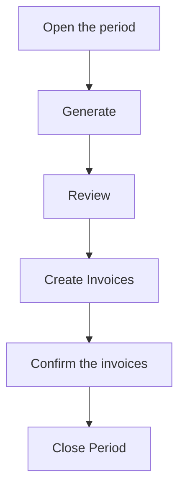

# Billing a month, step by step

:::{rh-description}
Billing a month in a care home with Resthome, step by step: from opening the period to closing it once the invoices are confirmed.
:::

:::{rh-faq}
How do I bill a month in Resthome?
: Open the month's period, click Generate, review the result, click Create Invoices, check and confirm the invoices, then close the period.

In what order should I bill?
: Always: Generate → review → Create Invoices → confirm the invoices → Close Period. On the period, the next step is always the leftmost button, highlighted.

Can I make corrections after billing?
: Yes. Set the resident's invoice back to draft or issue a credit note, then refresh. Other residents are not affected.
:::

This guide walks you **from start to finish** through a billing month: open the
period, generate the billing, create and confirm the invoices, then close the
month. Follow it with Resthome open alongside: each step tells you **where to
click**.

:::{admonition} The idea in two parts
:class: tip

Each month can be billed in **two flows**:

- the **resident's share** — accommodation, supplements and supplement
  agreements, care services, medication, adjusted for absences → standard
  invoices, the subject of this page;
- the **insurer's share** (the care allowance paid by the health insurer), where
  the country pack bills one → sent to the health insurers according to the
  country's rules.

Resthome runs them in parallel on a single **period**.
:::

:::{admonition} In Belgium
:class: rh-country rh-country-be

The insurer's share is the INAMI allowance: between **Generate** and **Create
Invoices**, the period adds a **Check MDA** step (insurability) and a
**Generate eFact** step; the batches are then sent and followed up in the eFact
Cockpit before the close. See
[Billing a month in Belgium](../belgique/facturation.md).
:::

## Step 1 — Open the month's period

1. Main menu → **Nursing Home**.
2. **Billing → Facturation → Billing Periods**.
3. Open the month's period, or create it with **New**.

The period shows its **status** at the top (Draft → Generated → Invoiced →
Closed). The button for the next step is always the **leftmost** one,
highlighted.

## Step 2 — Generate the billing lines

1. Click **Generate**. The **Generate Billing** window opens.
2. Leave **Residents** empty to bill all active residents (or pick one
   resident for a specific case), then click **Generate**.
3. For each resident, Resthome computes the **accommodation**, the
   **supplements** and **supplement agreements**, the **care services** and the
   **medication**, applies the **absences**, and adds the **care allowance**
   where the country pack bills one.

The period becomes **Generated**.

:::{admonition} Advance billing
:class: note

Accommodation is billed **one month in advance**; the care allowance and
supplements for the month served. See [Overview](index.md).
:::

## Step 3 — Review the result

Before invoicing, read what was generated:

- the **Residents** tab — one row per resident, with the room, the stay type,
  the presence and absence days and the amounts;
- the **Billing Lines** tab — the detail, line by line;
- the counters at the top of the period — **Absences** (the absences that
  reduced the presence days) and **Unbilled** (the residents absent for the
  whole month, not billed at all).

A mistake is cheaper to fix now: correct the source (stay, absence,
supplement), then run **Refresh** from the gear menu of the period.

:::{admonition} In Belgium
:class: rh-country rh-country-be

Before creating the invoices, the period asks for two more steps: **Check MDA**
(the insurability of the residents; **Retry Failed MDA** for the requests that
failed), then **Generate eFact**, which builds one batch per union of
mutualities from the period's lines. See
[Billing a month in Belgium](../belgique/facturation.md).
:::

## Step 4 — Create the invoices (resident's share)

1. Click **Create Invoices**.
2. The **draft** invoices for the resident's share are generated, in the
   **Invoices** tab.
3. Check them, then **Confirm** them.

The period becomes **Invoiced**.

:::{admonition} A confirmed invoice "freezes" the month
:class: warning

Once **posted**, a resident's invoice is locked for that month (protection). To
correct it: set it back to **draft** or issue a **credit note**, then **Refresh**.
Other residents are not affected.
:::

:::{admonition} In Belgium
:class: rh-country rh-country-be

The eFact batches built before the invoices are then sent to the mutualities,
and their acknowledgements, settlements and rejections followed up; the period
closes only once every batch has reached a final outcome. See
[Billing a month in Belgium](../belgique/facturation.md) and
[Electronic invoicing (eFact)](../belgique/ehealth/efact.md).
:::

## Step 5 — Close the period

Once no invoice is left in draft, click **Close Period**. The month is locked.

If the button does not show, a message under the header says what is still
blocking the close. A closed period can be reopened with **Reopen**.

## Process recap

```mermaid
graph TD
  A[Open the period] --> B[Generate]
  B --> C[Review]
  C --> D[Create Invoices]
  D --> E[Confirm the invoices]
  E --> F[Close Period]
```

## Going further

- [Month-end checklist](checklist-fin-de-mois.md)
- [Absences and hospitalisations](absences.md)
- [Departure and death](depart-deces.md)
- [Split billing](../facturation-partagee/index.md)
