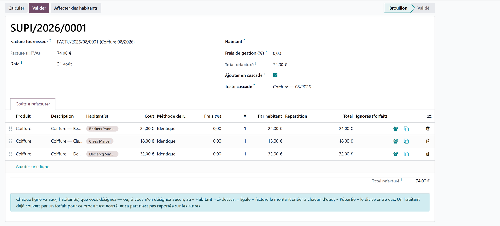

# Recharging a vendor bill

:::{rh-description}
Pass a supplier's bill on to the residents it concerns: doctor co-payments, hairdresser or chiropody statements become one supplement per resident.
:::

:::{rh-faq}
What is a vendor-bill recharge?
: An intermediate document that picks up the lines of a bill the home has paid, lets you say which resident each line is for, and writes one supplement on each resident's envelope. The link back to the source bill is kept.

Which bills can be recharged?
: Any posted supplier bill carrying at least one line whose product is flagged "Rechargeable to residents" — or a line typed without any product, which is the common case for a hairdresser's statement.

How do I charge the same amount to several residents, or split it between them?
: Each line carries a split method. "Equal" charges the full amount to every resident named on the line; "Spread" divides it between them, to the cent.

What happens to a resident already covered by a flat-rate agreement?
: They are left out and shown in the "Skipped" column. Their share is not passed on to the other residents.

Can I cancel a recharge?
: Yes, as long as no supplement it created has reached a resident invoice. Cancelling withdraws the lines from the envelopes.
:::

The home pays **one** bill — the doctor's co-payment summary, the hairdresser's
or the chiropodist's monthly statement — and then has to pass each line on to
the resident it concerns. The **Vendor-bill recharges** screen does it in one
document: the bill's lines come in on their own, you say who each one is for,
and validation writes one supplement on each resident's envelope.

:::{admonition} Where the charges land
:class: info

A recharge writes on the resident's **supplement envelope**, the same one
described in [Supplements](supplements.md). From the billing period onwards,
a recharged supplement behaves exactly like one keyed by hand.
:::

## Before you start

The bill must be **posted**: a draft bill can still change under the residents'
supplements, so Resthome refuses it.

The products you buy and pass on carry a flag in their record, **Rechargeable
to residents**. It is what makes the button appear on the bill. Set it on the
hairdressing, chiropody or doctor-fee products of your catalog.

:::{admonition} A bill line with no product
:class: tip

A statement typed as a plain "Hairdresser, March" line, with no product at all,
is picked up too — you then point it at the right supplement product inside the
recharge. Validation requires that product: the flat-rate agreements are keyed
on it.
:::

## 1. Start the recharge from the bill

Open the supplier bill in **Accounting → Vendor bills** and click **Recharge to
residents**. Resthome creates the recharge, pre-filled with one line per
eligible bill line — product, wording and untaxed amount — and opens it.

A **smart button** on the bill leads to the recharges it produced, and one on
the recharge leads back to the bill: an amount on a family's invoice can always
be traced back to the supplier document that justifies it.

:::{admonition} Starting from the app instead
:class: note

The **Supplements → Vendor-bill recharges** menu does the same: create a
recharge, pick the bill, and its lines come in.
:::

## 2. Say who each line is for

On each line, name the **resident(s)** and choose how the amount is split.

| Column | What it does |
|---|---|
| **Resident(s)** | Who this line is charged to. Left empty, the line goes to the **Resident** named at the top of the recharge |
| **Split method** | **Equal**: each resident is charged the full amount — the doctor co-payment case, where the line already states one resident's share. **Spread**: the amount is divided between them — a 100 € outing for five residents |
| **Fee (%)** | Optional surcharge, 0 by default. A home that passes costs on at actual cost leaves it alone |
| **Per resident**, **Split**, **Total** | What each resident actually pays. When they do not all pay the same, the **Split** column spells the division out |
| **Skipped** | The residents a flat-rate agreement takes out |

The **Assign residents** button opens a picker where several residents are
ticked at once and applied to one line, to the lines you selected, or to the
whole recharge — the answer to a thirty-line statement.

Use **Duplicate this line** when one bill line covers several residents with
different amounts.

:::{admonition} Rounding never loses a cent
:class: note

With **Spread**, 100 € over three residents gives 33,34 + 33,33 + 33,33. The
remainder always goes to the first resident, so the shares add back up to the
line total.
:::

## 3. Add lines in cascade

A hairdresser's statement is one line per resident, all worded the same. Tick
**Add in cascade** and fill in the **Cascade text**: every line you then add
opens with that wording and with the **next resident of the house**, in
alphabetical order.

Adding a line then comes down to keying the amount.

- Residents are served **in alphabetical order**, A to Z, and only those
  currently present.
- The lines that came from the bill are **never** rewritten, so you can tick
  the box halfway through a document.
- A wording or a resident you have already keyed is left alone.

## 4. Check, then validate

**Compute** is a dry run: it refreshes what each resident would be charged and
tells you the total and the residents a flat-rate agreement leaves out. Nothing
is written yet.

**Validate** writes one supplement on each resident's open envelope. Resthome
refuses first — before writing anything — when:

- a line carries no supplement product (unless the home has set a fallback, see
  below);
- a resident has already been charged for the same bill line by another
  recharge;
- a resident's envelope cannot be reached, because their month is already
  invoiced or they have no stay. All of them are listed at once, with the
  reason for each.

:::{admonition} A resident on a flat rate is never charged twice
:class: warning

If a resident is covered by an active **supplement convention** for the same
product, they are left out of the charge and appear in the **Skipped** column.
Their share is **not** passed on to the others: a flat rate must never make the
neighbours pay more.
:::

## Cancelling a recharge

**Cancel** withdraws from the residents' envelopes the supplements the recharge
created. It refuses as soon as one of them sits on a resident invoice — a draft
invoice included, since that is the normal state between the generation of a
period and its invoicing. Delete that draft invoice, or issue a credit note,
and cancel afterwards.

A cancelled recharge can be **reset to draft** and used again.

## A supplier credit note

A supplier **credit note** is recharged exactly the same way, and gives the
money back: the residents are **credited** on their envelope instead of being
charged a second time. The recharge says so in a banner.

## Settings — "Other supplement"

Lines that name no supplement product stop the validation. A home that prefers
them to go through anyway designates a fallback product in **Supplements →
Configuration → Settings**, under **Other supplement**: those lines are charged
under it, and a note in the discussion thread lists them.

Left empty — the default — the recharge stops and names the lines to fix, which
is the safer behaviour for a home that has not decided.

## Key points to remember

- One posted bill, one recharge, one supplement per resident — with the link
  back to the source bill kept in both directions.
- **Equal** charges the full amount to each resident; **Spread** divides it.
- **Add in cascade** pre-fills each new line with a common wording and the next
  resident, in alphabetical order.
- A resident covered by a **flat-rate agreement** is skipped, visibly, and the
  others pay no more for it.
- Cancelling is possible right up to the moment an invoice carries the
  supplement.

## Further reading

- [Supplements](supplements.md)
- [The Supplements app](application-supplements.md)
- [Billing a month, step by step](facturer-un-mois.md)
- [Billing overview](index.md)
