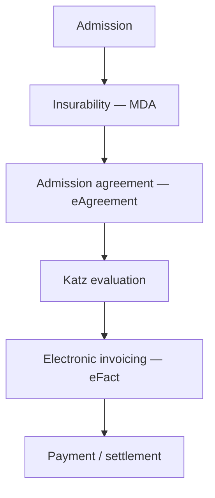

# The billing journey

:::{rh-description}
From admission to payment: the complete billing journey of a nursing home resident with Resthome (MDA, eAgreement, Katz, eFact).
:::

From **admission** to **payment**, a correct invoice always follows the same
steps. This page connects the whole journey; each step links to its detailed
page.



```text
Admission ─► MDA ─► eAgreement ─► Katz ─► eFact ─► Payment
```

1. **Admission** — Create the resident's file and open their stay.
2. **Insurability (MDA)** — Check the insurability and the exact mutuality with
   MyCareNet / WalCareNet.
3. **Admission agreement (eAgreement)** — The care notification (Annex 7) is
   prepared for the mutuality.
4. **Katz evaluation** — Score the dependency: the Katz category is declared to
   the mutuality for the INAMI allowance.
5. **Electronic invoicing (eFact)** — Generate the period, create the invoices
   and send the mutuality share to the insurance organisations.
   → [Electronic invoicing (eFact)](ehealth/efact.md)
6. **Payment / settlement** — The resident share is invoiced, the mutuality
   share is followed up to the insurer's settlement (acknowledgement,
   acceptance, rejection).

:::{admonition} In practice
:class: tip
**Insurability (MDA)** at the start of the month and a **validated Katz
evaluation** are the two prerequisites that avoid most eFact rejections. Handle
them before generating the invoices.
:::
