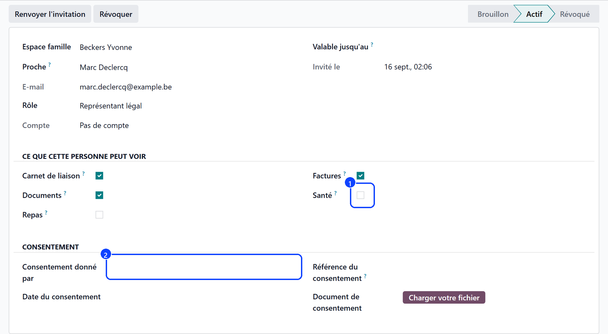

# Granting an access

:::{rh-description}
Granting, inviting and revoking a family portal access in Resthome: role, scopes, consent for health data, validity date and account status.
:::

:::{rh-faq}
How does a relative get their login?
: Their e-mail address becomes their login. **Invite** creates the portal account and sends them the invitation.

Can I delete an access?
: Not while it is active. Revoke it first: the date it was taken back is part of the record.

What happens when the validity date passes?
: The access revokes itself the day after, automatically.
:::

Accesses live in **Family Portal → Accesses**. You can also grant one directly
from the **resident's record**, which shows the accesses in progress and the
link to the family space.

## 1. Create the access

1. Choose the **resident** and the **relative**.
2. Set the **role**: **Relative**, **Trusted Person** or **Legal
   Representative**.
3. Tick what this person may see, under **What This Person May See**:
   **Liaison Notebook**, **Documents**, **Meals**, **Invoices**, **Health**.
4. Fill in **Valid Until** if the access is temporary.

Creating an access also adds the person to the resident's **family contacts** —
one gesture instead of two.

## 2. Record the consent, for health data

The **Consent** group asks for:

- **Consent Given By** — **the resident** or **the legal representative**;
- **Consent Date**;
- **Consent Reference** and, if you have it, the **signed document**.

It is required as soon as **Health** is ticked: without it, Resthome refuses to
save.

## 3. Invite

Click **Invite**. Resthome creates the portal account (login = the e-mail
address), subscribes the person to the liaison notebook and sends them the
invitation. **Send Invitation Again** sends it a second time.

The invitation is refused when:

- the relative has **no e-mail address**;
- the **Valid Until** date has already passed;
- the address is already the login of another user.

The **Account** field then follows the person: **No account**, **Invited, never
signed in**, **Signed in**.

## 4. Revoke

**Revoke** closes the access: the person no longer sees anything about the
resident, and is unsubscribed from the notebook. The date is kept.

:::{admonition} The account is not deleted
:class: note

Revoking an access does not disable the person's account: they may hold
accesses to other residents, or their own invoices.
:::

## Who may do what

- Care staff **read** the accesses.
- The **administrative team** and **managers** create, invite and revoke.
- Only **management** may delete.

In other words, a nurse can write in the notebook without being able to open an
access to anybody.

## What's next

- [Notebook, documents and invoices](carnet-documents.md)
- [What the relative sees](cote-famille.md)
