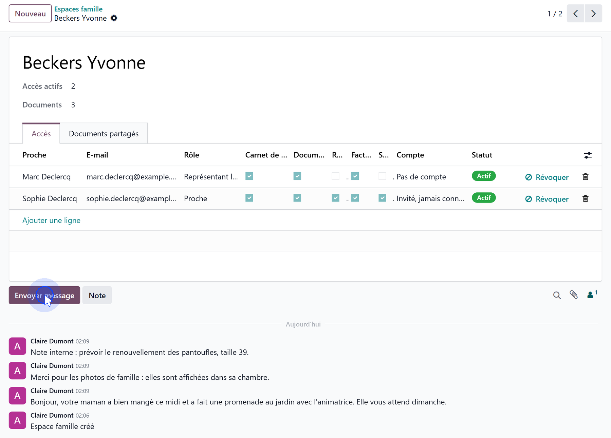
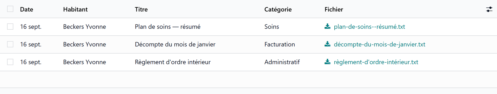

# Notebook, documents and invoices

:::{rh-description}
Writing in the liaison notebook and sharing documents with the family in Resthome: message or internal note, document category, and the invoices visible to the family.
:::

:::{rh-faq}
How do I write to the family?
: In the resident's family space, post a message in the discussion thread. It reaches the relatives subscribed to the notebook.

How do I note something for the team only?
: Post an internal note instead. It stays with the team and is never shown on the portal.

Which switch reveals a document?
: Its category: administrative and other documents follow **Documents**, a billing document follows **Invoices**, a care document follows **Health** — and therefore consent.
:::

## The liaison notebook

The resident's **family space** carries the notebook. It is the discussion
thread of that space:

- a **message** reaches the relatives who hold the **Liaison Notebook** scope,
  and appears on their portal;
- an **internal note** stays with the team.

Relatives can **answer**: their reply comes back into the same thread, and the
team reads it there.

## Shared documents

Documents are added to the family space, in the **Shared Documents** tab: a
**date**, a **title**, a **category**, the **file**, and a **note for the
family**.

The category decides who sees the document:

| Category | Shown to a relative who has |
| --- | --- |
| **Administrative**, **Other** | **Documents** |
| **Billing** | **Invoices** |
| **Care** | **Health** — and therefore a recorded consent |

## Invoices

A relative with the **Invoices** scope sees the resident's **posted** invoices:
number, date, due date, amount and status — **Paid**, **Partially paid** or
**To pay** — and can download the PDF.

:::{admonition} A debtor's own invoices
:class: note

A relative who pays a share under [split billing](../facturation-partagee/index.md)
receives **their own** invoices, which they find in their portal as any customer
would. That does not depend on the family portal.
:::

## What's next

- [Granting an access](acces.md)
- [What the relative sees](cote-famille.md)
