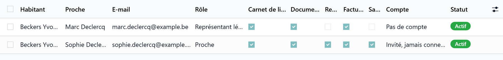

# Family portal

:::{rh-description}
The Resthome family portal: an access granted per resident and per scope, a liaison notebook, documents, invoices and a health summary for relatives.
:::

:::{rh-faq}
Is being a family contact enough to see the portal?
: No. Being in the resident's contacts and having an access are two different things. What opens the portal is an **access**, granted scope by scope.

What can a relative see?
: Only what is ticked on their access: liaison notebook, documents, meals, invoices, health. Nothing else of the record.

Can a relative answer the team?
: Yes. The liaison notebook works both ways: a relative who can read it can reply, and the team reads the reply.
:::

:::{toctree}
:hidden:

acces
carnet-documents
cote-famille
:::

The **family portal** gives relatives a window onto the resident's stay: what
the team writes day to day, the documents handed over, the invoices, and — if
the family has consented — a summary of the care.

## Two ideas to keep apart

- **Family contact** — a name and a phone number in the resident's record. It
  opens nothing.
- **Access** — the authorisation itself, granted to one person for one resident,
  with what they may see. This is what opens the portal.

A relative may hold accesses to **several residents** (both parents, for
example); each one is granted separately.

## What the access opens, scope by scope

| Scope | What it shows |
| --- | --- |
| **Liaison Notebook** | What the team writes, and the family's replies |
| **Documents** | The documents handed over to the family |
| **Meals** | The menus and how the meals went |
| **Invoices** | The resident's posted invoices, and their PDF |
| **Health** | A care summary — **requires a recorded consent** |

The first three are ticked by default; invoices and health are not.

:::{admonition} Health is never opened without consent
:class: warning

Ticking **Health** requires recording **who gave the consent** and **when**.
Resthome refuses the access otherwise. Every reading of the health panel is
logged.
:::

## The resident's family space

Each resident has a **family space**, created the first time it is needed. Its
discussion thread **is** the liaison notebook: what the team posts there is what
the family reads.

## What's next

- [Granting an access](acces.md) — invitation, scopes, consent, revocation.
- [Notebook, documents and invoices](carnet-documents.md) — what the team publishes.
- [What the relative sees](cote-famille.md) — a tour of the portal pages.
