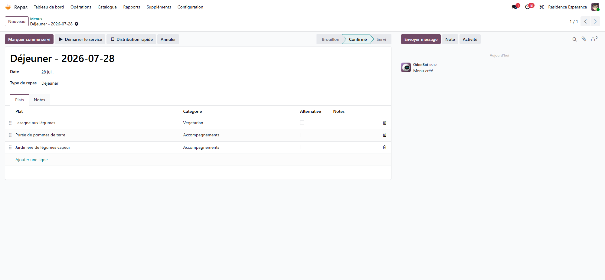
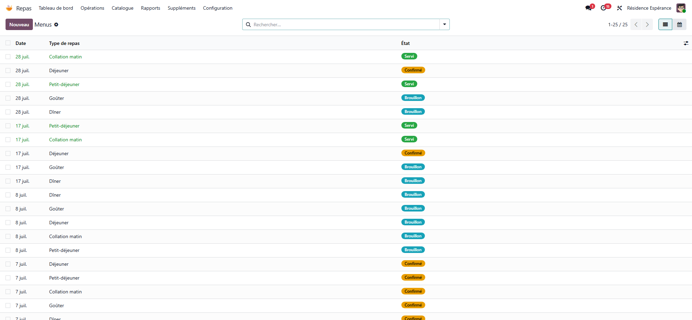
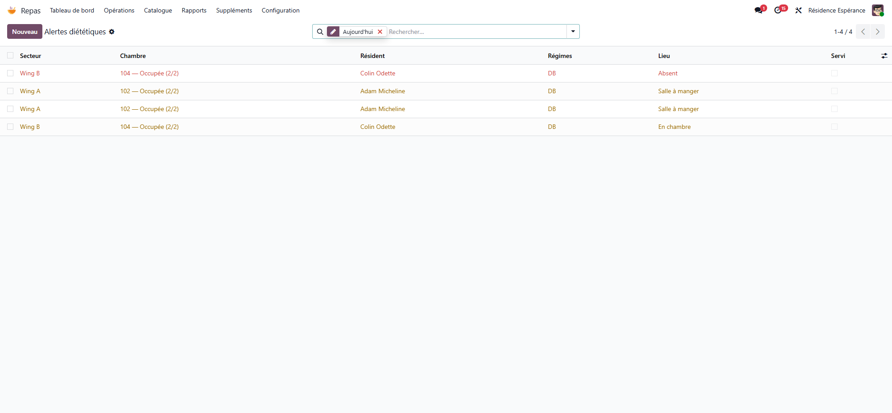

# Menus, diets and hydration

:::{rh-description}
Build menus, manage diets and allergies, and track residents' nutrition and hydration in Resthome.
:::

:::{rh-faq}
How do I build a menu in Resthome?
: In the Meals app -> Menus, create the menu for the day or the week and add dishes from the catalog, by meal type (breakfast, lunch, dinner, snacks).

How does Resthome handle diets and allergies?
: Each resident can have one or more diets and allergies. Resthome takes them into account and flags incompatibilities between a planned dish and the resident's profile, in the Dietary alerts menu.

What is a meal service?
: A meal served at a given time. It follows a simple cycle: confirm, then mark as served, with the option to cancel or reset to draft.

How is residents' hydration tracked?
: Hydration is logged throughout the day against tailored targets, which makes insufficient intake easy to spot.
:::

## Building a menu

1. In the Meals app → **Menus**, create the menu for the day or the
   week.
2. Add **dishes** from the catalog, by **meal type** (breakfast,
   lunch, dinner, snacks).
3. **Save.**

**Dishes** are described once in the **catalog** (ingredients, category)
and reused across all menus.

## Meal services

A **meal service** represents a meal served at a given time. It follows a
simple cycle: **Confirm** → **Mark as served**, with the option to
**cancel** or **reset to draft**.

## Diets and allergies

Each resident can have one or more **diets** (salt-free, diabetic,
blended/adapted texture…) and **allergies**. Resthome takes them into account and
**flags incompatibilities** between a menu and a resident's profile.

:::{admonition} Dietary alerts
:class: warning

The **Dietary alerts** menu surfaces cases where a planned dish does not suit
a resident's diet or allergies — to be checked before service.
:::

## Nutritional monitoring and hydration

- Resthome tracks residents' **nutritional coverage** (energy, protein) and
  **hydration**, with tailored targets.
- **Malnutrition** screening relies on the **MNA** (see [Clinical
  registers](../soins/registres.md)).
- **Hydration** is logged throughout the day to spot insufficient intake.

## Going further

- [Family portal and kiosk](portail-familles.md)
- [Clinical registers](../soins/registres.md)
