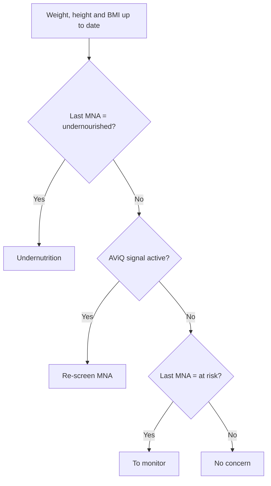

# Nutritional monitoring and undernutrition

:::{rh-description}
Screen for undernutrition and track intake in a nursing home (MR/MRS): risk status, MNA, ESPEN targets and automatic alerts.
:::

:::{rh-faq}
How does Resthome identify a resident at risk of undernutrition?
: Resthome applies the AViQ/ESPEN screening rules and updates a status: a weight loss of more than 5% in 1 month or more than 10% in 6 months, a BMI below 23 in a resident over 70, or an MNA overdue by more than 6 months move the resident to Re-screen (MNA). A latest MNA of "undernourished" places the resident directly in Undernutrition. The status is recalculated on every weight change and once a day.

Does the undernutrition category change the dependency allowance?
: No. The dependency allowance depends on the resident's Katz category, not on their nutritional status. Undernutrition monitoring is a clinical tool: it triggers assessments (MNA) and alerts, but has no effect on billing. The Katz category and the allowance are managed elsewhere (see the Katz page).

Where do the energy, protein and fluid targets come from?
: The ESPEN coefficients (30 kcal/kg, 1 g/kg of protein, 1.6 L for women and 2.0 L for men) are facility-wide settings. Resthome then computes each resident's own target from their weight and sex. The energy band rises to 35 kcal/kg for an underweight resident (BMI less than or equal to 21).

How is actual intake calculated?
: From the meal services: for each meal served, you record the amount eaten (Amount Eaten: none, 25%, 50%, 75%, fully). Resthome multiplies the per-portion nutritional value of the dishes served by this percentage, adds the logged hydration, then compares the 3-day average with the targets. Dishes must therefore carry their portions and their per-portion values.

Who receives the undernutrition or deficit alerts?
: A daily cron creates a "to do" activity. The undernutrition alert goes to the head nurse (then the manager); nutritional deficit or hydration deficit alerts go first to the Kitchen role (dietitian), then to the head nurse, then to the manager. Each alert is capped at once every 30 days per resident to avoid duplicates.

Is nutritional monitoring mandatory to use Resthome?
: No. It is an optional screening feature, designed as a differentiator for MR/MRS. It assists the team but does not replace the judgment of a dietitian or a physician. You can use it as much or as little as you like: it activates as soon as you enter weight, MNA, meals and drinks.
:::

Resthome screens for **undernutrition** and tracks each resident's **intake**,
drawing on the geriatric **ESPEN** recommendations and the **AViQ** screening
rules. Everything is read in the resident record's **Nutrition tab** and driven
from the **Meals dashboard**.

The principle is simple: you enter the **weight**, the **meals served** and the
**drinks**; Resthome derives an **undernutrition risk status**, **targets** for
energy, protein and fluids, a **coverage** of intake, and raises **alerts** when
a resident falls behind.

:::{admonition} A screening tool, not a diagnosis
:class: info

Nutritional monitoring helps the team spot frail residents early. It does not
replace the assessment of a **dietitian** or a **physician**: the status and
alerts are signals to be interpreted, not decisions.
:::

## The resident's Nutrition tab

Open a resident (the **Residents** or **Meals** app), then the **Nutrition** tab.
The tab only appears for residents. It brings together the undernutrition status,
the latest MNA, the ESPEN targets, the intake, the diets and the food preferences.

<!-- screenshot to add: Nutrition tab of a resident record, showing the undernutrition status, the latest MNA and the ESPEN targets -->

### The undernutrition risk status

The **Undernutrition Status** block is **read-only**: Resthome computes it, you do
not edit it by hand. It shows a colored badge and the measurements that explain it.

| Displayed status | Meaning | Badge color |
|---|---|---|
| **No concern** | No concern | Green |
| **To monitor** | To monitor (last MNA "at risk") | Blue |
| **Re-screen (MNA)** | An AViQ signal is active: redo or renew the MNA | Orange |
| **Undernutrition** | Confirmed undernutrition (last MNA "undernourished") | Red |

Below the badge, the tab shows the **weight**, the **BMI**, a **Low BMI** indicator
(age-adjusted low BMI) and the **weight loss** over 1 month and over 6 months.

:::{admonition} What triggers "Re-screen (MNA)"
:class: note

An **AViQ signal** is active as soon as one of these conditions is true:

- **weight loss** of more than **5%** over about 1 month;
- **weight loss** of more than **10%** over about 6 months;
- **BMI below 23** in a resident **over 70** (age-adjusted threshold);
- **overdue MNA**: no MNA, or a last MNA more than 6 months old.

The thresholds match the default values of the AViQ/PWNS-be-A screening.
:::

:::{admonition} Weigh regularly to get the weight loss
:class: warning

The weight loss over 1 and 6 months is computed from the **weights logged in the
vital signs** (nursing notes). Without regular weigh-ins, Resthome cannot compare
and these percentages stay at zero. The **height** is required for the **BMI**.
:::

### The latest MNA

The **Latest MNA** block summarizes the resident's most recent **MNA** (Mini
Nutritional Assessment) assessment: **date**, **score** and **interpretation**
(normal, at risk, undernourished).

Two buttons give access to it:

- **New MNA** opens a new MNA assessment pre-filled for this resident, with the
  **BMI band** already selected based on their known BMI.
- **MNA History** opens the list of their previous MNAs.

The MNA-SF is a **14-point** scale: **12–14** = normal status, **8–11** = at risk
of undernutrition, **0–7** = undernourished. It is the MNA that switches the status
to **Undernutrition** or **To monitor**. The assessments are **clinical registers**:
see [Clinical registers](../soins/registres.md).

### The ESPEN targets

The **Nutritional Needs (ESPEN)** block shows the target **specific to the
resident**, derived from their weight and sex:

| Target | How it is computed |
|---|---|
| **Energy Target (kcal/day)** — energy | Weight × 30 kcal/kg (or 35 if BMI less than or equal to 21) |
| **Protein Target (g/day)** — protein | Weight × 1 g/kg |
| **Fluid Target (ml/day)** — fluids | 1600 ml (women) / 2000 ml (men) |

The **coefficients** (30/35 kcal, 1 g, 1.6/2.0 L) are set once for the whole
facility in [Meal and nutrition settings](../configuration/reglages-repas.md).
Resthome then derives each resident's individual target.

### Intake vs needs (3-day average)

The **Intake vs Needs** block compares what the resident actually consumed with
their targets.

- The **Today** row shows the day's intake: **kcal**, **protein (g)** and
  **fluids (ml)**.
- Three coverage bars — **Energy Coverage**, **Protein Coverage** and **Fluid
  Coverage** — give the **3-day average** as a percentage of the target.
- Two indicators, **Nutrition Deficit** and **Hydration Deficit**, become true
  when coverage falls below the configured threshold (75% by default).

Two buttons round out the block:

- **Log Drink** quickly records a drink for this resident.
- **Hydration History** opens their drinks log.

:::{admonition} For coverage to fill in
:class: tip

Food intake comes from the **meal services**: at each meal, record the **amount
eaten** (see below). The **dishes** must carry their **portions** and their
**per-portion** values (kcal, protein), otherwise the intake stays at zero.
Hydration comes from the **logged drinks**.
:::

## Logging food intake

Energy and protein intake is derived from the **meal services**. On a service, the
**Amount Eaten** field offers: **Not Eaten**, **25%**, **50%**, **75%** and **Fully
Eaten**.

Resthome multiplies the **per-portion** nutritional value of the dishes served by
this percentage to obtain the meal's actual intake, then takes the **3-day
average**. Meal-by-meal entry is done in **Meals → Operations** (Meal services,
Distribution) — see [Menus, diets and hydration](menus-regimes.md).

## Recording hydration

Drinks are logged throughout the day in **Meals → Operations → Hydration**, a
directly editable list (quick entry). Each line records the resident, the time, the
**quantity in milliliters** and the **drink type**: water, coffee/tea, juice/soda,
milk/dairy, soup/broth, oral supplement, other.

You can also log a drink in one click from the Nutrition tab, with the **Log Drink**
button. Resthome adds up the day's drinks, computes the **fluid coverage** over 3
days and raises an alert if intake is insufficient.

<!-- screenshot to add: Hydration list in quick entry, Meals → Operations → Hydration -->

## The nutrition dashboard

Open **Meals → Statistics**: below the general cards (Residents, Menus, Alerts), the
page brings together three nutritional banners that only appear if they concern at
least one resident.

| Banner | Residents concerned | Button |
|---|---|---|
| **Undernutrition risk** (red) | Re-screen (MNA) or Undernutrition status | **Review** opens the list of these residents |
| **Nutritional deficit** (orange) | Intake below the ESPEN target | **Review** opens the list of these residents |
| **Hydration deficit** (blue) | Fluid intake below the target | **Review** opens the list of these residents |

Each **Review** button opens the filtered list of residents, on their full record
(Nutrition tab included) to act directly.

<!-- screenshot to add: Meals Statistics page with the three undernutrition / deficit / hydration banners -->

## The automatic alerts

A **daily cron** refreshes the screening and creates **activities** for residents
who fall behind. Activities are capped at **once every 30 days** per resident to
avoid duplicates.

| Alert | Condition | Recipient |
|---|---|---|
| **Undernutrition — redo/renew the MNA** | Re-screen (MNA) or Undernutrition status | Head nurse, otherwise manager |
| **Nutritional deficit — intake below target** | Energy or protein coverage below the threshold | Kitchen (dietitian), otherwise head nurse, otherwise manager |
| **Hydration deficit — fluid intake below target** | Fluid coverage below the threshold | Kitchen (dietitian), otherwise head nurse, otherwise manager |

In addition to the activities, the Nutrition tab shows a **warning banner** at the
top as soon as the status is Re-screen (MNA) or Undernutrition, recalling the weight
loss and prompting to redo the MNA.

:::{admonition} Set the deficit threshold
:class: note

The **75%** coverage threshold that triggers the deficit alerts is changed in [Meal
and nutrition settings](../configuration/reglages-repas.md). Lower it to be alerted
later, raise it to be alerted earlier.
:::

## Key takeaways

- The resident's **Nutrition tab** brings together the undernutrition status, latest
  MNA, ESPEN targets and intake coverage — read-only for the computed measurements.
- The **undernutrition status** follows the AViQ/ESPEN rules: weight loss,
  age-adjusted BMI, overdue MNA or "undernourished" MNA.
- The **targets** (energy, protein, fluids) are specific to each resident, computed
  from their weight and sex using the configurable ESPEN coefficients.
- The **intake** is derived from the **amount eaten** at meals and the **logged
  drinks**; coverage is a 3-day average.
- The **Meals dashboard** (Statistics) and the **daily alerts** surface at-risk
  residents; this monitoring does **not** change the allowance, which depends on the
  Katz category.

## Further reading

- [Menus, diets and hydration](menus-regimes.md)
- [Family portal and kiosk](portail-familles.md)
- [Meals overview](index.md)
- [Clinical registers (MNA)](../soins/registres.md)
- [Meal and nutrition settings](../configuration/reglages-repas.md)
- [The allowance and the Katz category](../residents/katz.md)
