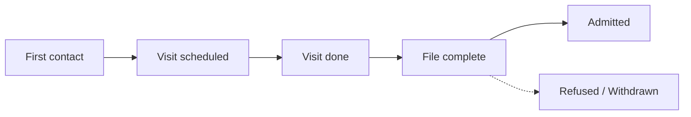

# Admissions (CRM pipeline)

:::{rh-description}
Manage nursing home (MR/MRS) admissions with Resthome: a CRM pipeline from first contact to admission, plus a wizard that creates the resident and stay.
:::

:::{rh-faq}
Where is the admissions pipeline in Resthome?
: In the CRM app, select the "Admissions" team. The pipeline shows prospective residents in a kanban view, from first contact through to admission.

How do I turn a prospect into a resident?
: Move the lead to the "Admitted" stage (or click the Won button). A wizard opens: pick the room and the stay start date, then confirm. Resthome then creates the contact as a resident and opens their stay.

Is a room required to admit a prospect?
: Yes. The admission wizard requires an available room and a stay start date; without a room, the admission cannot be finalized.

What happens if I move a lead out of the "Admitted" stage?
: Resthome automatically cancels any draft or confirmed stays linked to that lead. A stay that has already started (active) is left untouched.

Do I need to check insurability before admitting?
: Yes, except in specific cases. Until the MDA check has succeeded, moving to "Admitted" is blocked. You can uncheck "MDA check required" for cases without a NISS (a foreign resident, for example).

What is the difference between the stay start date and the admission date?
: The stay start date triggers billing for accommodation (the room); the admission date marks the start of the health insurer's contribution and is set when the stay is started. They are often identical, but can differ.
:::

The **admission pipeline** is the entry point of a resident's journey. It lets
you track every **prospect** — from a relative's first enquiry through to the
actual move-in — and then, in a single action, **turn them into a resident**
with their room and stay.

You will find it in the **CRM** app, under the **Admissions** team. Each enquiry
becomes a **lead** (a prospective resident) that you move from stage to stage on
a kanban board.

## Overview

:::{admonition} Two dates not to confuse
:class: note

- **Stay start date**: when billing for accommodation (the room) begins. This is
  the one you enter in the admission wizard.
- **Admission date**: when the health insurer's contribution (the dependency
  allowance) begins. It is set later, when the **stay is started**.

They are often identical, but can differ.
:::

## 1. Open the Admissions pipeline

1. Open the **CRM** app.
2. Select the **Admissions** team / pipeline (menu **Sales → My Pipeline**, then
   filter on the Admissions team, or open the team directly from the teams view).
3. The **kanban** board shows one column per stage and one card per prospect.

<!-- screenshot to add: the Admissions pipeline in kanban view, one column per stage -->

## 2. Create an admission lead

1. Click **New**.
2. Give the lead a **name** (for example "Admission - Prospect name").
3. The **Prospective resident** checkbox is ticked automatically when the lead
   belongs to the Admissions team. It enables the **Resident admission** tab and
   hides the standard **Contacts** tab, which is not relevant for an admission.
4. **Save.**

:::{admonition} The prospect and the relative who calls
:class: tip

Often it is a **relative** (a son or daughter) who makes contact on behalf of
the person to be accommodated. Resthome keeps the two apart: the **prospective
resident** is the person being accommodated, while the caller is recorded as a
**family contact**. At admission, the identity (NISS, date of birth) is carried
by the resident, not the relative.
:::

### The "Resident admission" tab

This is where you build the prospect's file without leaving the lead:

- **Personal information**: NISS, date of birth, gender, attending physician,
  family contacts, and above all the **requested stay type** (MR, MRS or short
  stay).
- **Health insurer / Insurability**: health insurer, insurance scheme,
  affiliation code, and the result of the **MDA check** (CT1/CT2, BIM status).

:::{admonition} Short stay (short stay / CSJ)
:class: info

If you choose **short stay**, two additional fields appear: the **number of
short-stay days already used** this calendar year and **notes**. The law caps
short stays at **90 days per year**; fill in this information (ask the family, or
confirm by phone with the health insurer) before accepting the admission.
:::

<!-- screenshot to add: the Resident admission tab of a lead -->

## 3. Move the lead forward

Drag the card from one column to the next, at the actual pace of the case:

| Stage | Meaning |
| --- | --- |
| **First contact** | Enquiry received, to be followed up. |
| **Visit scheduled** | A visit to the facility has been booked. |
| **Visit done** | The visit has taken place. |
| **File complete** | The administrative and medical file is ready. |
| **Admitted** | The "won" stage: triggers the admission wizard. |
| **Refused / Withdrawn** | The enquiry does not go ahead (folded column). |

You can also schedule visit appointments directly from the lead (**Meetings**
button / shared calendar).

## 4. Check insurability (MDA)

Before you can admit the prospect, check that they are properly insured:

1. On the lead, click **Check insurability** (header).
2. Resthome sends an **MDA** request (MyCareNet / WalCareNet insurability) and
   automatically updates the prospect's **health insurer**, **BIM** status and
   **CT1/CT2** codes.

:::{admonition} The MDA check gates admission
:class: warning

Until the MDA check has **succeeded**, moving to the **Admitted** stage is
**blocked**. For a case without a NISS (a foreign resident, a newborn, etc.),
uncheck **MDA check required** in the Resident admission tab to remove the block.
If the MDA comes back as **not insured**, admission is still possible but
Resthome warns you: billing will then have to be addressed to the resident, not
to the health insurer.
:::

For a full understanding of the insurability check, see
[Insurability (MDA)](../ehealth/mda.md).

## 5. Admit the prospect

When the file is ready, turn the prospect into a resident. Two equivalent actions
open the **admission wizard**:

- **Drag** the card into the **Admitted** column, or
- Open the lead and click the **Won** button.

:::{admonition} Before marking as "Admitted"
:class: warning

The **requested stay type** (MR / MRS / short stay) must be filled in: it
determines the bed and Annexe 7. The MDA check must also have succeeded (see
above). Otherwise, Resthome blocks the operation and tells you what to complete.
:::

The admission wizard asks you for:

1. The **room** — **required**; only **available** rooms are offered.
2. The **stay type** — carried over from the prospect (MR / MRS / short stay),
   read-only.
3. The **stay start date** — defaults to today.

Click **Admit** to confirm.

<!-- screenshot to add: the admission wizard window with the Room, Stay type and Stay start date fields -->

### What the admission creates

When you confirm the wizard, Resthome:

- **creates the contact as a resident** (and removes them from the list of
  prospective residents);
- **opens the corresponding stay**, in the **Confirmed** state, on the chosen
  room and date;
- **opens the resident's record** so you can continue (Katz, documents, stay).

The stay then still needs to be **started** (**Start Stay** button) once the
resident is actually present — it is this start that sets the **admission date**
and triggers billing. See [Manage a resident](gerer-un-resident.md).

## Safeguards and edge cases

Resthome protects the consistency of the pipeline:

- **Wizard cancellation** — if you close the wizard without admitting, the lead
  **returns to the previous stage**: nothing is created until you confirm.
- **Regression out of "Admitted"** — if you move an already-admitted lead back to
  an earlier stage, Resthome **automatically cancels** the stays still in
  **draft** or **confirmed** state linked to that lead. A stay that has already
  been **started** (active) is left untouched.
- **Duplicate detection** — the admission is tied to the **resident**, not just to
  the lead. If a stay already exists for this person, Resthome reuses it rather
  than creating a second one; a confirmed stay belonging to **another** lead is
  never "stolen".
- **Re-dragging a lead** — if you reopen the wizard on a lead that already has a
  stay, that stay's **room** is pre-filled.

## Key takeaways

- The **Admissions** pipeline lives in the **CRM** app; each prospect is a lead
  that you move forward on the kanban board.
- The **Resident admission** tab centralizes the prospect's identity, health
  insurer and **MDA** check.
- Moving to **Admitted** (drag-and-drop or the **Won** button) opens the wizard:
  **room required** + **stay start date**, then creation of the **resident** and
  the **stay**.
- Admission is **blocked** without a stay type filled in and without a
  **successful MDA** (unless the MDA check is unchecked).
- Moving a lead out of **Admitted** cancels its **draft/confirmed** stays;
  **active** stays are preserved.

## Further reading

- [Manage a resident](gerer-un-resident.md)
- [The Katz assessment](katz.md)
- [Insurability (MDA)](../ehealth/mda.md)
- [eAgreement agreements](../ehealth/eagreement.md)
- [Billing journey](../parcours-facturation.md)
