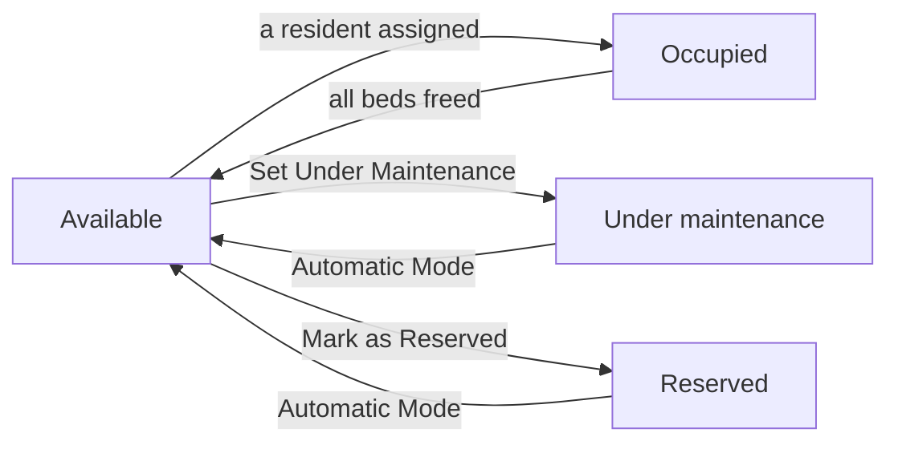

# Rooms and occupancy

:::{rh-description}
Track the occupancy of a nursing home's (MR/MRS) rooms with Resthome: kanban board by status, room record, maintenance and assigning a resident.
:::

:::{rh-faq}
Where is the room occupancy board in Resthome?
: In the MR/MRS application, Accommodation → Rooms menu. Rooms are shown as a kanban, grouped by status: Available, Occupied, Under maintenance and Reserved.

What does the colored badge on each room mean?
: It shows the occupancy "occupied / capacity" (for example 1/2) and its color reflects the status: green for Available, blue for Occupied, orange for Under maintenance, cyan for Reserved. A two-bed room with only one bed taken stays Available.

How do I make a room unavailable for works?
: On the room record, click Set Under Maintenance (or Mark as Reserved). The room is then excluded from the assignable rooms. The Automatic Mode button puts it back to automatic status computation.

How do I assign a resident directly from a room?
: Open an available room and click Assign a Resident. Choose the resident and the entry date: Resthome creates the stay, in the In Progress state, on that room.

What happens if the resident already occupies a room?
: The wizard detects the current stay and shows a transfer warning. On confirmation, Resthome ends the old stay (reason: transfer) and opens a new stay in the chosen room.

Is the daily rate displayed the INAMI package?
: No. It is the accommodation price (the room), a value specific to your facility, set on the room type. The dependency package, for its part, depends on the resident's Katz category, not on the room.
:::

The **Rooms** area gives you a real-time view of the facility's **occupancy**:
which rooms are free, occupied, reserved or under maintenance, how many beds
remain available, and at what rate. From a room, you can also **directly assign a
resident**, which opens their stay.

You'll find it in the **MR/MRS → Accommodation → Rooms** application.

## The occupancy board

On opening, the rooms are shown as a **kanban**, grouped by **status**: an
**Available** column, an **Occupied** column, an **Under maintenance** column and
a **Reserved** column. At a glance, you can see where space remains.

Each room card shows:

- the room **number**;
- an **occupancy badge** "occupied / capacity" (for example 1/1 or 1/2), colored
  by status — green (Available), blue (Occupied), orange (Maintenance), cyan
  (Reserved);
- the **room type**;
- the **resident(s) present**, if any;
- the **daily accommodation rate**.

<!-- screenshot to add: the kanban board of rooms, grouped by status, with the colored occupancy badges -->

:::{admonition} The occupancy / capacity badge
:class: note

A capacity-2 room with only one bed taken shows **1/2** and stays **Available**:
there is still a spot. It only switches to **Occupied** when **all** beds are
taken. A single room (capacity 1) therefore goes straight from Available to
Occupied as soon as the first resident arrives.
:::

In the top right, you can switch from the **kanban** to the **list** (number,
floor, type, capacity, occupancy, rate, amenities, status) or the **form**.

### Filtering and grouping

The search bar offers quick **filters**: **Available**, **Occupied**,
**Maintenance**, **Reserved**, as well as **Active (excluding maintenance)**. You
can also **group** rooms by **Status**, **Floor**, **Type** or **Sector**, and
search by number, floor, building or sector.

## The room record

Click a card to open the **room record**. At the top, a **status bar** shows the
current state (**Available → Occupied → Under maintenance → Reserved**), and
**ribbons** visually flag a room as "Maintenance" or "Reserved".

### Details and rate

| Field | Purpose |
| --- | --- |
| **Room Number** | Unique identifier of the room. |
| **Room Type** | Determines the **daily rate** and the default capacity. |
| **Floor** / **Building** | Physical location. |
| **Sector** | Sector / floor of the facility; used for grouping and access rights. |
| **Capacity** | Number of beds in the room. |
| **Current Occupancy** | Number of occupied beds (computed automatically). |
| **Daily Rate** | Accommodation price, taken from the room type. |
| **Billing Product** | Product linked to the room (read-only). |

:::{admonition} The daily rate is not the INAMI package
:class: info

The **daily rate** is the **accommodation price** (the room), a value **specific
to your facility**, set on the **room type**. It is distinct from the **dependency
package** (the insurer's share), which depends on the resident's **Katz category**
— the same for all categories under AViQ rates — and not on the room.
:::

### Amenities

The **Amenities** section lists, as tags, what the room provides (Television,
Wifi, Private bathroom, Medical bed, Nurse call, Balcony…). An **Additional
amenities notes** field lets you add a free-text detail. The amenities catalog is
managed in the settings (see [Configuration](../configuration/index.md)).

### Current occupancy and history

Three tabs complete the record:

- **Current Occupancy** — the residents present in the room (name, resident code,
  age).
- **Stay History** — all stays that involved this room, with the resident, the
  start and end dates, and the status (**Draft**, **Confirmed**, **In Progress**,
  **Done**).
- **Notes** — free internal notes about the room.

## Changing a room's status

The **Available / Occupied** status is computed automatically from occupancy. You
can, however, **force** a manual status from the record header:

- **Set Under Maintenance** — the room switches to **Under maintenance** (works,
  deep cleaning, breakdown…) and is no longer offered for assignment.
- **Mark as Reserved** — the room becomes **Reserved** (for example for an
  upcoming admission) and drops out of the available rooms.
- **Automatic Mode** — cancels the manual override: the status is again
  **computed automatically** from occupancy.

:::{admonition} Maintenance and Reserved block assignment
:class: warning

As long as a room is **Under maintenance** or **Reserved**, the **Assign a
Resident** button is hidden and the room does **not** appear in the available-room
lists (admission, transfer). Switch it back to **Automatic Mode** to make it
assignable again.
:::

## Assigning a resident from the room

You can open a stay directly from a free room, without going through the admission
pipeline:

1. Open the record of an **Available** room (neither full, nor under maintenance,
   nor reserved — otherwise the button does not appear).
2. Click **Assign a Resident**.
3. In the wizard, choose the **resident** (only residents are offered).
4. Check the **entry date** (today by default) and, if needed, the **planned end
   date**.
5. The **daily rate** is taken from the room; adjust the **Bill To** field if the
   invoice must be addressed to a third party (a relative, CPAS).
6. Optionally add an **admission reason**, then click **Assign a Resident**.

Resthome then creates the **stay** on this room, in the **In Progress** state, and
brings you back to the room record.

<!-- screenshot to add: the Assign a Resident wizard, with the Resident, Entry Date, Daily Rate and Bill To fields -->

### When the resident is already housed: the transfer

If the chosen resident **already occupies a room**, the wizard detects it and
shows a **transfer warning** recalling their current room. The button then becomes
**Transfer the Resident**. On confirmation, Resthome **ends** the old stay
(reason: *transfer*) and **opens** a new stay in the chosen room.

:::{admonition} Assign ≠ Change Room
:class: note

Assigning an **already-housed** resident from the room performs a simple
**transfer**. For a room change that **cleanly splits the accommodation billing**
on the exact date while keeping the INAMI intervention **continuous** (no new
agreement), prefer the **Change Room** action on the **stay** — see
[Room change and transfer](changement-chambre.md).
:::

## Configuring room types and amenities

The room structure is prepared in the configuration, via **MR/MRS →
Configuration → Rooms**:

- **Room Types** — define each type (single, double…), its **daily rate**, its
  **default capacity** and the associated **billing product**. A room's rate
  derives from its type.
- **Room Amenities** — maintain the **catalog** of available amenities (comfort,
  medical, technology, outdoor), which you then tick on each room record.

For the settings details, see [Configuration](../configuration/index.md).

## Key takeaways

- The occupancy board lives in **MR/MRS → Accommodation → Rooms**, as a **kanban
  grouped by status** (Available, Occupied, Under maintenance, Reserved).
- Each card's **badge** shows the occupancy "occupied / capacity" and its color
  reflects the status; a shared room stays **Available** as long as one bed is
  free.
- The **Set Under Maintenance** / **Mark as Reserved** buttons force a status;
  **Automatic Mode** restores automatic computation.
- A room **under maintenance** or **reserved** is **not** assignable.
- **Assign a Resident** from the room creates the stay; if the resident is already
  housed, the operation becomes a **transfer**.
- The **daily rate** is the accommodation price specific to the facility (per room
  type), not to be confused with the **dependency package** tied to Katz.

## Going further

- [Managing a resident](gerer-un-resident.md)
- [Room change and transfer](changement-chambre.md)
- [The condition report](etat-des-lieux.md)
- [Configuration](../configuration/index.md)
