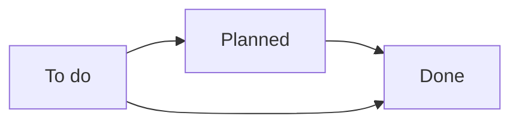

# The condition report (move-in and move-out)

:::{rh-description}
The move-in/move-out condition report for a nursing home (MR/MRS) with Resthome: assess each item of equipment, photos, and a signed PDF report (eIDAS).
:::

:::{rh-faq}
Where do I create a condition report in Resthome?
: In the Accommodation ▸ Condition reports menu, click New. When you select the resident, the room (taken from their current stay) and the representative are filled in automatically.

What is the difference between a move-in and a move-out condition report?
: The Condition report type field distinguishes Move-in from Move-out. The move-in records the state of the room when the resident arrives, the move-out when they leave. The PDF report shows a Move-in or Move-out badge depending on the type chosen.

Does the condition report have legal value?
: Yes. It is a joint assessment, signed by the resident's representative and by the facility, drawn up in two copies. The report carries a statement of compliance with the eIDAS regulation.

Can I reuse a standard list of equipment?
: Yes, through the Condition report templates (Configuration ▸ Condition reports). A template pre-fills the lines, the sections and the general observations, like a quotation template.

How do I sign the condition report electronically?
: The PDF report contains signature anchors (representative and facility) designed for the Odoo Sign app. Otherwise, print it and have it signed by hand, in two copies.

What do Compliant and Non-compliant mean on a line?
: It is the recorded condition of the equipment. The report summary counts the compliant and non-compliant items, and the photos are included in a photographic appendix.
:::

The **condition report** records the **state of a room** and its equipment at a
specific moment: when the resident **moves in**, and then when they **move out**.
It is a legally binding **joint assessment**, signed by the resident (or their
representative) and by the facility. You will find it in the
**Accommodation ▸ Condition reports** menu.

Each condition report links a **resident**, a **room** and a **representative**,
lists the **equipment** assessed (compliant or not), and produces a
**PDF report** on your letterhead, ready to sign.

:::{admonition} An optional module
:class: info

Condition reports are provided by a dedicated module. When it is installed, a
**Condition reports** entry appears in the **Accommodation** menu, alongside
**Rooms** and **Stays**.
:::

## 1. Create the condition report

1. Open **Accommodation ▸ Condition reports**.
2. Click **New**.
3. Select the **Resident**.
4. Check the **Date** (today's date by default) and the **Person in charge**
   (you by default).
5. **Save**: an automatic **reference** is assigned (prefix `EL-`).

:::{admonition} The resident, the room and the representative link themselves
:class: tip

As soon as you choose the **resident**, Resthome pre-fills:

- the **Room**, taken from their **current stay**;
- the **Resident's representative** (the reference person who will sign), taken
  from their **first family contact**.

Both fields remain editable if needed.
:::

<!-- screenshot to add: the condition report form with the resident selected and the room and representative pre-filled -->

## 2. Choose the type: move-in or move-out

Fill in the **Condition report type** field:

- **Move-in** — the state of the room when the resident **arrives**.
- **Move-out** — the state at the time of **departure**, to be compared with the move-in.

The type determines the **badge** shown on the PDF report (Move-in / Move-out).

:::{admonition} Type not specified
:class: note

If you do not choose a type, the report shows the **Not specified** badge.
Fill in Move-in or Move-out for a clear document.
:::

## 3. Fill in the detail lines

Open the **Details** tab. Each line describes an **item of equipment** and its
condition. Three buttons are available at the bottom of the list:

- **Add a line** — an item of equipment being assessed;
- **Add a section** — a heading that groups lines (e.g. "Bedroom", "Bathroom",
  "Furniture");
- **Add a note** — a free-text line, in italics.

For an equipment line, fill in:

| Field | Purpose |
|---|---|
| **Equipment** | The item being assessed (required) |
| **Condition** | **Compliant** or **Non-compliant** (required) |
| **Photo** | A photo of the item (optional) |
| **Notes** | A free-text observation |

:::{admonition} Equipment and condition are required
:class: warning

A detail line must always carry an **item of equipment** and a **condition**
(Compliant / Non-compliant). Sections and notes, on the other hand, carry
neither equipment nor condition: they are simple headings or remarks.
:::

<!-- screenshot to add: the Details tab with equipment lines (Compliant / Non-compliant condition), a section and a photo -->

A second tab, **General observations**, lets you add free text about the overall
condition of the room.

### The equipment catalogue

The lines point to the facility's **equipment catalogue** ("Room equipment"),
shared with room management. There you define the bed, the wardrobe, the
television, the bathroom, etc. once and for all. See [Furniture and
equipment](mobilier.md).

### Reusable templates

To avoid re-entering the same list every time, use a **template**.

1. Create your templates in **Configuration ▸ Condition reports ▸ Condition
   report templates**.
2. On a condition report, choose the **Condition report template**: its lines,
   sections and general observations pre-fill the document.

:::{admonition} Like a quotation template
:class: tip

A template works like a quotation template: it sets up the structure (sections +
equipment) that you then just have to assess and complete.
:::

## 4. Track the lifecycle

A condition report goes through four **statuses**, shown in the status bar and
as columns in the kanban view:

| Status | Meaning |
|---|---|
| **To do** | Created, assessment not yet carried out (initial status) |
| **Planned** | The assessment is planned |
| **Done** | The assessment is carried out and closed |
| **Cancelled** | The condition report is abandoned |

The buttons at the top of the form move the record forward:

- **Plan** — moves from *To do* to *Planned*;
- **Mark as done** — moves to *Done*;
- **Reset to To do** — returns to *To do* from *Done* or *Cancelled*;
- **Cancel** — switches to *Cancelled*.

<!-- screenshot to add: the kanban view of condition reports grouped by status (To do / Planned / Done / Cancelled) -->

## 5. Generate the signed PDF report

From a condition report, use **Print ▸ Condition report**. Resthome produces an
`EDL_<reference>.pdf` document in your facility's house style.

The report includes:

- your **letterhead** (logo, name, address, VAT) and your facility's **colour**
  — set in **Settings ▸ Configure document layout**;
- the title **CONDITION REPORT** with the **Move-in badge** (green) or
  **Move-out** (orange) depending on the type;
- the **metadata**: resident, room, person in charge of the assessment,
  representative, date, tags;
- the **general observations**, if you have entered any;
- the **detail of the items assessed** (equipment, condition, photo,
  observation);
- a **summary**: number of items, including compliant and non-compliant;
- two **joint signature** boxes — *The resident's representative* and *For the
  facility* — beneath the wording "Done at …, in two copies";
- a **photographic appendix** showing the photos in large format (4 per page).

:::{admonition} Ready for electronic signature (Odoo Sign)
:class: info

The report contains **signature anchors** that are invisible when printed,
placed for the **Odoo Sign** app: when a signature request is created, the
*representative* and *facility* fields land in the right place. The footer
states compliance with the **eIDAS Regulation (EU) No 910/2014**. Using Odoo
Sign is optional: otherwise, print the PDF and have it signed by hand.
:::

<!-- screenshot to add: the first page of the PDF report with the Move-in badge, the summary and the joint signature boxes -->

## Key points to remember

- The condition report is a legally binding **joint assessment**: move-in then
  move-out, signed by the resident's representative and the facility.
- The **resident**, the **room** (taken from the stay) and the **representative**
  are pre-filled automatically.
- Each line carries an **item of equipment** and a **Compliant / Non-compliant**
  condition, with a photo and an observation; **sections** and **notes**
  structure the list.
- **Templates** save you from re-entering the same list; the **equipment
  catalogue** is shared with the rooms.
- The **PDF report** is in your house style, with a Move-in/Move-out badge,
  summary, signatures and a photo appendix, ready for **Odoo Sign** (eIDAS).

## Going further

- [Manage a resident](gerer-un-resident.md)
- [Room change and transfer](changement-chambre.md)
- [Furniture and equipment](mobilier.md)
- [General settings (residents, rooms)](../configuration/reglages-generaux.md)
