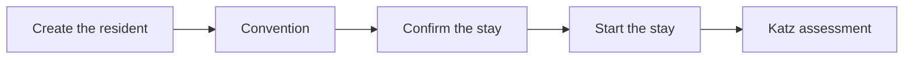

# Manage a resident

:::{rh-description}
Create a resident, record their admission and stay, and enter the Katz assessment.
:::

This page describes a resident's complete journey in Resthome: from **creation** to **active stay**, including the **Katz assessment** that governs INAMI billing.

## Overview

:::{admonition} Two dates not to confuse
:class: note

- **Stay start date**: when accommodation billing begins (the room).
- **Admission date**: when the INAMI intervention begins (the flat-rate fee).

They are often identical, but can differ — Resthome handles both.
:::

## 1. Create the resident

1. Open the **MR/MRS → Residents** application.
2. Click **New**.
3. Enter at least: **name**, **date of birth**, **gender**, and the **NISS** (national number) if known.
4. Select the resident's **health insurance fund**.
5. **Save**.

:::{admonition} The NISS is required for eHealth
:class: warning

Without a NISS, insurability verification (MDA) and agreements (eAgreement) cannot be sent. You can create the resident without a NISS, but remember to fill it in as soon as possible.
:::

## 2. Open a stay agreement

The **stay** links the resident to a room and triggers billing.

1. On the resident record, open the **Convention** tab.
2. Click **Add a line**.
3. Choose the **room** (only available rooms are offered).
4. Enter the **stay type** (MR or MRS) and the **stay start date**.
5. **Save**.

The stay is then in the **Draft** state.

## 3. Confirm then start the stay

The stay goes through two steps:

1. **Confirm** — the stay becomes *Confirmed* (the room is reserved). The **admission date and time** fields appear: fill them in.
2. **Start Stay** — the stay becomes *In Progress* (the resident is actually present).

:::{admonition} What starting the stay triggers automatically
:class: tip

When the stay starts, Resthome:

- adds the resident to the open **billing periods**;
- for a resident billed in advance, creates the **first accommodation invoice** for the admission month;
- opens the month's **supplements envelope**;
- creates the **admission eAgreement** (if the NISS is present).
:::

## 4. Enter the Katz assessment

The **Katz** category (O, A, B, C, Cd) determines the **INAMI flat-rate fee**.

1. From the resident record, open **Assessment tools → Katz** (or the **Katz** button).
2. Click **New** and score the 6 criteria (washing, dressing, transfer, going to the toilet, continence, eating).
3. **Confirm** then **Validate** the assessment.

:::{admonition} No validated Katz?
:class: note

As long as no validated Katz exists, the resident is in category **O** by default, and a "Katz to do" reminder appears on the dashboard.
:::

## 5. Check insurability (MDA)

Before billing, check that the resident is properly insured:

1. Open the month's billing period, or the resident record.
2. Run an **MDA check** (MyCareNet/WalCareNet insurability).
3. Resthome automatically updates the **health insurance fund** and the **BIM** status where applicable.

## Special cases

- **Room change**: use the dedicated action on the stay — accommodation billing is split across the two rates, without a new admission.
- **MR ↔ MRS transfer**: a wizard records the transfer date and updates the stay type.
- **Absence / hospitalization**: see the [Billing](../facturation/index.md) section — an absence adjusts the flat-rate fee and can generate an eHealth notification (Annexe 11).
- **End of stay / death**: close the stay; Resthome stops billing on the correct date and prepares the credit note if needed.

## Further reading

- [Billing](../facturation/index.md)
- [eHealth](../ehealth/index.md)
