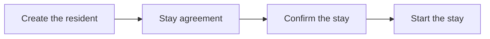
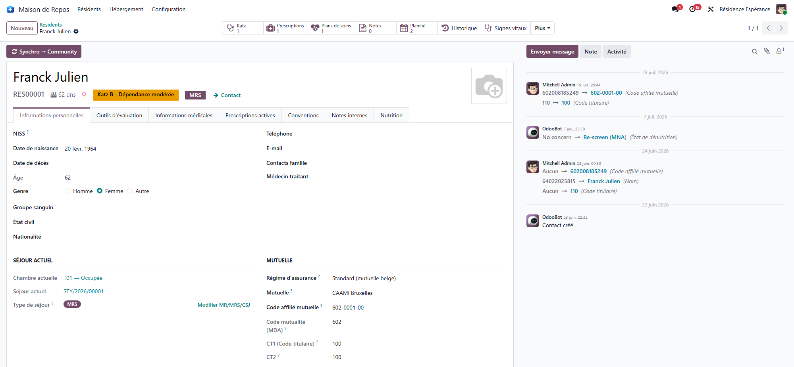

# Manage a resident

:::{rh-description}
Create a resident, open and start their stay, and read the dependency category on file.
:::

:::{rh-faq}
How do I create a resident in Resthome?
: Open the Nursing Home -> Residents app and click New. Enter at least the name, date of birth and gender, and save.

What is the difference between confirming and starting a stay?
: Confirming reserves the room and makes the admission date fields appear. Starting the stay records that the resident is actually present, and it is that step which triggers billing.

What does Resthome do automatically when a stay starts?
: It adds the resident to the open billing periods, creates the first accommodation invoice for residents billed in advance and opens the month's supplements envelope.

Where does the resident's dependency category come from?
: From the dependency scale of the country pack installed. Resthome shows the category currently on file on the resident's card; without a country pack, no category is shown.
:::

This page describes a resident's complete journey in Resthome: from **creation**
to **active stay**, and where to read the resident's **dependency category**.

## Overview

```mermaid
graph LR
  A[Create the resident] --> B[Stay agreement]
  B --> C[Confirm the stay]
  C --> D[Start the stay]
```

:::{admonition} Two dates not to confuse
:class: note

- **Stay start date**: when accommodation billing begins (the room).
- **Admission date**: the resident's effective entry, when the care allowance
  paid by the health insurer begins.

They are often identical, but can differ — Resthome handles both.
:::

## 1. Create the resident

1. Open the **Nursing Home → Residents** application.
2. Click **New**.
3. Enter at least: **name**, **date of birth** and **gender**.
4. **Save**.

The **ID Card Number** field keeps the number of the identity document presented
at admission. It identifies the card, which expires and is renewed — not the
person.

:::{admonition} In Belgium
:class: rh-country rh-country-be

The Belgian pack adds the **NISS**, the **Health Insurance** (mutualité) and the
eID card reading, which fills the identity and the NISS straight from the chip.
The **Verify Insurability** button runs the MDA check from the record and
updates the mutualité and the BIM status; without a NISS, MDA and eAgreement
cannot be sent — see [The resident's file in Belgium](../belgique/dossier-resident.md).
:::

## 2. Open a stay agreement

The **stay** links the resident to a room and triggers billing.

1. On the resident record, open the **Stay Agreement** tab.
2. Click **Create the first stay**. The button shows only while the resident
   has no stay: later stays are opened by the admission, room change or
   transfer actions, which chain the dates.
3. Choose the **Room** (only available rooms are offered).
4. Enter the **Stay Type** — one of the sectors the home is licensed for — and
   the **Stay start date**.
5. **Save**.

The stay is then in the **Draft** state.

## 3. Confirm then start the stay

The stay goes through two steps:

1. **Confirm** — the stay becomes *Confirmed* (the room is reserved). The **admission date and time** fields appear: fill them in.
2. **Start Stay** — the stay becomes *Active* (the resident is actually present).

:::{admonition} What starting the stay triggers automatically
:class: tip

When the stay starts, Resthome:

- adds the resident to the open **billing periods**;
- for a resident billed in advance, creates the **first accommodation invoice** for the admission month;
- opens the month's **supplements envelope**.
:::

:::{admonition} In Belgium
:class: rh-country rh-country-be

Starting the stay also creates the **admission eAgreement** (Annexe 7) when the
NISS is present, and the stay type is the MR or MRS sector — see
[The resident's file in Belgium](../belgique/dossier-resident.md).
:::

## Dependency category

The **dependency category** is what the care allowance paid by the health
insurer relies on. The scale that produces it, and the way an assessment is
entered and validated, come with the country pack: each country grades
dependency on its own scale.

The resident's card in the **Residents** list shows the category currently on
file. Without a country pack, or while the resident has no valid assessment,
no category is shown.

:::{admonition} In Belgium
:class: rh-country rh-country-be

The scale is **Katz**: six criteria, categories O, A, B, C and Cd, entered from
the record then confirmed and validated. Category O applies by default, with a
"Katz to do" reminder on the dashboard — see
[The Katz assessment](../belgique/katz.md).
:::

## Special cases

- **Room change**: use the dedicated action on the stay — accommodation billing is split across the two rates, without a new admission.
- **Absence / hospitalization**: see the [Billing](../facturation/index.md)
  section — an absence adjusts the billing of the days concerned.
- **End of stay / death**: close the stay; Resthome stops billing on the correct date and prepares the credit note if needed.

:::{admonition} In Belgium
:class: rh-country rh-country-be

A change of sector is the **MR ↔ MRS** internal transfer, entered with its
own wizard that records the transfer date and updates the stay type; an
absence can generate an **Annexe 11** notification — see
[The resident's file in Belgium](../belgique/dossier-resident.md).
:::

## Further reading

- [Billing](../facturation/index.md)
- [Geriatric assessments](evaluations.md)
- [Room change and transfer](changement-chambre.md)
