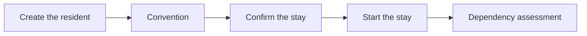

# Manage a resident

:::{rh-description}
Create a resident, record their admission and stay, and enter their dependency assessment.
:::

:::{rh-faq}
How do I create a resident in Resthome?
: Open the Nursing Home -> Residents app and click New. Enter at least the name, date of birth and gender, then the national identification number and the health insurer if your country pack asks for them, and save.

Is the national identification number mandatory to create a resident?
: No. You can create a resident without it, but the electronic exchanges with the health insurer, where the country has them, cannot be sent until it is filled in. Complete it as soon as possible.

What is the difference between confirming and starting a stay?
: Confirming reserves the room and makes the admission date fields appear. Starting the stay records that the resident is actually present, and it is that step which triggers billing.

What does Resthome do automatically when a stay starts?
: It adds the resident to the open billing periods, creates the first accommodation invoice for residents billed in advance and opens the month's supplements envelope. Where the country has electronic exchanges with the health insurer, the country pack adds its own admission steps.

What happens if the resident has no validated dependency assessment?
: The resident keeps the country's default category and a reminder appears on the dashboard, because the dependency category is what the care allowance paid by the health insurer relies on.
:::

This page describes a resident's complete journey in Resthome: from **creation**
to **active stay**, including the **dependency assessment** that the care
allowance paid by the health insurer relies on.

## Overview

```mermaid
graph LR
  A[Create the resident] --> B[Convention]
  B --> C[Confirm the stay]
  C --> D[Start the stay]
  D --> E[Dependency assessment]
```

:::{admonition} Two dates not to confuse
:class: note

- **Stay start date**: when accommodation billing begins (the room).
- **Admission date**: the resident's effective entry, when the care allowance
  paid by the health insurer begins.

They are often identical, but can differ — Resthome handles both.
:::

## 1. Create the resident

1. Open the **Nursing Home → Residents** application.
2. Click **New**.
3. Enter at least: **name**, **date of birth** and **gender**.
4. Fill in the **national identification number** and the resident's **health
   insurer**, when your country pack provides these fields.
5. **Save**.

The **ID Card Number** field keeps the number of the identity document presented
at admission. It is not the national identification number: the card expires
and is renewed, the person's number does not.

:::{admonition} In Belgium
:class: rh-country rh-country-be

The Belgian pack adds the **NISS**, the **Health Insurance** (mutualité) and the
eID card reading, which fills the identity and the NISS straight from the chip.
Without a NISS, MDA and eAgreement cannot be sent — see
[The resident's file in Belgium](../belgique/dossier-resident.md).
:::

## 2. Open a stay agreement

The **stay** links the resident to a room and triggers billing.

1. On the resident record, open the **Convention** tab.
2. Click **Add a line**.
3. Choose the **room** (only available rooms are offered).
4. Enter the **stay type** — one of the sectors the home is licensed for — and
   the **stay start date**.
5. **Save**.

The stay is then in the **Draft** state.

## 3. Confirm then start the stay

The stay goes through two steps:

1. **Confirm** — the stay becomes *Confirmed* (the room is reserved). The **admission date and time** fields appear: fill them in.
2. **Start Stay** — the stay becomes *In Progress* (the resident is actually present).

:::{admonition} What starting the stay triggers automatically
:class: tip

When the stay starts, Resthome:

- adds the resident to the open **billing periods**;
- for a resident billed in advance, creates the **first accommodation invoice** for the admission month;
- opens the month's **supplements envelope**.
:::

:::{admonition} In Belgium
:class: rh-country rh-country-be

Starting the stay also creates the **admission eAgreement** (Annexe 7) when the
NISS is present, and the stay type is the MR or MRS sector — see
[The resident's file in Belgium](../belgique/dossier-resident.md).
:::

## 4. Enter the dependency assessment

The **dependency category** determines the **care allowance paid by the health
insurer**. The scale that produces it depends on the country.

1. From the resident record, open the dependency scale from the **Evaluation
   Tools** tab.
2. Click **New** and score the criteria.
3. **Confirm** then **Validate** the assessment.

:::{admonition} No validated assessment?
:class: note

As long as no validated assessment exists, the resident keeps the country's
default category, and a reminder appears on the dashboard.
:::

:::{admonition} In Belgium
:class: rh-country rh-country-be

The scale is **Katz**: six criteria, categories O, A, B, C and Cd, category O
by default and a "Katz to do" reminder — see
[The Katz assessment](../belgique/katz.md).
:::

## 5. Check insurability

Before billing, check that the resident is properly insured with their health
insurer. Where the country has an electronic insurability check, run it from the
month's billing period or from the resident record: Resthome updates the
**health insurer** and the resident's coverage details.

:::{admonition} In Belgium
:class: rh-country rh-country-be

The check is the **MDA** request (MyCareNet/WalCareNet): it updates the
mutualité and the BIM status — see
[The resident's file in Belgium](../belgique/dossier-resident.md).
:::

## Special cases

- **Room change**: use the dedicated action on the stay — accommodation billing is split across the two rates, without a new admission.
- **Transfer between sectors**: when the home is licensed for several sectors, a
  wizard records the transfer date and updates the stay type.
- **Absence / hospitalization**: see the [Billing](../facturation/index.md)
  section — an absence adjusts the care allowance and, where the country
  requires it, is notified to the health insurer.
- **End of stay / death**: close the stay; Resthome stops billing on the correct date and prepares the credit note if needed.

:::{admonition} In Belgium
:class: rh-country rh-country-be

The transfer between sectors is the **MR ↔ MRS** internal transfer, and an
absence can generate an **Annexe 11** notification — see
[The resident's file in Belgium](../belgique/dossier-resident.md).
:::

## Further reading

- [Billing](../facturation/index.md)
- [Geriatric assessments](evaluations.md)
- [Room change and transfer](changement-chambre.md)
