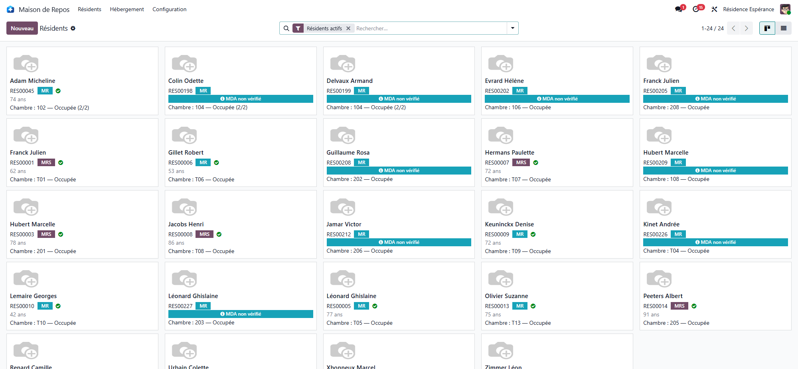

# Residents

:::{rh-description}
Managing residents in a nursing home with Resthome: admission, stay, dependency and geriatric assessments, rooms, condition report and private furniture.
:::

:::{toctree}
:hidden:

gerer-un-resident
evaluations
changement-chambre
chambres
entretien-chambres
etat-des-lieux
procedure-emmenagement
mobilier
:::

Everything about a resident's life in the facility, from the first contact to
the daily record: **admission**, **stay**, **assessments**, **room** and
**condition report**. The resident is the central record all the other apps
build on — care, meals and billing.

## Key principles

- **Admission**: handled in its own application, from the first enquiry to the
  move-in; it creates the resident and opens their stay. See
  [Admissions](../admissions/index.md).
- **Stay**: the period during which the resident occupies a **room**. It drives
  presence, billing and the end-of-stay procedures.
- **Dependency assessment**: scores the resident's dependency on the scale
  the country uses; it determines the **category** declared to the health
  insurer, on which the care allowance it pays relies.
- **Room**: taken from the stay; occupancy is tracked per status.
- **Condition report**: a joint move-in/move-out assessment of the room and its
  equipment, signed by the representative and the facility.

:::{admonition} In Belgium
:class: rh-country rh-country-be

The dependency scale is **Katz**, the stay types are the **MR** and **MRS**
sectors, and the resident's file carries the NISS and the mutualité — see
[The resident's file in Belgium](../belgique/dossier-resident.md) and
[The Katz assessment](../belgique/katz.md).
:::

## What's next

- [Managing a resident](gerer-un-resident.md) — the central record.
- [Geriatric assessments](evaluations.md) — MMSE, Braden, MNA and others.
- [Room change and transfer](changement-chambre.md)
- [Rooms and occupancy](chambres.md)
- [Room housekeeping](entretien-chambres.md)
- [The condition report (move-in and move-out)](etat-des-lieux.md)
- [The move-in procedure](procedure-emmenagement.md)
- [The resident's private furniture](mobilier.md)
