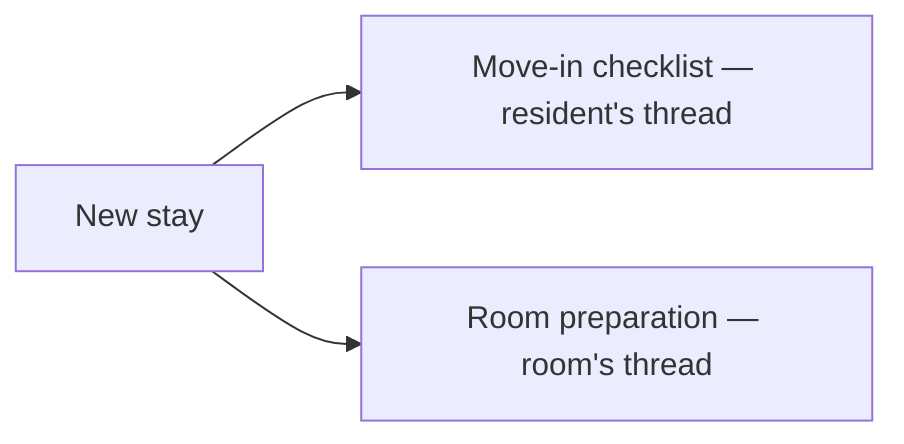

# The move-in procedure

:::{rh-description}
The automatic move-in checklist for nursing homes (MR/MRS) with Resthome: 6 tasks at admission plus room preparation, assigned to the managers in charge.
:::

:::{rh-faq}
How is the move-in checklist created in Resthome?
: Automatically, whenever a new stay opens (admission, room change, internal transfer, readmission). Resthome schedules 6 activities on the resident's thread, due on the stay's start date, assigned to the Move-in Procedure Manager. You have nothing to trigger by hand.

What are the six tasks of the move-in procedure?
: Sign the agreement with the resident's representative, the entry / exit condition report, updating the resident's private inventory, the medication locker and the laundry, and disinfecting the new (or the old) room.

Where is the procedure manager set?
: In Settings ▸ Nursing Home ▸ Accommodation, the Move-in Procedure Manager field. Leaving this field empty disables the checklist entirely. The Rooms Technical Manager, just above, receives the room preparation activities.

Who prepares the room when the resident arrives?
: The Rooms Technical Manager receives a « Prepare the room » activity on the arrival room's thread. On a room change or an internal transfer, a second « Put the room back in order » activity is scheduled on the room being left.

What do I do with a task that does not apply?
: The list is the same for a first admission and for a room change: the manager ticks it off (marks it as done) or deletes the steps that do not apply — for example, there is no old room to disinfect on a first entry.

Can these automations be disabled?
: Yes. Leave the Move-in Procedure Manager field empty to disable the resident's checklist, and the Rooms Technical Manager field empty to disable the room preparation activities.
:::

At every **new stay** — admission, room change, internal transfer or
readmission — Resthome automatically opens the resident's **move-in
procedure**: a **checklist of administrative activities** on the resident's
thread, and the **room preparation** on the technical side. Nothing to trigger
by hand: the tasks appear in the **activities** of the relevant managers and on
the corresponding threads.

You choose these managers in **Settings ▸ Nursing Home ▸ Accommodation**.

:::{admonition} An optional automation
:class: info

Both automations trigger only if the corresponding **manager** is set in the
settings. As long as a field is empty, the automation stays silent — handy for
a data import or a gradual roll-out.
:::

## What triggers at every new stay

As soon as a **stay** is created (by the [admission wizard](admissions.md), the
conversion of a CRM opportunity, or a
[room change / transfer](changement-chambre.md)), Resthome schedules **both
parts** of the procedure at the same time. The deadline of every activity is
the **stay's start date**.

| Event | Resident checklist | Room preparation |
|---|---|---|
| **Initial admission** | 6 tasks | Prepare the new room |
| **Room change** | 6 tasks | Prepare the new room **and** put the old one back in order |
| **Internal transfer** (MR ↔ MRS) | 6 tasks | Prepare the new room **and** put the old one back in order |
| **Readmission** | 6 tasks | Prepare the room (no putting back in order — the old one was already freed) |

:::{admonition} No duplicates
:class: note

The activities are **idempotent**: if you save the stay again, Resthome does
not stack an identical activity that is already open. A **cancelled** stay, or
one without a room or a resident, generates no task.
:::

## The move-in checklist (six tasks)

The checklist is scheduled on the **resident's thread** (activity type
**Move-in procedure**), assigned to the **Move-in Procedure Manager**. It has
six tasks:

| Task | What it is for |
|---|---|
| **Sign the agreement with the resident's representative** | Have the accommodation agreement signed with the reference person |
| **Entry / exit condition report (état des lieux)** | Draw up the joint condition report of the room (see [The condition report](etat-des-lieux.md)) |
| **Update the resident's private inventory** | List the private furniture brought in for the new room (see [Furniture](mobilier.md)) |
| **Update the medication locker** | Move / re-label the room's medication locker |
| **Update the laundry service** | Update the resident's laundry service |
| **Disinfect the new / old room** | Disinfect the arrival room (and the old one, on a room change) |

:::{admonition} Tick what applies
:class: tip

The list is **the same** for a first admission and for a room change. The
manager **marks as done** or **deletes** the steps that do not apply — for
example, there is no old room to disinfect on a first entry.
:::

<!-- screenshot to add: a resident's thread (chatter) with the 6 « Move-in procedure » activities scheduled on the stay's start date -->

## Room preparation

In parallel, Resthome schedules the **room preparation** on the **room's
thread** (activity type **Room preparation**), assigned to the **Rooms
Technical Manager**:

- **Prepare the room — arrival of …**: always scheduled on the **arrival
  room**, on the stay's start date.
- **Put the room back in order — departure of …**: scheduled on the **room
  being left**, only on a **room change** or an **internal transfer** (where
  the resident actually frees an occupied room).

:::{admonition} No putting back in order on entry or readmission
:class: note

The « Put the room back in order » activity is **not** created for a first
admission (no previous room) or for a readmission (the old room was already
freed and cleaned at the previous departure).
:::

## Setting the managers

Both automations rely on two configuration fields, specific to your
institution. Go to **Settings ▸ Nursing Home ▸ Accommodation**:

1. **Move-in Procedure Manager** — the user who receives the resident's
   checklist (the 6 tasks above). Leaving it empty **disables** the checklist.
2. **Rooms Technical Manager** — the user who receives the room **preparation**
   and **putting back in order** activities. Leaving it empty **disables** these
   activities.

:::{admonition} No manager, no activities
:class: warning

If a field stays empty, the corresponding automation creates **no** activity.
Set at least the **Move-in Procedure Manager** to benefit from the checklist at
every new stay.
:::

<!-- screenshot to add: the Accommodation section of the settings with the Rooms Technical Manager and Move-in Procedure Manager fields -->

## Key points to remember

- The move-in procedure triggers **automatically** when any new stay opens:
  admission, room change, internal transfer, readmission.
- It has two parts: a **6-task checklist** on the resident's thread and the
  **room preparation** on the room's thread.
- Every activity is **due on the stay's start date** and is assigned to the
  configured **managers**.
- The six tasks: **agreement**, **condition report**, **private inventory**,
  **medication locker**, **laundry**, **disinfection** — the manager closes or
  deletes those that do not apply.
- You set the managers in **Settings ▸ Nursing Home ▸ Accommodation**; an empty
  field **disables** the corresponding automation.

## Learn more

- [Manage a resident](gerer-un-resident.md)
- [Room change and transfer](changement-chambre.md)
- [The condition report (entry and exit)](etat-des-lieux.md)
- [General settings (residents, rooms)](../configuration/reglages-generaux.md)
