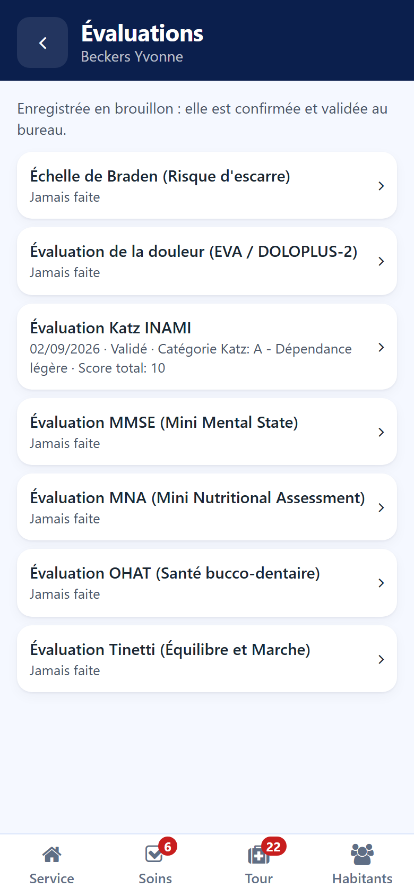

# Evaluations

:::{rh-description}
Filling in an evaluation scale from the Resthome care app: the scales available for the resident, the draft recorded at the bedside and validated at the desk.
:::

:::{rh-faq}
Is an evaluation filled in on the phone final?
: No. It is recorded as a draft, then confirmed and validated in the back office.

What does "To do" mean next to a scale?
: The scale is awaited, for example by an admission waiting for its evaluation.

Why is a scale locked?
: Your role does not allow filling in that scale.
:::

The **Evaluations** button of the resident's sheet lists the evaluation scales
available for that resident.

## The list of scales

Under each scale:

- the date, the status and the result of the last evaluation, or **Never done**;
- **To do** — the scale is awaited, for example by an admission;
- **To validate** — an evaluation is waiting for its validation at the desk;
- a **padlock** — your role does not allow this scale.

## Filling in a scale

1. Tap the scale.
2. Answer each question with one tap. A star marks the questions still required.
3. Add your remarks under **Observations**.
4. Save.

The evaluation is recorded as a **draft**. It is confirmed and validated in the
back office — see [Evaluations](../residents/evaluations.md).
