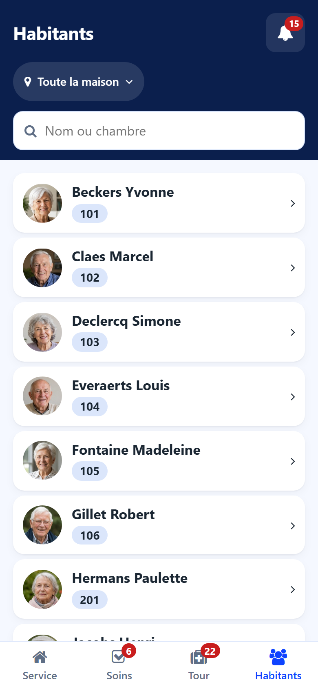
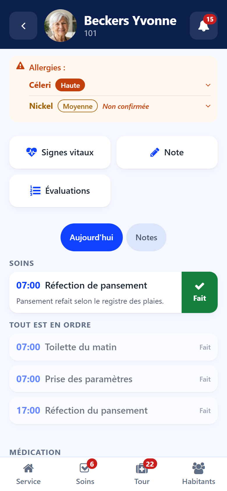

# Residents

:::{rh-description}
The Residents screen and the resident sheet of the Resthome care app: search by name or room, photo, allergies, the day's cares and medication, and the notes.
:::

:::{rh-faq}
How do I find a resident quickly?
: On **Residents**, type part of the name or the room number in the search field.

Why does the sheet say "No allergy recorded"?
: Because no allergy is entered in the resident's record. The sheet says it explicitly so that an empty space is never read as "no allergy".

Can I check it is the right person before an act?
: Yes. Tap the photo on the sheet to enlarge it.
:::

## Residents list

The **Residents** screen lists the residents of the chosen sector, with their
photo and their room.

- Type part of a **name or room** in the search field.
- Tap a resident to open the sheet.

## Resident sheet

The sheet gathers what a carer needs in front of the resident.

### Top of the sheet

- **Photo** — tap it to enlarge it and check you have the right person.
- **Room and sector** under the name.
- **Points of attention** — for example an evaluation awaited. A point that
  leads somewhere opens the right screen.

### Allergies

The allergies come first, the most severe at the top, each with its severity.
The strip takes the colour of the most severe one. Tap an allergy to read the
reaction. An allergy not yet confirmed says so. With no allergy entered, the
sheet shows **No allergy recorded**.

### Quick buttons

- **Vital signs** → [Vital signs](signes-vitaux.md)
- **Note** → [Notes](notes.md)
- **Evaluations** → [Evaluations](evaluations.md)

### Today and Notes

- **Today** — the resident's cares and medication of the day, with their
  **Done** and **Given** buttons. What is settled comes under **All in order**.
- **Notes** — the latest notes about the resident. Tap one to read it whole.
