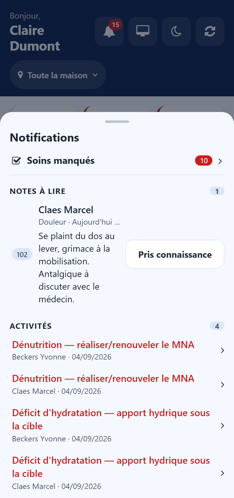

# Care app

:::{rh-description}
The Resthome care app for phones and tablets — the shift, the cares, the medication round, the residents, notes, vital signs and evaluations, at the bedside.
:::

:::{rh-faq}
How do I open the care app?
: From the back office, click the phone icon in the top bar. On a phone, open the same address followed by `/care`, then add it to the home screen with the browser menu.

Can a carer land directly in the care app?
: Yes. Tick **Open the care app at sign-in** on the user: signing in then opens the care app instead of the back office.

Why do I not see the back office button in the app?
: The button only appears for the roles that work at the desk: head nurse, nurse, physician, direction and administration.

What happens without a connection?
: The app keeps working. What you record is kept on the phone, marked **On this phone**, and sent as soon as the connection comes back.

I tapped the wrong button. Can I take it back?
: Yes. After each act a message offers **Undo** for a few seconds.
:::

:::{toctree}
:hidden:

service
soins
tour-medicaments
habitants
notes
signes-vitaux
evaluations
:::

The **care app** is the Resthome screen made for the phone or tablet a carer
carries on the round. It shows only what the shift needs: what is to be done,
the medication to give, the resident in front of you, and what must be written
down. Everything recorded lands in the same records as the back office.

## Opening the app

- **From the back office** — click the phone icon in the top bar.
- **On a phone or tablet** — open the Resthome address followed by `/care`, then
  use the browser menu to add it to the home screen. It then opens like an app.
- **Directly at sign-in** — on the user, tick **Open the care app at sign-in**.
  The person lands in the care app instead of the back office.

The app uses the same sign-in and the same access rights as the back office.

## Moving around

A bar at the bottom of the screen gives the four main screens. A number on a tab
says how many things are waiting there.

- **My shift** — the overview of the shift. → [Shift screen](service.md)
- **Cares** — the cares to carry out, resident by resident. → [Cares](soins.md)
- **Round** — the medication round. → [Medication round](tour-medicaments.md)
- **Residents** — the list and each resident's sheet. → [Residents](habitants.md)

From a resident's sheet you write a [note](notes.md), take the
[vital signs](signes-vitaux.md) or fill in an [evaluation](evaluations.md).

## Choosing the sector

Under the title of the main screens, the sector button filters every list of the
app — cares, round and residents. Tap it and choose a sector, or **The whole
house**. The choice stays when you change screen.

## The bell

The bell at the top right gathers what asks for your attention:

- doses and cares missed, each on one line that opens the list concerned;
- your colleagues' notes marked **Someone must read this**, with their text and a
  **Seen** button — your own notes never appear there;
- the activities due.

A note leaves the bell once someone has pressed **Seen**.

## Undoing an act

After **Done**, **Given** or a refusal, a message at the bottom of the screen
offers **Undo** for a few seconds. Use it to take back a wrong tap.

## Working without a connection

The app keeps working when the Wi-Fi drops:

- a **red** band says there is no connection, and how many acts are waiting on
  the phone;
- an **orange** band says the connection is back and the acts are still being sent;
- each act not yet sent carries **On this phone**.

:::{warning}
Until the band has disappeared, what is waiting is not yet in the resident's
record. Keep the app open until everything is sent.
:::

## Night mode and back office

On the **My shift** screen, the buttons at the top right:

- the **moon** switches to a dark display for the night shift, the **sun**
  switches back — the phone remembers the choice;
- the **screen** icon goes back to the back office. It only appears for head
  nurses, nurses, physicians, direction and administration.

## Going further

- [Care](../soins/index.md) — care plans, prescriptions and registers, managed
  in the back office.
