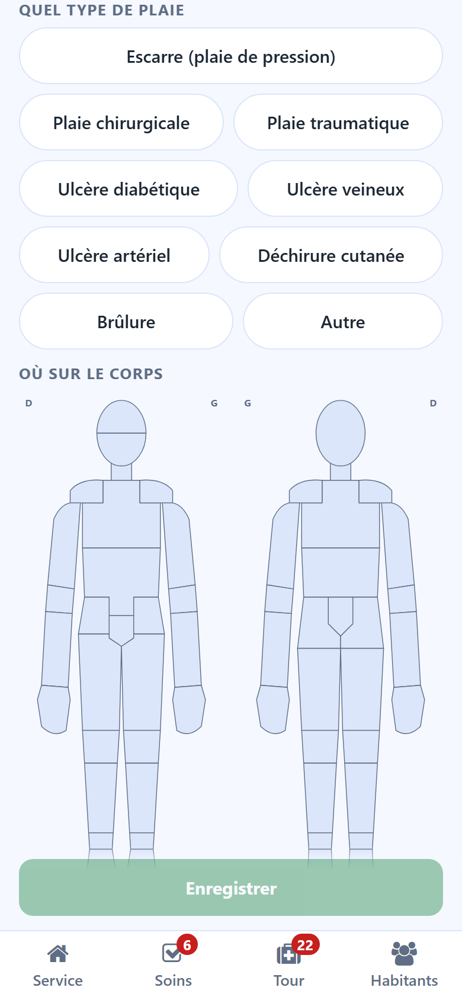
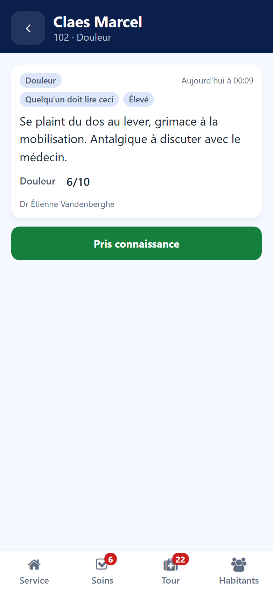

# Notes

:::{rh-description}
Writing a note from the Resthome care app: observation, behaviour, pain, fall, change, wound with body map and photo, family, and the notes someone must read.
:::

:::{rh-faq}
Which note types does the app offer?
: Observation, Behaviour, Pain, Fall, Change, Wound and Family. Some types ask a few extra questions.

How do I make sure a colleague reads my note?
: Switch on **Someone must read this**. The note appears in your colleagues' bell until they press **Seen**.

Can I photograph a wound?
: Yes. In a Wound note, tap **Take a photo**: the phone camera opens.
:::

A note is written from the resident's sheet, with the **Note** button.

## Writing a note

1. Choose the type at the top: **Observation**, **Behaviour**, **Pain**,
   **Fall**, **Change**, **Wound** or **Family**.
2. Write what you saw, in your words.
3. Switch on **Someone must read this** if the team must know.
4. Answer the extra questions, if the type asks for them.
5. Tap **Save**.

## Extra questions by type

The app only asks what the record needs for that type.

- **Pain** — **How bad, 0 to 10**: tap the score.
- **Fall** — **What happened** and **Where**.
- **Change** — **What kind**, and **How often** the first time only: the answer
  is then kept in the continence register.
- **Wound** — see below.

## Wound

Under **Which wound**, choose a wound already followed, **A new wound**, or
**Skin watched, no wound**.

For a new wound:

- **What kind of wound**;
- **Where on the body** — tap the zone on the drawing, or **Elsewhere, not on
  the drawing** and say where;
- **Where it comes from**.

Then, for a new wound as for a wound followed:

- **Photo** — **Take a photo**, **Retake** to replace it;
- **Measured today, in cm** — length, width, depth;
- **Stage** when the type of wound has one, **Exudate** and **Edges**.

For a wound already followed, **And now** records the decision of the day.

## Reading a note

Tap a note on the resident's sheet or in the bell: it opens whole, with its
type, its time, its author and the measures it carries. For a note marked
**Someone must read this**, tap **Seen** once it is read.

The notes also appear in the back office, in the resident's nursing notes. See
[Care plans and vital signs](../soins/plans-de-soins.md).
