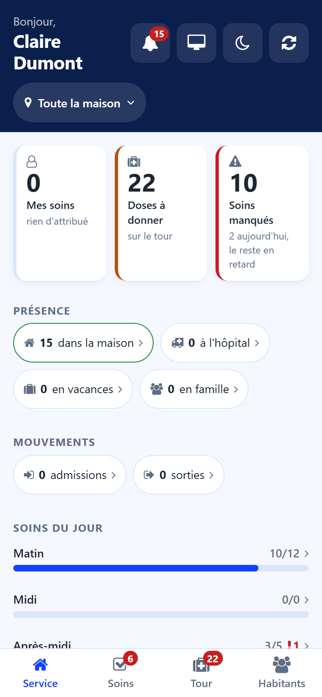

# Shift screen

:::{rh-description}
The Shift screen of the Resthome care app: counters for the carer, residents present, arrivals and departures, the day's cares by period and what comes next.
:::

:::{rh-faq}
What do the three counters at the top show?
: **My cares** counts the cares assigned to you, **Doses due** the doses still to give, **Missed cares** the cares nobody did over the last days. Each counter opens its list.

Can I see who is in hospital today?
: Yes. The **Presence** block counts residents in the house, in hospital, on vacation and with family. Tap a figure to see the residents concerned.

What does the red number next to a period mean?
: Cares of that period that were missed. Tap the bar to open them.
:::

**My shift** is the first screen of the [care app](index.md). It answers the
question of the start of a shift: where things stand, and what comes next.

## Counters

- **My cares** — the cares assigned to you today.
- **Doses due** — the doses still to give. The counter turns red when doses were
  missed.
- **Missed cares** — the cares nobody did over the last days, still owed.

Tap a counter to open the list it counts.

## Presence and movements

- **Presence** — residents in the house, in hospital, on vacation, with family,
  and back today.
- **Movements** — the day's admissions and departures, and the residents deceased
  this week.

Every figure opens the list of the residents it counts. A button above the list
reminds which figure you came from; tap its cross to see everyone again.

## Today's care

One bar per period of the day — morning, noon, afternoon, evening, night —
shows the cares done out of the cares planned. A red number marks the missed
cares of the period. Tap a bar to open that period's cares.

## Next

The next cares and doses, in time order, with the resident and the room. Tap a
line to open the resident's sheet.

When nothing is waiting, the screen says so: **Nothing is waiting. The shift is
up to date.**
