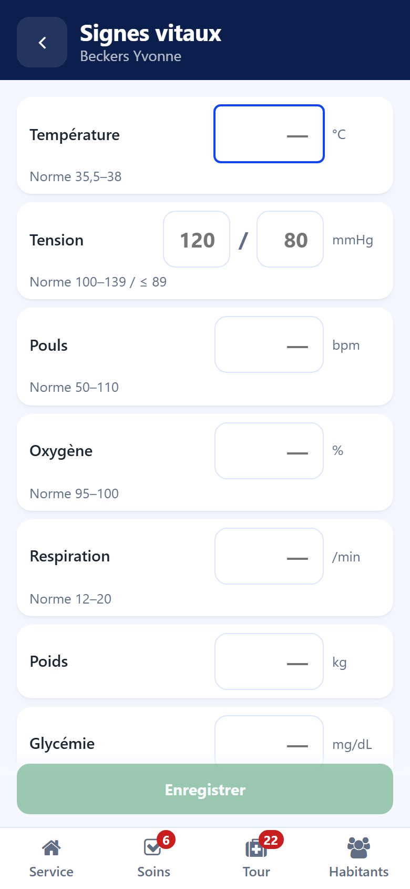

# Vital signs

:::{rh-description}
Taking the vital signs from the Resthome care app: temperature, blood pressure, pulse, oxygen, breathing, weight and blood sugar, with the usual range and the last value.
:::

:::{rh-faq}
Must I fill in every measure?
: No. Fill in only the measures taken. An empty field is a measure not taken, never a zero.

Can I type 37,4 with a comma?
: Yes. The comma and the point are both accepted.

Why is a field orange or red?
: Orange means the value is outside the usual range. Red means the value is impossible: correct it, **Save** stays locked until then.
:::

The **Vital signs** button of the resident's sheet opens the form of measures.

## Measures

- **Temperature** (°C)
- **Blood pressure** — the two figures, in mmHg
- **Pulse** (bpm)
- **Oxygen** (%)
- **Breathing** (per minute)
- **Weight** (kg)
- **Blood sugar** (mg/dL)

The **Next** key of the phone keyboard goes to the next field.

## Taking the measures

1. Fill in the measures taken — only those.
2. Read the line under each field: the usual range and the last value.
3. Add a remark under **Anything to add** if useful.
4. Tap **Save**.

## Colours and short forms

- **Orange** — the value is outside the usual range: check it.
- **Red** — the value is impossible. **Save** stays locked until it is corrected.

The short forms used on the floor are understood: **13** is read as 130 mmHg,
**374** as 37.4 °C. The line under the field then says what will be recorded.

The measures are recorded as a vital signs note on the resident. They feed the
same history and the same curves as in the back office. See
[Care plans and vital signs](../soins/plans-de-soins.md).
