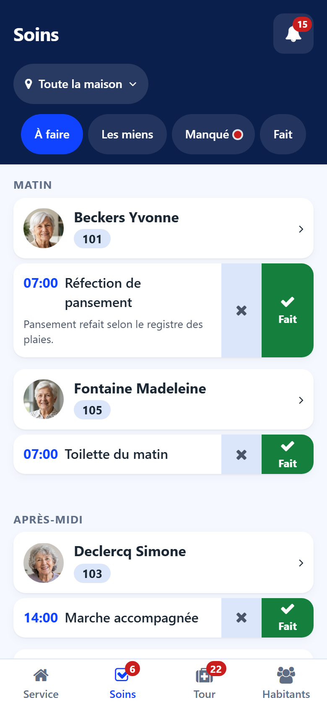
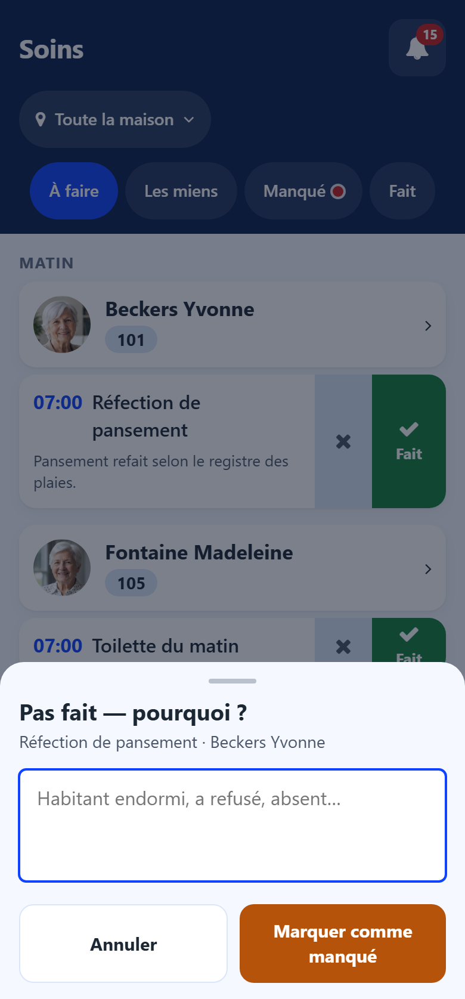

# Cares

:::{rh-description}
The Cares screen of the Resthome care app: the day's cares resident by resident, marking a care done or not done with its reason.
:::

:::{rh-faq}
Where do I find only the cares assigned to me?
: In the **Mine** tab. Your cares also carry the **you** label in the other tabs.

How do I record a care that could not be done?
: Tap the cross next to the care, write why (resident asleep, refused, away…) and tap **Mark missed**.

Can a missed care still be done?
: Yes. It stays in the **Missed** tab and keeps its **Done** button.
:::

The **Cares** screen lists the cares planned for the day in the chosen sector,
grouped by period, then resident by resident with the face and the room.

## Tabs

- **To do** — the cares still to carry out today.
- **Mine** — the cares assigned to you.
- **Missed** — the cares not done over the last days. A red dot on the tab
  says some are waiting.
- **Done** — the cares closed today.

## Marking a care done

Tap **Done** on the care line. The care leaves the **To do** tab and appears in
**Done**. A wrong tap is taken back with **Undo**, offered for a few seconds.

## Recording a care not done

1. Tap the **cross** next to the care.
2. Write why, in your words: resident asleep, refused, away…
3. Tap **Mark missed**.

The reason is kept on the care: the head nurse reads it in the back office.

:::{note}
A care planned in a care plan and never ticked is marked missed automatically
at night. It then appears in **Missed** and in the **Missed cares** counter of
the [Shift screen](service.md).
:::
