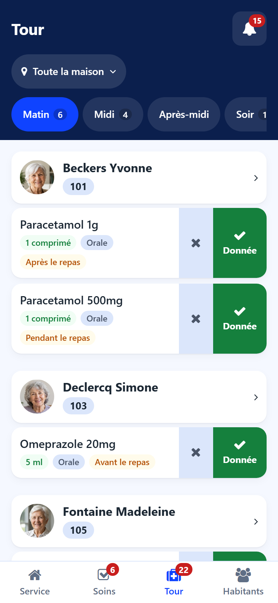
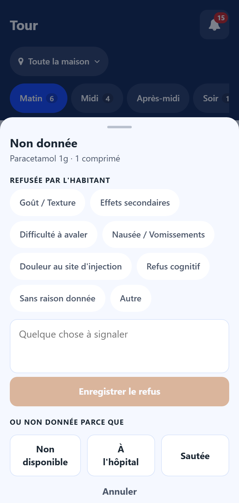

# Medication round

:::{rh-description}
The Round screen of the Resthome care app: the doses of each moment of the day, resident by resident, recorded as given, refused or not given.
:::

:::{rh-faq}
Why is the round sorted by resident and not by medication?
: Because the round goes from room to room. The residents who still have a dose to receive come first; the ones already done follow under **All in order**.

How do I record a refused medication?
: Tap the cross next to the dose, choose the reason under **Refused by the resident**, add a remark if needed and tap **Record refusal**.

What if the medication is missing or the resident is away?
: Tap the cross, then **Not available**, **In hospital** or **Skipped** under **Or not given because**.
:::

The **Round** screen shows the doses to give at each moment of the day, taken
from the prescriptions entered in the back office.

## Moments of the day

The tabs at the top are the moments of the round (morning, noon, afternoon,
evening, night). A number gives the doses still to give; a red dot says doses of
that moment were missed.

## What a dose shows

- the medication and the dose;
- the route (oral, sublingual…) and the moment relative to the meal;
- the special instructions of the prescription.

## Recording a dose given

Tap **Given**. The line then shows the status, the time and who gave it.

## Recording a dose not given

1. Tap the **cross** next to the dose.
2. Choose:
   - under **Refused by the resident**, the reason of the refusal, add a remark
     if useful, then tap **Record refusal**;
   - or, under **Or not given because**, **Not available**, **In hospital** or
     **Skipped**.

:::{note}
The administrations recorded here are the same as in the back office: they
feed the resident's history and the refusal counters of the prescription. See
[Prescriptions](../soins/prescriptions.md).
:::
