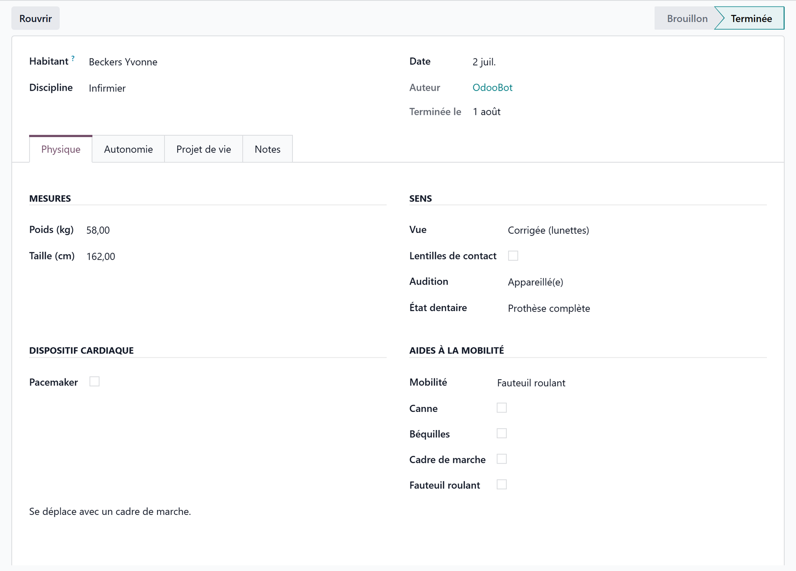

# Anamnesis and life project

:::{rh-description}
The multidisciplinary anamnesis in Resthome: a dated intake per discipline (nursing, physiotherapy, occupational therapy, speech therapy) that collects the resident's life project without re-entering what the record already holds.
:::

:::{rh-faq}
What is the multidisciplinary anamnesis in Resthome?
: A dated intake form, one per discipline (nursing, physiotherapy, occupational therapy, speech therapy), that gathers the resident's physical particularities, hospitalisation preferences and end-of-life wishes, together with the remarks of the professional who fills it in.

Do I have to re-enter the Katz assessment, allergies or treatments?
: No. Those live in the resident's record and are reached from the anamnesis through smart buttons. The anamnesis composes the existing record instead of duplicating it, so nothing can diverge between the two.

Can several disciplines fill in an anamnesis for the same resident?
: Yes, and that is the point. Each discipline keeps its own anamnesis. A single resident can only have one anamnesis per discipline and per date.

What is the difference between the Draft and Complete states?
: A draft can still be edited or deleted. Once marked Complete, the anamnesis becomes part of the clinical record: it can no longer be deleted, only reopened if it was completed by mistake.

Where are the end-of-life wishes recorded?
: In the anamnesis, in the life project section: funeral preferences, notary, religion, palliative status, DNR order and advance directives. They are stored on the resident, so they stay accessible outside the anamnesis too.
:::

The **anamnesis** is the guided intake of a resident's **life project**. It is
filled in shortly after admission, then updated whenever the situation changes.

Menu: **Care → Anamneses**, or the **Anamneses** button on the resident record.

## The principle: compose, never re-enter

An anamnesis is a **dated snapshot per discipline**, not a second copy of the
record.

- The **resident's facts** (glasses, pacemaker, walking aids, weight, wishes…)
  are stored **once on the resident** and edited straight from the anamnesis.
  Correcting the weight here corrects it everywhere.
- The **structured clinical data** (Katz, allergies, prescriptions, assessment
  scales) is **reached by smart button**, never copied.
- Only the **remarks** and the **general notes** belong to the anamnesis itself:
  they are what that professional observed, on that date.

:::{admonition} Why this matters
:class: tip

An intake form that re-asks for the Katz category, the allergies and the
treatments quickly produces two versions of the truth — and staff learn to skip
those blocks. Here there is nothing to skip: what already exists is shown, not
asked again.
:::

## 1. Create the anamnesis

1. Open **Care → Anamneses** and click **New** (or start from the resident).
2. Pick the **resident** and the **discipline**: Nursing, Physiotherapy,
   Occupational Therapy or Speech Therapy.
3. The **date** defaults to today, and the **author** is you.
4. **Save.**

:::{admonition} One anamnesis per resident, discipline and date
:class: note

Resthome refuses a duplicate for the same resident, the same discipline and the
same date. To revise a same-day entry, edit the existing one rather than
creating a second.
:::

## 2. Physical particularities

The first block gathers what care staff need at a glance:

| Item | Detail |
|---|---|
| **Sight, hearing, dental status, mobility** | the resident's core selections |
| **Contact lenses** | yes / no |
| **Pacemaker** | presence, rhythm and device number |
| **Walking aids** | cane, crutches, walking frame, wheelchair (with its number) |
| **Weight and height** | feed the nutritional monitoring |

These fields belong to the resident: they are visible on their record and in the
other apps that need them.

## 3. Hospitalisation preferences

What to do, and where to go, if the resident has to be hospitalised:
**preferred hospitals**, **refused hospitals**, **room type** and
**complementary insurance**.

These preferences feed the **liaison pack** printed when a hospitalisation is
recorded — see [Manage a resident](../residents/gerer-un-resident.md).

## 4. The life project and end-of-life wishes

The most sensitive block, and the reason the anamnesis exists:

- **Administrative arrangements** — will, burial concession, funeral preference
  and funeral home, funeral contract status, notary.
- **Religion**, when the resident wishes to state it.
- **Instructions** — end-of-life instructions and hospitalisation instructions,
  in free text.
- **Palliative status** — start date, and whether the **resident** and their
  **representative** have agreed.
- **DNR order** and **advance directives**, with their notes.

:::{admonition} Collected once, honoured everywhere
:class: warning

A DNR order or an advance directive entered here shows up on the resident's
record, where the care team sees it. These wishes must be gathered with the
resident, and with their representative where applicable — the two agreement
boxes exist precisely to record that this conversation took place.
:::

## 5. Remarks and clinical context

Three free-text areas hold what **you** observed: **physical**,
**autonomy / care**, and **life project** remarks, plus richer **general
notes**.

Alongside them, smart buttons open the existing clinical record without leaving
the page:

- the resident's **Katz** assessments (and their current category);
- their **allergies**, with a counter;
- their **prescriptions**, with a counter;
- the **assessment scale** suited to the discipline — Tinetti for
  physiotherapy, MMSE for occupational therapy, Katz otherwise.

## 6. Complete the anamnesis

When the intake is done, click **Complete**. Resthome records the completion
date.

| State | Meaning |
|---|---|
| **Draft** | Being filled in; editable and deletable. |
| **Complete** | Part of the clinical record: no longer deletable. |

:::{admonition} A completed anamnesis cannot be deleted
:class: warning

It belongs to the clinical record, whose retention is a legal obligation. If it
was completed by mistake, **reopen** it — that returns it to draft, and it
becomes editable again.
:::

The same rule applies to the resident: the record is **archived**, never
deleted.

## Key takeaways

- The anamnesis is a **dated intake per discipline**, not a second record.
- What the record already holds is **composed, never re-entered**: correcting a
  fact here corrects it everywhere.
- The **life project** and end-of-life wishes are gathered here and stay visible
  on the resident's record.
- **Complete** makes the anamnesis part of the clinical record — it can then be
  reopened, but no longer deleted.

## Further reading

- [Manage a resident](../residents/gerer-un-resident.md)
- [The Katz assessment](../residents/katz.md)
- [Care plans and vital signs](plans-de-soins.md)
- [Clinical registers](registres.md)
