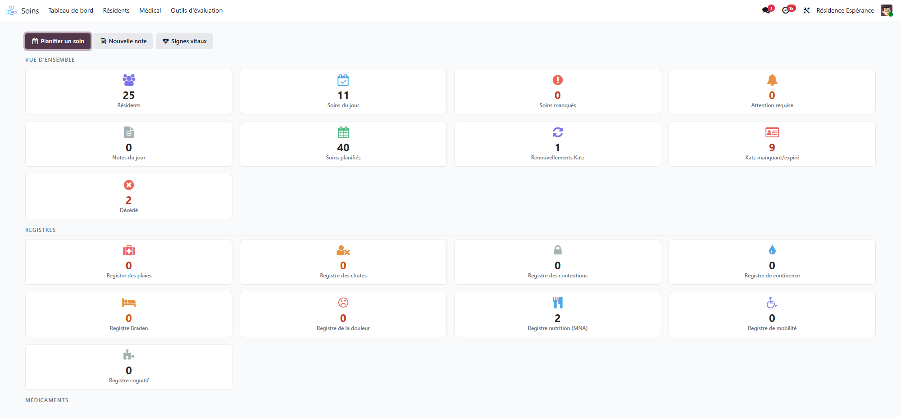

# Care

:::{rh-description}
The Resthome Care application — prescriptions, care plans, vital signs, nursing notes and clinical registers for the medical follow-up of residents.
:::

:::{toctree}
:hidden:

dossier-medical
anamnese
prescriptions
plans-de-soins
registres
:::

The **Care** application brings together all **medical and nursing** follow-up
of residents: medication, care plans, vital signs, notes, and the **clinical
registers** (falls, wounds, pain, nutrition…). It is designed for the daily work
of the care staff.

## The dashboard

When you open it, the **dashboard** highlights what needs attention today: care
to carry out, points to watch, administrations to give. You start from here for
your round.

## What the application covers

- **Prescriptions and medication** — Medication catalogue, prescriptions, administrations, batches and stock. → [Prescriptions](prescriptions.md)
- **Care plans and vital signs** — Care plans, planning of the day's care, vital signs and trends, nursing notes. → [Care plans](plans-de-soins.md)
- **Clinical registers** — Falls, pressure ulcers (Braden), wounds, pain, restraint, nutrition (MNA), continence, mobility, cognition. → [Registers](registres.md)

## Main menus

- **Medical** — dependency assessment, nursing notes, attention points, vital
  signs entry, care planning, today's care, my assigned care, care plans,
  prescriptions, administrations, hospitalisation.
- **Registers** — the dedicated clinical registers.
- **Stock** — medication batches, stock withdrawals.
- **Configuration** — medication catalogue, pathologies (ICD-10), allergens,
  drug interactions, and the national medication database where the country
  provides one.

:::{admonition} In Belgium
:class: rh-country rh-country-be

The dependency assessment is the Katz scale, and the medication catalogue is fed
from the official SAM database: see [Care in Belgium](../belgique/soins.md) and
[The SAM medication database](../belgique/sam-base-medicaments.md).
:::

:::{admonition} Separate but connected
:class: note

The Care application is separate from billing, but **connected to the
residents**: a hospitalisation entered here appears, on the billing side, as an
[absence](../facturation/absences.md) that adjusts the allowance.
:::

## Going further

- [Prescriptions and medication](prescriptions.md)
- [Care plans and vital signs](plans-de-soins.md)
- [Clinical registers](registres.md)
