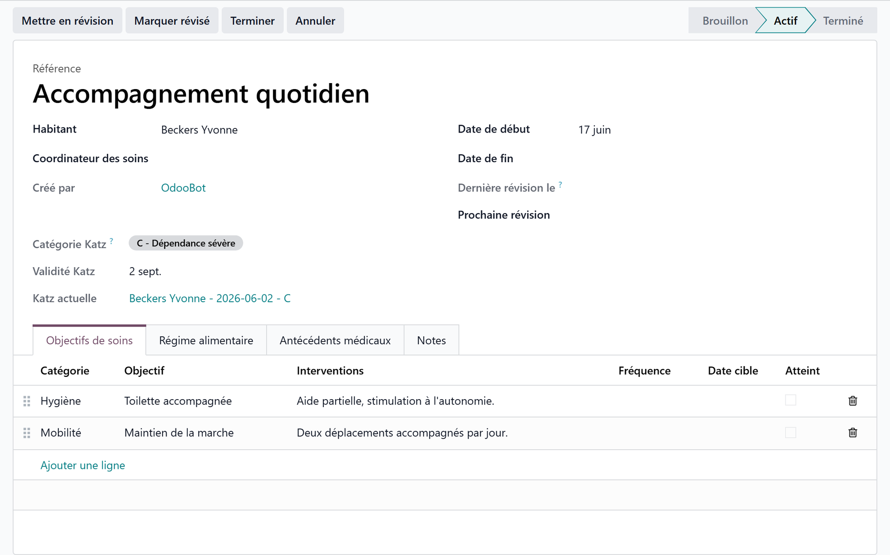
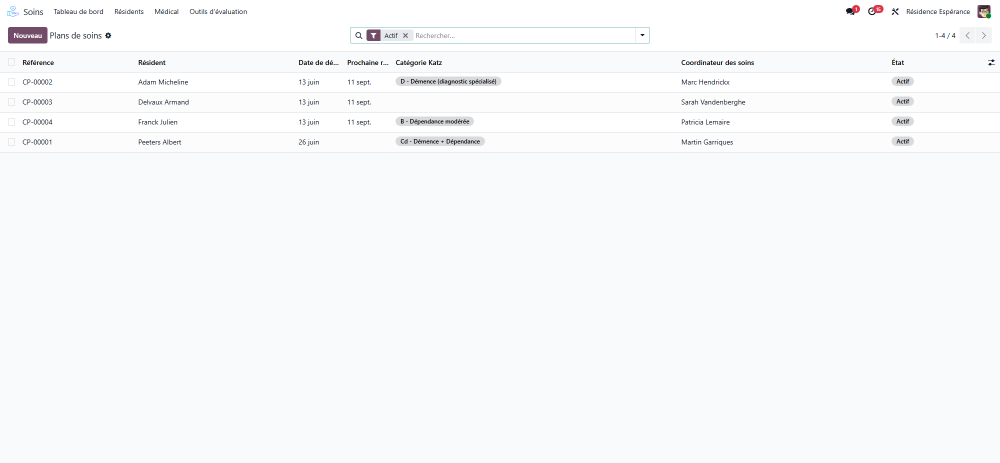
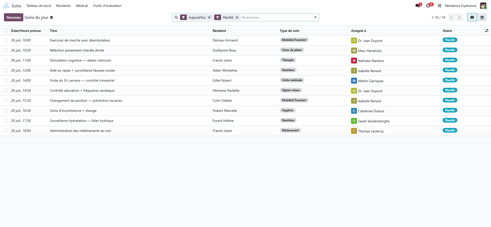
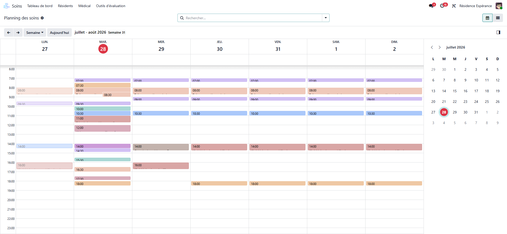
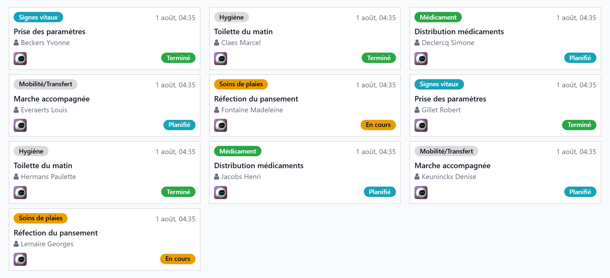
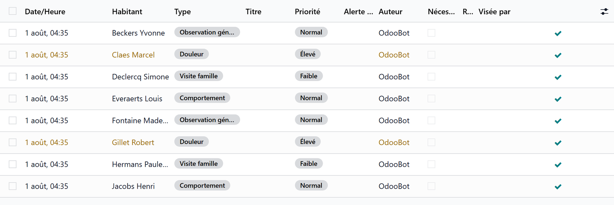

# Care plans and vital signs

:::{rh-description}
Care plans, daily care schedule, vital signs entry and trends, and nursing notes in Resthome.
:::

:::{rh-faq}
What is a care plan in Resthome?
: A plan describing the goals of a resident's care and the actions to carry out. It is activated, put under review then validated periodically, and finally completed or cancelled.

Where do I see the care to be carried out today?
: In "Today's care" for the whole list, and "My assigned care" for what is assigned to you personally. Each task can be started, completed, cancelled or marked missed.

How do I record vital signs?
: From the resident record, open Vital signs entry and fill in the measurements (blood pressure, pulse, temperature, weight, saturation...), then save.

Can I see how a resident's vital signs evolve?
: Yes. The Trends tool shows how measurements change over time, which helps spot a deterioration before it sets in.

What are nursing notes used for?
: To record observations. Items needing attention surface under Watch points / Attention required, and are marked resolved once handled.
:::

Beyond medication, the Care app organizes **day-to-day nursing work**: care plans, scheduling, vital signs and notes.

## Care plans

A **care plan** describes the **goals** of a resident's care and the actions to carry out. It follows a clear cycle:

- **Activate** — the plan becomes effective.
- **Put under review** then **Validate review** — periodic reassessment.
- **Complete** / **Cancel** — closure.

Each plan carries its own **goals**, which makes follow-up measurable.

## Care scheduling

- **Today's care** — the list of care tasks to perform today.
- **My assigned care** — what is assigned to you personally.
- Each scheduled care task can be **started**, **completed**, **cancelled** or marked **missed** — the round stays traceable.

The same care can be read as a **calendar**, which makes the workload of each day
of the week visible at a glance.

In **kanban** view, the same day reads as a board of cards — one per care task,
with its status at a glance.

## Vital signs

1. From the resident record, open **Vital signs entry**.
2. Fill in the measurements (blood pressure, pulse, temperature, weight, saturation…).
3. **Save.**

:::{admonition} Trends
:class: tip

The **Trends** tool displays how vital signs evolve over time — handy for spotting a deterioration before it sets in.
:::

## Nursing notes

**Nursing notes** record observations. Items that need attention surface under **Watch points** / **Attention required**, and are marked **resolved** once handled.

## Learn more

- [Prescriptions and medications](prescriptions.md)
- [Clinical registers](registres.md)
