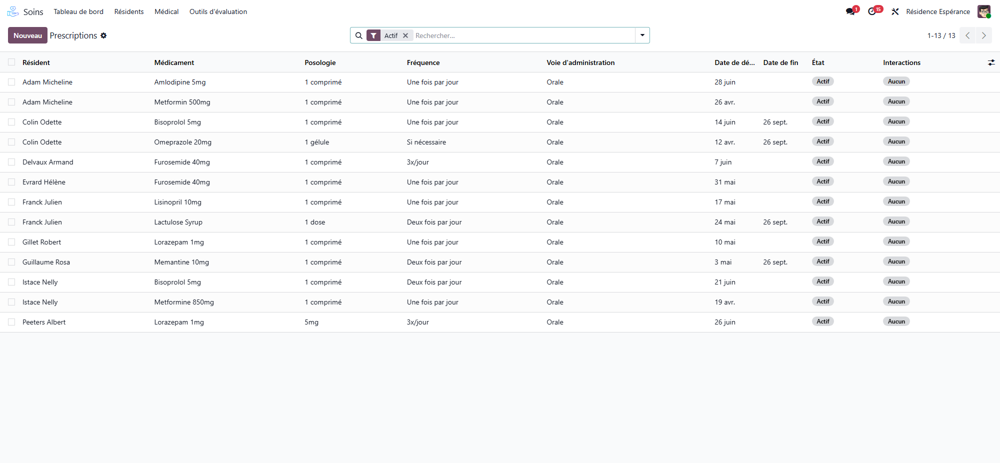
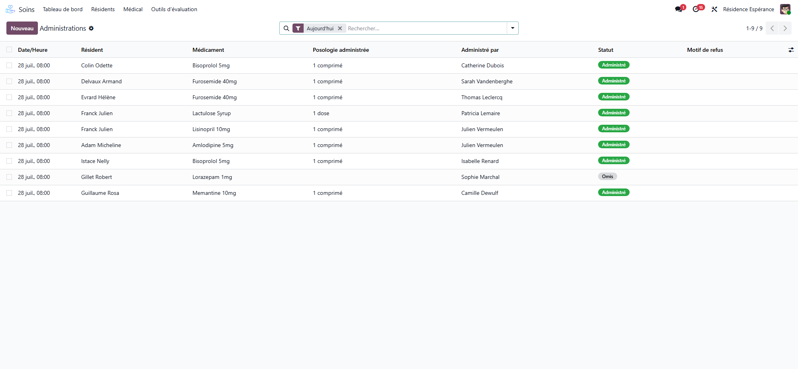

# Prescriptions and medications

:::{rh-description}
Manage medication in Resthome — catalogue, prescriptions, administrations, lots and stock, allergies and interactions.
:::

:::{rh-faq}
How do I prescribe a medication in Resthome?
: From the resident's record in the Care app, create a prescription, then choose the medication, the dosage and the period.

Does Resthome check allergies and drug interactions?
: Yes. Resthome knows the resident's allergies and the known interactions, and warns you when a prescription poses a risk - before administration.

What can I do with an ongoing prescription?
: You can suspend it temporarily (before an examination for instance), resume it, end it at the end of treatment, or cancel one entered by mistake.

How is medication administration traced?
: Administrations stem from the prescriptions: the caregiver records what was given, when and by whom, which makes traceability complete.

Where does the medication catalogue come from?
: From the facility's medication catalogue, which lists the name, form and dosage of each medication. You fill it by hand, or import from the national medication reference database where the country provides one.
:::

Resthome manages a resident's **medication** end to end: from prescription to
administration, including stock and safety checks (allergies, interactions).

## The medication catalogue

Available medications are grouped in a **catalogue**. It lists the name, the
form and the dosage. It is the source of prescriptions. Where the country
provides a national medication reference database, Resthome imports its
medications into the catalogue instead of having you enter them by hand.

:::{admonition} In Belgium
:class: rh-country rh-country-be

The catalogue is fed from **SAM**, the official Belgian medication database
(CNK code, active ingredient, ATC code, leaflets). See [The SAM medication
database](../belgique/sam-base-medicaments.md).
:::

## Prescribing

1. From the resident's record (Care application), create a **prescription**.
2. Choose the **medication**, the **dosage** and the **period**.
3. **Save.**

A prescription follows its life cycle with clear actions:

- **Suspend** — temporarily interrupt (e.g. before an examination).
- **Resume** — restart a suspended prescription.
- **End** — close at the end of the treatment.
- **Cancel** — remove a prescription entered by mistake.

:::{admonition} Safety: allergies and interactions
:class: warning

Resthome knows the resident's **allergies** and the known **drug interactions**.
It warns you if a prescription poses a risk — a safeguard before administration.
:::

## Administering

**Administrations** stem from prescriptions: the caregiver records what was
given, when and by whom. Traceability is complete.

## Hospitalisation: suspend, then resume

When a resident goes to hospital, their prescriptions must not stay active —
the hospital takes over. Resthome does it in one step.

1. From the resident's record, open the **hospitalisation** action.
2. Choose **Hospitalise**, and enter the **date** and the **reason**.
3. Confirm: every **active** prescription is **suspended**, each one carrying
   the date and the reason.

On the way back, the same action in **Return** mode **resumes** the
prescriptions that had been suspended for this hospitalisation.

### The liaison pack

Before the resident leaves, print the **liaison pack**: the document the
hospital asks for on admission. It gathers what the ward needs — identity,
treatments, allergies, dependency, and the hospitalisation preferences recorded
in the [anamnesis](anamnese.md).

:::{admonition} One click, at the right moment
:class: tip

The pack is printed from the hospitalisation window itself, so it is produced
while the transfer is being recorded — not looked for afterwards.
:::

## Lots and stock

The **medication lots** and the **stock withdrawals** let you track the available
quantities and consumption, with lot numbers for traceability.

## Useful configuration

- **Pathologies (ICD-10)** — the resident's history and diagnoses.
- **Allergens** — known allergies.
- **Drug interactions** — vigilance rules.
- **National medication database** — the country's reference catalogue of
  medications, where one is provided.

## Going further

- [Care plans and vital signs](plans-de-soins.md)
- [Clinical registers](registres.md)
