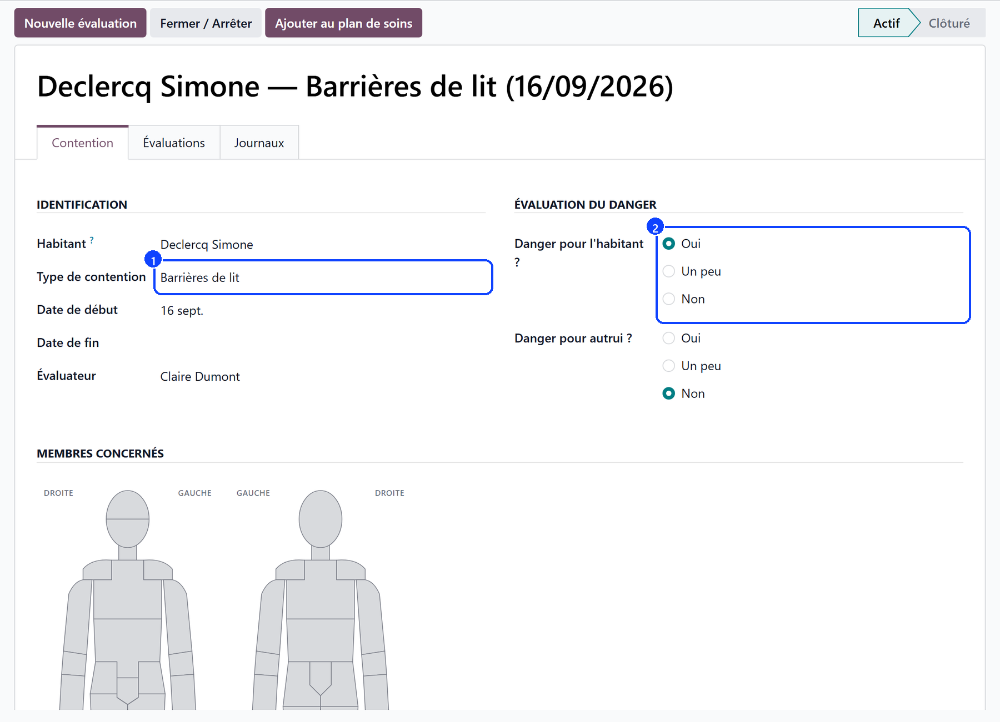
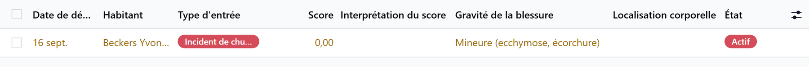
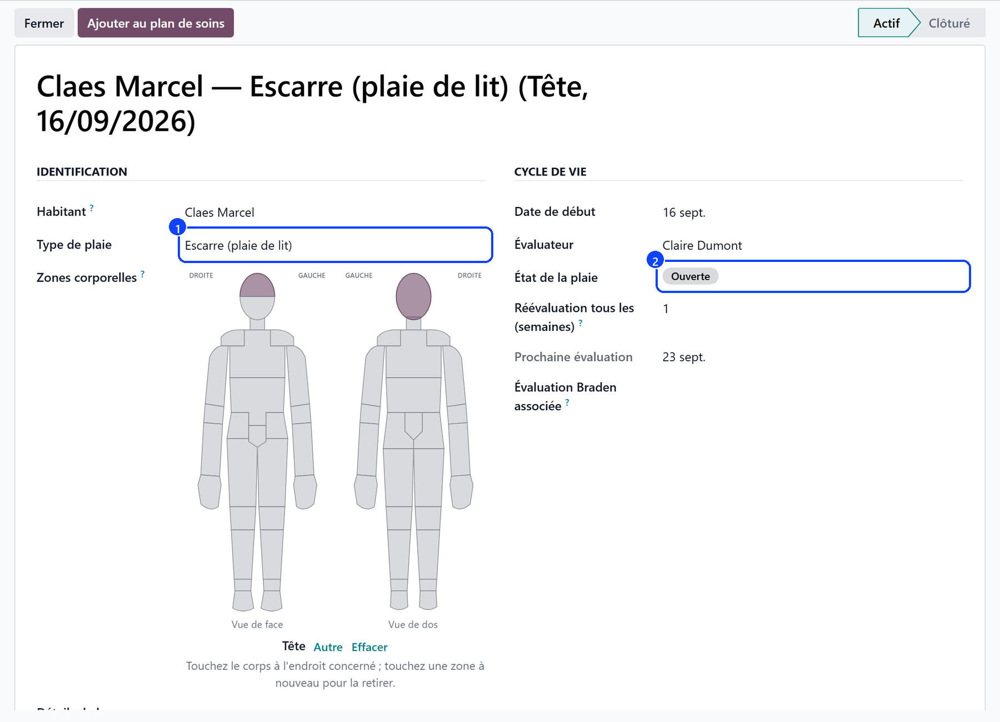

# Clinical registers

:::{rh-description}
The Resthome clinical registers — restraint, falls, continence, wounds, infections, invasive procedures and isolation — opened, followed and closed for each resident.
:::

:::{rh-faq}
Which registers does Resthome provide?
: Seven: restraint, falls, continence, wounds, infections, invasive procedures and isolation. They record **events**, over time, for one resident.

Where are the registers?
: In the **Care** application, under **Registries**. Each register has its own menu.

What is the difference between a register and an assessment scale?
: A register records events — a fall, a wound, an isolation. A scale measures a state at a given moment: Braden, MNA, Tinetti, MMSE, the pain scales. The scales live with the [assessments](../residents/evaluations.md).

Can a register be closed and reopened?
: Yes. A register stays open as long as the situation lasts, is closed when it is over, and can be reopened if it comes back.
:::

**Clinical registers** are the memory of what happened: a fall, a wound, an
episode of infection. Each register follows one theme, for one resident, over
time — which is what an inspection, a handover or a family conversation needs.

## The seven registers

| Register | What it records |
|---|---|
| **Restraint Registry** | Every restraint measure, its reason and its duration |
| **Fall Registry** | Falls, their circumstances and their consequences |
| **Continence Registry** | The continence situation and how it changes |
| **Wound Registry** | Wounds, their care and their healing |
| **Infection Registry** | Infection episodes and the measures taken |
| **Procedure Registry** | Invasive procedures (catheter, probe…) |
| **Isolation Registry** | Isolation measures and their follow-up |

:::{admonition} A register is not a scale
:class: note

A register records **events**. A **scale** measures a state at a given moment —
Braden, MNA, Tinetti, MMSE, the pain scales. They are filled in from the
resident's record or from the [care app](../soins-mobile/evaluations.md), and
are described under [Geriatric assessments](../residents/evaluations.md).
:::

## How a register works

1. Open the register from the **Care** application → **Registries**.
2. Create the entry for the resident concerned, and describe the event.
3. The register keeps the **history**: each new entry adds to the file rather
   than replacing it.
4. **Close** it when the situation is over; **reopen** it if it comes back.

## What it feeds

- The **care app** writes into the registers straight from the bedside: a fall
  note, a wound note with its photo and its measurements, a continence note.
  See [Notes](../soins-mobile/notes.md).
- The **wound register** carries the wounds that the care app offers to follow.

- An **infection** or **isolation** register is what an inspection asks to see.

## Going further

- [Notes in the care app](../soins-mobile/notes.md)
- [Geriatric assessments](../residents/evaluations.md)
- [Care plans and vital signs](plans-de-soins.md)
