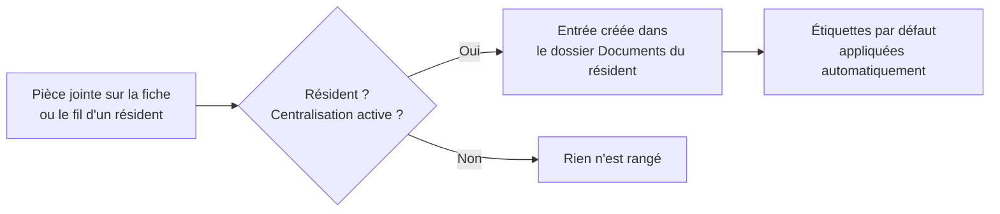

# La centralisation automatique des pièces jointes

Dans une maison de repos, un même résident accumule des dizaines de pièces : accord
de séjour, formulaires médicaux, décomptes de mutuelle, consentements RGPD… Sans
rangement, ces fichiers finissent éparpillés dans les fils de discussion. La
**centralisation automatique** règle le problème : **toute pièce jointe déposée sur la
fiche ou le fil de discussion d'un résident est recopiée dans son dossier personnel**
de l'app **Documents**, avec application des **étiquettes par défaut**.

Vous n'avez rien à faire : le rangement est **automatique** et **activé par défaut**.
Le paramétrage (activation, dossier racine, tags) se trouve dans **Réglages > Documents
> Centralisation des fichiers**, bloc **Maison de repos**.

!!! info "Prérequis"
    Cette fonctionnalité s'appuie sur l'application **Documents** d'Odoo : elle n'est
    disponible que si Documents est installée. Le **dossier racine des résidents** et le
    **dossier personnel** de chaque résident sont créés automatiquement — vous n'avez
    rien à préparer.

## Comment ça marche

Dès qu'un fichier est joint à un résident — que ce soit **en pièce jointe d'un message
du fil de discussion** ou **directement sur sa fiche** — Resthome en crée une entrée
correspondante dans l'app Documents, à l'intérieur du dossier de ce résident.

Trois conditions déclenchent le rangement :

- la fiche est bien celle d'un **résident** (une personne marquée comme résident) ;
- la **centralisation** est **activée** pour l'établissement ;
- l'app **Documents** est installée.

Si l'une manque, la pièce jointe reste simplement attachée au message ou à la fiche,
sans copie dans Documents.

!!! note "Ce qui n'est PAS centralisé"
    La centralisation ne concerne **que les résidents**. Les pièces jointes déposées sur
    un **contact ordinaire**, un **fournisseur** ou un **employé** ne sont pas recopiées
    dans l'app Documents.

## Où arrivent les documents

Chaque document centralisé est rangé dans le **dossier personnel du résident**, lui-même
placé sous le dossier racine **« Résidents »**. À l'admission (ou à l'activation de la
fiche résident), ce dossier personnel est créé automatiquement, avec trois sous-dossiers
prêts à l'emploi :

- **Documents médicaux**
- **Documents administratifs**
- **Documents de facturation**

Le dossier porte le **nom du résident** et se renomme tout seul si le nom change.

<!-- capture a ajouter : dossier personnel d'un resident dans l'app Documents, avec ses trois sous-dossiers -->

!!! tip "Le bouton « Documents » de la fiche du résident"
    Sur la fiche d'un résident, le bouton **Documents** (compteur en haut de la fiche)
    ouvre **directement** son dossier dans l'app Documents. Le compteur inclut les
    pièces rangées dans les **sous-dossiers**, pas seulement à la racine du dossier.

## Les étiquettes par défaut

À chaque document centralisé, Resthome applique automatiquement les **étiquettes par
défaut** choisies pour l'établissement (**Réglages > Documents > Centralisation des
fichiers > Tags par défaut**). C'est ce qui permet, ensuite, de **filtrer** et
**retrouver** rapidement les documents dans l'app Documents.

Resthome fournit déjà une liste de tags prêts à l'emploi, adaptés au métier :

| Étiquette | Usage typique |
|---|---|
| **Katz** | Évaluations de dépendance |
| **Fin de séjour** | Documents de sortie ou de décès |
| **eAgreement** | Accords MR/MRS (convention de soins) |
| **OA** | Décomptes et courriers de l'organisme assureur |
| **Convention** | Convention |
| **Formulaire médical** | Formulaires et certificats médicaux |
| **Facturation** | Décomptes et factures |
| **CPAS** | Prises en charge CPAS |
| **RGPD** | Consentements et documents RGPD |

!!! tip "Commencez léger"
    Les **Tags par défaut** sont **optionnels**. Laissez le champ **vide** au démarrage,
    ou mettez-y un seul tag générique : vous pourrez toujours étiqueter finement chaque
    document a posteriori dans l'app Documents.

## Qui peut voir les documents

Les documents centralisés **héritent des droits du dossier du résident** : seuls les
utilisateurs disposant d'un accès à l'app **Documents** les consultent. Ils n'ont pas de
propriétaire individuel, ce qui évite qu'un fichier « appartienne » à un seul agent et
garde l'ensemble du dossier résident cohérent et gérable par l'équipe.

!!! note "Cloisonné par établissement"
    En multi-société, **chaque établissement a son propre dossier racine « Résidents »**
    et son propre paramétrage de centralisation. Les documents d'un résident restent
    donc cloisonnés dans sa société.

## Activer ou désactiver

La centralisation est **activée par défaut**. Vous la contrôlez avec le bloc **Maison de
repos** dans **Réglages > Documents > Centralisation des fichiers** :

- **cocher** le bloc **active** le rangement automatique ;
- **décocher** le bloc **arrête** la centralisation des **futures** pièces jointes — les
  documents déjà rangés **restent en place**, rien n'est supprimé ni déplacé.

Le détail des trois réglages (activation, **dossier racine**, **tags par défaut**) est
décrit dans la page [Réglages des documents](../configuration/reglages-documents.md).

## Points clés à retenir

- Toute pièce jointe déposée sur le **fil de discussion** ou la **fiche** d'un résident
  est **automatiquement recopiée** dans son dossier Documents.
- Le rangement ne concerne **que les résidents** — pas les contacts, fournisseurs ou
  employés.
- Les **étiquettes par défaut** de l'établissement sont **appliquées automatiquement**
  à chaque document centralisé.
- Le **dossier personnel** du résident (et ses sous-dossiers) est créé automatiquement ;
  le bouton **Documents** de la fiche l'ouvre directement.
- La centralisation est **activée par défaut** et se désactive en décochant le bloc
  **Maison de repos** — les documents déjà rangés restent en place.
- Le réglage et le dossier racine sont **propres à chaque établissement**.

## Pour aller plus loin

- [Documents](index.md)
- [Réglages des documents](../configuration/reglages-documents.md)
- [Gérer un résident](../residents/gerer-un-resident.md)
