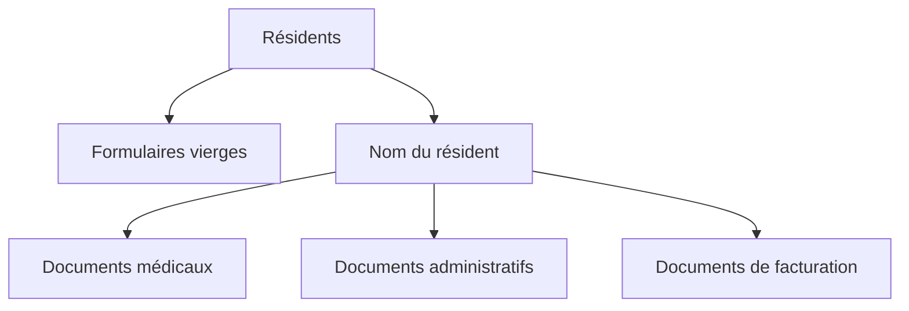

# Les documents du résident

Resthome tient, pour **chaque résident**, un **dossier documentaire** rangé dans
l'app **Documents** d'Odoo. Vous n'avez rien à créer ni à classer à la main :
le dossier, ses sous-dossiers et le classement sont automatiques. Vous y accédez
depuis le bouton **Documents** sur la fiche du résident, ou depuis l'application
**Documents → Résidents**.

!!! info "Prérequis"
    Cette fonctionnalité s'appuie sur l'application **Documents** d'Odoo : elle
    doit être installée. Une fois activée, les dossiers résidents et les
    étiquettes sont mis en place automatiquement — vous n'avez rien à préparer.

## Un dossier par résident, créé automatiquement

Dès qu'un résident est créé (ou dès que sa fiche devient une fiche résident),
Resthome crée son **dossier personnel** sous le dossier racine **« Résidents »**,
avec **trois sous-dossiers** prêts à l'emploi :

| Sous-dossier | Ce qu'on y range |
|---|---|
| **Documents médicaux** | Évaluations, formulaires et pièces médicales du résident. |
| **Documents administratifs** | Convention, pièces d'identité, accords, courriers. |
| **Documents de facturation** | Factures et pièces liées à la facturation du résident. |

Le dossier porte le **nom du résident** et se **renomme automatiquement** si le
nom change. Les dossiers sont **triés par ordre alphabétique**, ce qui les garde
faciles à parcourir dans l'app Documents.

!!! note "Des dossiers protégés"
    Les dossiers créés automatiquement sont **protégés contre la suppression** :
    un utilisateur standard peut y déposer et y consulter des documents, mais ne
    peut pas supprimer le dossier lui-même. Vous évitez ainsi de perdre par
    erreur toute la structure documentaire d'un résident.

<!-- capture à ajouter : dossier d'un résident dans l'app Documents montrant les trois sous-dossiers Documents médicaux / administratifs / de facturation -->

## Le bouton « Documents » sur la fiche

Sur la fiche du résident, un **bouton intelligent « Documents »** affiche le
**nombre de fichiers** rangés dans son dossier. Le compteur additionne les
documents du dossier **et de ses sous-dossiers** (les sous-dossiers eux-mêmes ne
sont pas comptés). Cliquer sur le bouton **ouvre directement** le dossier
personnel du résident dans l'app Documents.

!!! tip "Réservé aux utilisateurs de l'app Documents"
    Le bouton n'apparaît que pour les utilisateurs qui ont accès à l'application
    **Documents**. Les autres continuent de voir la fiche résident normalement,
    sans le raccourci.

<!-- capture à ajouter : fiche résident avec le bouton intelligent « Documents » et son compteur en haut à droite -->

## Les dossiers créés au niveau de l'établissement

À la création de la société (l'établissement), Resthome met en place
automatiquement deux dossiers au sommet de l'app Documents :

- **Résidents** — le dossier racine qui contient tous les dossiers résidents.
- **Formulaires vierges** — un sous-dossier pour vos **modèles** et documents à
  compléter (conventions type, formulaires médicaux vierges, etc.).

!!! note "Cloisonné par établissement"
    En multi-société, **chaque établissement a son propre dossier racine**
    « Résidents » et son propre dossier « Formulaires vierges ». Les documents
    restent ainsi séparés d'une maison à l'autre.

## Les étiquettes prédéfinies

Resthome fournit une liste d'**étiquettes** (tags) prêtes à l'emploi pour
**catégoriser** les documents et les **retrouver par filtre** dans l'app
Documents :

| Étiquette | Usage typique |
|---|---|
| **Évaluation Katz** | Grilles et rapports d'évaluation de dépendance Katz. |
| **Formulaire médical** | Formulaires et documents médicaux. |
| **Accord MR/MRS (eAgreement)** | Accords de la mutuelle (eAgreement). |
| **Allocation OA** | Décisions et allocations de l'organisme assureur. |
| **Convention** | La convention signée avec le résident. |
| **Facturation** | Factures et pièces de facturation. |
| **CPAS** | Documents de prise en charge CPAS. |
| **Consentement RGPD** | Consentements et documents relatifs à la vie privée. |
| **Fin d'hébergement** | Documents de fin de séjour / sortie. |

!!! tip "Appliquer des étiquettes automatiquement"
    Vous pouvez faire appliquer un ou plusieurs de ces tags **automatiquement** à
    chaque document centralisé, via le champ **Tags par défaut** des réglages.
    Voir [Réglages des documents](../configuration/reglages-documents.md).

## Le classement automatique des pièces jointes

Au-delà des dossiers, Resthome peut **centraliser automatiquement** les pièces
jointes déposées sur la fiche d'un résident : elles atterrissent directement dans
son dossier personnel, sans classement manuel. Ce comportement se règle dans la
configuration.

!!! info "En savoir plus"
    Le fonctionnement détaillé, les cas d'usage et l'activation sont décrits dans
    la page [La centralisation des documents](centralisation.md).

## Points clés à retenir

- Chaque résident dispose d'un **dossier personnel automatique** avec trois
  sous-dossiers : **médicaux**, **administratifs**, **de facturation**.
- Le dossier suit le **nom du résident** et se renomme tout seul ; les dossiers
  sont **protégés contre la suppression** accidentelle.
- Le **bouton « Documents »** de la fiche ouvre le dossier et compte les fichiers,
  sous-dossiers inclus.
- Au niveau de l'établissement, Resthome crée les dossiers **« Résidents »** et
  **« Formulaires vierges »**, **cloisonnés par société**.
- Neuf **étiquettes** prédéfinies (Katz, eAgreement, RGPD, CPAS…) facilitent le
  filtrage, et peuvent s'appliquer automatiquement.

## Pour aller plus loin

- [La centralisation des documents](centralisation.md)
- [Gérer un résident](../residents/gerer-un-resident.md)
- [Réglages des documents](../configuration/reglages-documents.md)
- [FAQ](../faq.md) · [Glossaire](../glossaire.md)
