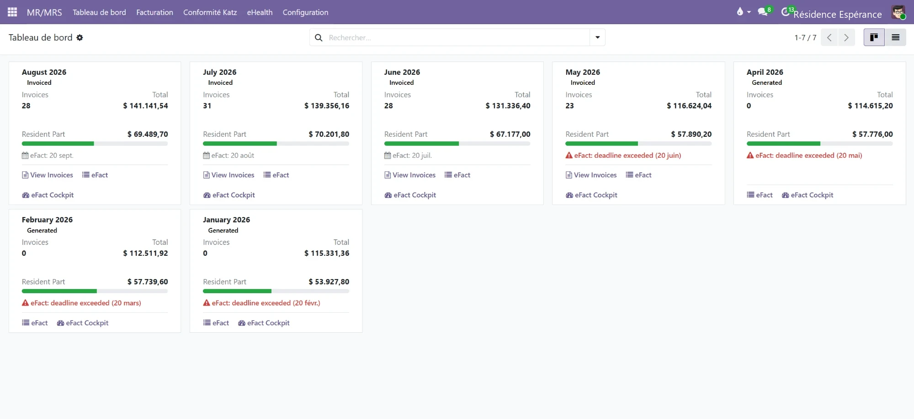
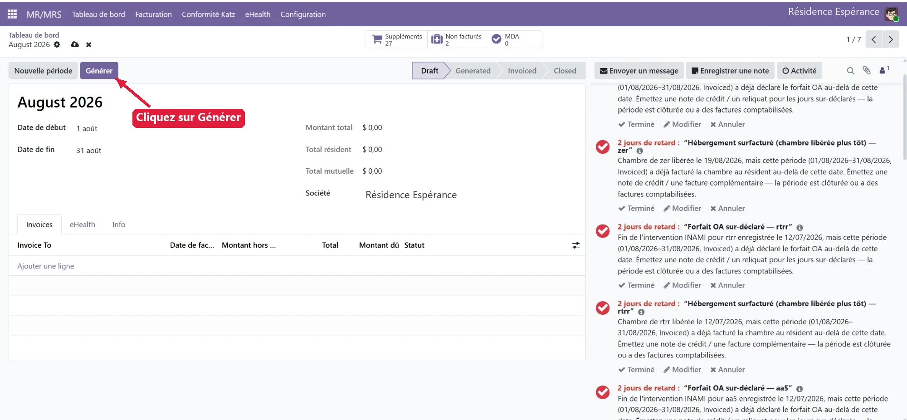
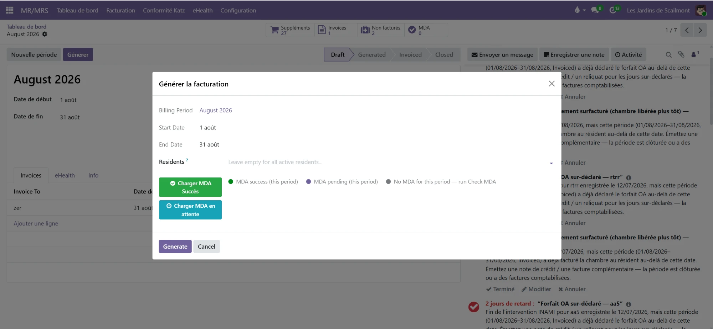
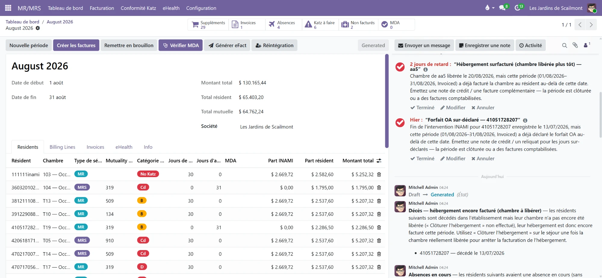

# Facturation électronique (eFact)

L'**eFact** est l'envoi **électronique** de la **part mutuelle** (le forfait
INAMI) aux **organismes assureurs** (OA), via le réseau eHealth / MyCareNet.
Resthome constitue les fichiers, les transmet et **suit les réponses** pour vous
— accusés de réception, décomptes, acceptations et rejets.

Ce guide vous accompagne du début à la fin : générer une période, contrôler,
facturer, envoyer l'eFact et traiter les retours.

!!! info "Obligation 2026"
    La facturation électronique des forfaits est **obligatoire**. La production a
    démarré en **avril 2026** ; la dernière ligne droite pour être en ordre est
    le **1er octobre 2026**. Resthome respecte les **dates limites** d'envoi par
    période et vous alerte quand une échéance approche ou est dépassée.

## Le cycle d'une période, en un coup d'œil

Chaque mois de facturation est une **période** qui passe par quatre états, dans
l'ordre :

| État | Ce que ça veut dire |
|------|---------------------|
| **Draft** (brouillon) | La période est créée, rien n'est encore calculé. |
| **Generated** (générée) | Les forfaits et parts sont calculés, résident par résident. À contrôler. |
| **Invoiced** (facturée) | Les factures sont comptabilisées. L'eFact peut être constitué et envoyé. |
| **Closed** (clôturée) | La période est terminée et verrouillée. |

Le fil conducteur : **Générer → contrôler → Créer les factures → Générer eFact →
envoyer → suivre les réponses**.

## 1. Le tableau de bord des périodes

Ouvrez l'application **MR/MRS → Tableau de bord**. Chaque mois est une carte qui
résume l'essentiel.

Sur chaque carte :

- le **statut** de la période (Invoiced, Generated…) ;
- **Invoices** (nombre de factures) et **Total** ;
- **Resident Part** (la part à charge du résident) ;
- la **date limite eFact** (par ex. « eFact : 20 sept. ») ;
- des raccourcis : **View Invoices**, **eFact** (les lots), **eFact Cockpit**.

!!! warning "« deadline exceeded »"
    Si une carte affiche **eFact : deadline exceeded** en rouge, la date limite
    d'envoi de cette période est **dépassée**. Envoyez sans tarder — au-delà,
    certains organismes assureurs peuvent refuser le lot.

## 2. Générer la période (Draft → Generated)

Ouvrez la période du mois. En état **Draft**, un seul bouton compte : **Générer**.

Un assistant **« Générer la facturation »** s'ouvre.

- **Billing Period / dates** : rappel du mois concerné.
- **Residents** : laissez **vide pour tous les résidents actifs** (ou ciblez un
  résident précis pour un cas particulier).
- **Charger MDA** : charge l'assurabilité (MDA) déjà vérifiée — « Succès » ou
  « en attente ». La légende indique l'état MDA de la période.

Cliquez sur **Generate**. La période passe en **Generated** : Resthome a calculé,
pour **chaque résident**, le forfait Katz, la **part INAMI** (mutuelle) et la
**part résident**.

Dans l'onglet **Residents**, vous retrouvez ligne par ligne :

- le **type de séjour** (MR / MRS) et la **chambre** ;
- la **catégorie Katz** (B, C, Cd, D…) ou **No Katz** ;
- les **jours de présence** et **jours d'absence** ;
- la **part INAMI**, la **part résident** et le **montant total**.

Les autres onglets : **Billing Lines** (le détail des lignes), **Invoices** (les
factures), **eHealth** (les échanges) et **Info**.

## 3. Contrôler avant de facturer

C'est l'étape la plus importante. En haut de la période, des **compteurs** donnent
l'état de santé du mois : **Suppléments**, **Absences**, **Non facturés**, **MDA**
et **Katz à faire** (évaluations Katz manquantes à compléter).

!!! tip "L'auto-contrôle de Resthome"
    Après la génération, Resthome passe la période au crible et **signale les
    anomalies** dans le fil de discussion (à droite). Chaque message décrit le
    problème **et** l'action à faire. Les cas les plus fréquents :

    - **Chambre libérée mais encore facturée** (surfacturation) — un résident a
      quitté sa chambre en cours de mois, mais l'hébergement continue d'être
      facturé. → Émettez une **note de crédit** ou clôturez l'hébergement.
    - **Forfait OA sur-déclaré** — la fin d'intervention INAMI (ou un décès) est
      antérieure à la fin de période, mais le forfait a été déclaré au-delà. →
      Émettez une **note de crédit / un reliquat** pour les jours sur-déclarés.
    - **Décès — hébergement encore facturé** — le résident est décédé mais la
      chambre n'a pas encore été libérée (« Clôturer l'hébergement »).
    - **Absences en cours** — des absences non clôturées influencent le forfait.

    Traitez chaque point (bouton **Terminé** une fois réglé) avant de facturer.

**Vérifier MDA** — le bouton **Vérifier MDA** contrôle l'**assurabilité** de vos
résidents auprès des mutualités (voir [Assurabilité (MDA)](mda.md)). Un résident
sans couverture valide ne pourra pas être facturé en tiers payant.

## 4. Créer les factures (Generated → Invoiced)

Quand les contrôles sont au vert, cliquez sur **Créer les factures**. Resthome
génère et comptabilise :

- les **factures résidents** (part à charge du résident / de la famille) ;
- la **part mutuelle**, qui alimentera l'eFact.

La période passe en **Invoiced**. Vous pouvez toujours **Remettre en brouillon**
tant que vous n'avez pas envoyé l'eFact, si une correction s'impose.

## 5. Générer l'eFact (les lots)

Cliquez sur **Générer eFact**. Resthome constitue les **lots** — un fichier
électronique par organisme assureur — puis affiche la liste **Lots eFact**.

<!-- capture à ajouter : 06-lots-efact.png — liste des lots eFact (un lot par union, statut, montants facturé/accepté/refusé) -->

!!! note "Un lot par union de mutualités"
    Les envois sont regroupés **par union** (les grandes familles d'OA), pas par
    petite mutualité individuelle : **100** (Alliance nationale), **300**
    (Solidaris), **500** (Union nationale), **600** (CAAMI), **900** (HR Rail)…
    Resthome s'occupe du regroupement.

Chaque ligne de lot indique :

- l'**OA** et son **code** ;
- la **référence** du lot (ex. `EF/2026/…`) et le **mois** de facturation ;
- la **date limite** d'envoi et l'état **MDA** ;
- le **statut** du lot (Draft, envoyé, accepté, rejeté…) ;
- les **montants** : facturé, accepté, refusé ;
- en cas de refus, le **code** et le **motif de rejet**.

## 6. Envoyer et suivre les réponses

Une fois les lots constitués, **envoyez-les** : la transmission part vers les
organismes assureurs via le réseau eHealth.

Le cycle de réponse est automatique :

1. **Accusé de réception** — l'OA confirme avoir reçu le lot.
2. **Décompte** — l'OA renvoie le résultat : **accepté** et/ou **rejeté**.
3. Resthome **rapproche** les réponses et met à jour chaque lot (montants
   acceptés / refusés, code et motif de rejet).

!!! warning "Traiter un rejet"
    Si un lot (ou une partie) est **rejeté**, le **code** et le **motif de rejet**
    vous disent pourquoi (assurabilité, forfait, dates…). Corrigez la cause, puis
    **renvoyez**. Le compteur **Renvois** garde la trace des retransmissions pour
    éviter les doublons.

Le bouton **Réintégration** permet, le cas échéant, de réintégrer des lignes
(par exemple après correction) dans un nouvel envoi.

## 7. Le Cockpit eFact

Depuis une période ou une carte du tableau de bord, **eFact Cockpit** offre une
**vue de pilotage** : l'état de tous les lots et envois d'un coup d'œil —
transmis, acceptés, rejetés, en attente. C'est l'écran idéal pour **suivre une
campagne mensuelle** et repérer ce qui bloque.

<!-- capture à ajouter : 07-cockpit.png — Cockpit eFact, vue de pilotage de tous les envois -->

## 8. Notes de crédit et régularisations

Quand un résident **part** ou **décède** en cours de mois déjà facturé, une partie
de l'hébergement ou du forfait a été **sur-facturée**. Resthome le détecte (voir
l'auto-contrôle plus haut) et prépare la **note de crédit** ou le **reliquat**
correspondant, pour rembourser la période non due — côté résident **et**, si
nécessaire, côté mutuelle via un lot correctif.

## Prérequis

!!! warning "À vérifier avant l'envoi"
    - **Assurabilité (MDA)** contrôlée pour la période.
    - **Mutuelle** correcte sur chaque résident.
    - Factures **comptabilisées** (période en état *Invoiced*).
    - **Certificat eHealth** actif.

## Points clés à retenir

- La période suit toujours l'ordre **Draft → Generated → Invoiced → Closed**.
- **Contrôlez avant de facturer** : traitez chaque message d'auto-contrôle.
- **Vérifiez le MDA** — pas de tiers payant sans assurabilité valide.
- **Un lot eFact par union** de mutualités, pas par mutualité.
- Respectez la **date limite** d'envoi de chaque période (« deadline exceeded »).
- Un **rejet** se corrige puis se **renvoie** — le compteur Renvois évite les
  doublons.

## Pour aller plus loin

- [Rejets eFact — causes et solutions](efact-rejets.md)
- [Assurabilité (MDA)](mda.md)
- [Accords (eAgreement)](eagreement.md)
- [Départ et décès](../facturation/depart-deces.md)
- [Absences et hospitalisations](../facturation/absences.md)
- [Vue d'ensemble de la facturation](../facturation/index.md)
